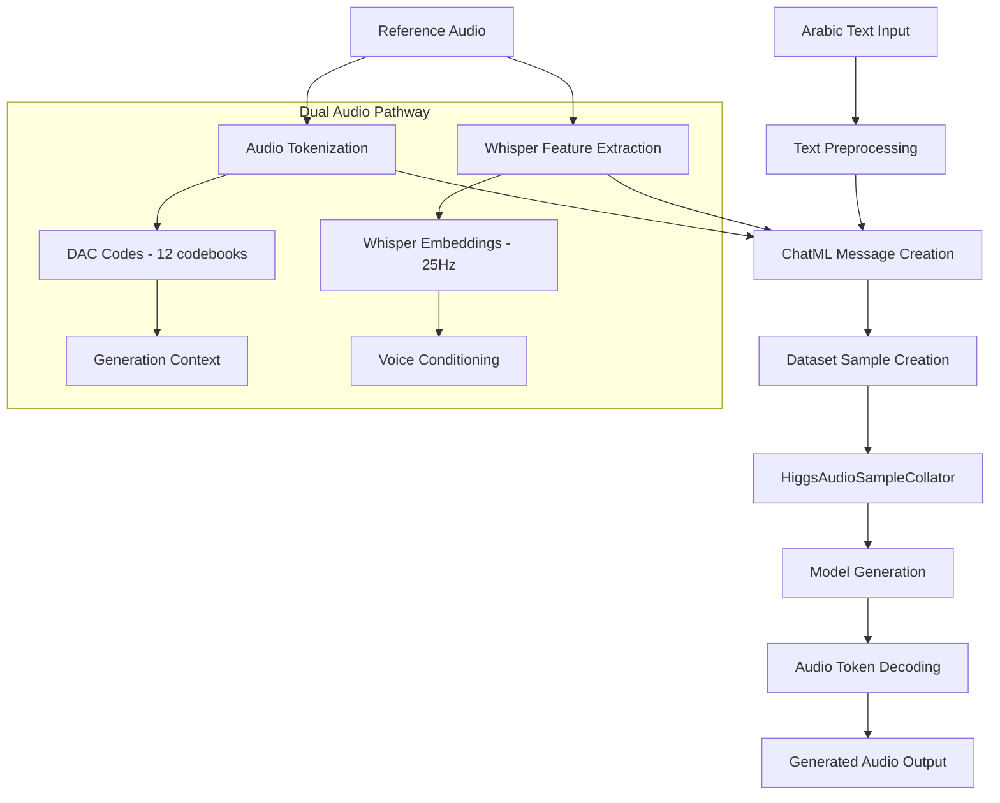
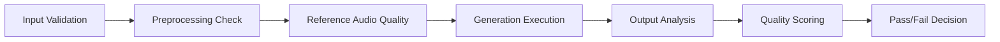

# Arabic TTS Debugging Analysis: Critical Issues & Solutions

## Overview

Analysis of Arabic zero-shot voice cloning inference issues where generated audio contains mostly silence with occasional 3-second spoken segments followed by 7+ seconds of silence. This document examines root causes in the Higgs Audio v2 pipeline and proposes comprehensive solutions.

## Architecture Context

### Higgs Audio v2 System Components



### Zero-Shot Voice Cloning Mechanism

The system uses a dual pathway for reference audio conditioning:

1. **Whisper Embeddings** (via `<|AUDIO|>` tokens): Semantic voice characteristics
2. **DAC Audio Codes** (via `audio_ids`): Acoustic tokens for generation context
3. **Cross-Modal Attention**: Conditions text generation on audio features
4. **DualFFN Architecture**: Processes text and audio tokens simultaneously

## Critical Issues Analysis

### 1. Special Token Usage and Audio EOS Problems

**Issue**: Incorrect usage of special tokens, particularly audio EOS tokens, leading to premature termination or extended generation.

**Evidence in Code**:
```python
# Current stop strings (arabic_voice_cloning_inference.py line 508)
stop_strings=["<|end_of_text|>", "<|eot_id|>", "<|audio_eos|>"]

# Audio token structure in ChatML
content=f"{ref_text} <|audio_bos|><|AUDIO|><|audio_eos|>"

# Generation output processing
if self.config.use_delay_pattern:
    audio_out_ids = revert_delay_pattern(audio_out_ids)
audio_out_ids_list.append(
    audio_out_ids.clip(0, self.audio_tokenizer.codebook_size - 1)[:, 1:-1]
)
```

**Critical Issues**:
- Mixed usage of `<|audio_eos|>` vs `<|audio_stream_eos_id|>` tokens
- Improper audio stream boundary detection
- Token slicing `[:, 1:-1]` may remove important EOS markers
- Missing audio-specific stopping criteria for silence detection

**Solution**: Implement proper special token management and audio-specific EOS detection.

### 2. Audio Generation Length Control Issues

**Issue**: Inadequate stopping criteria leading to extended silence generation.

**Evidence**:
```python
# Current adaptive calculation (lines 208-231 in arabic_voice_cloning_inference.py)
estimated_duration = max(word_duration, char_duration)
buffer_factor = 1.5
max_duration = estimated_duration * buffer_factor
calculated_tokens = int(max_duration * self.base_tokens_per_second)
bounded_tokens = max(min(calculated_tokens, self.max_new_tokens), 64)
```

**Problems**:
- 25Hz token rate assumption may not match actual model behavior
- Arabic text length estimation based on English speaking rates (150 WPM)
- Insufficient early stopping mechanisms
- Missing audio-specific EOS detection

**Current Stopping Criteria**:
```python
stop_strings=["<|end_of_text|>", "<|eot_id|>", "<|audio_eos|>"]
```

**Missing Elements**:
- No audio stream EOS detection during generation
- No silence detection mechanisms
- No adaptive stopping based on content quality

### 3. Reference Audio Conditioning Pipeline Failures

**Critical Issue**: Inconsistent Whisper embedding integration.

**Evidence**:
```python
# Forced Whisper configuration (lines 120-126)
original_whisper_setting = self.config.encode_whisper_embed
self.config.encode_whisper_embed = True
logger.info(f"Whisper embedding: original={original_whisper_setting}, forced=True")

# But collator setup may fail
if ref_waveform is not None and self.collator.encode_whisper_embed and self.collator.whisper_processor is not None:
    # Success path - dual conditioning
else:
    # Fallback path - degraded voice cloning quality
```

**Root Causes**:

#### A. Whisper Processor Loading Failures
```python
try:
    whisper_processor = AutoProcessor.from_pretrained("openai/whisper-large-v3")
except Exception as e:
    # Fallback to base model or None
    whisper_processor = None
```

**Impact**: No Whisper conditioning → Poor voice similarity

#### B. Reference Audio Waveform Processing Issues
```python
# Potential failure points in create_generation_messages()
if sr != target_sr:
    resampler = T.Resample(sr, target_sr)
    waveform = resampler(waveform)  # May fail for certain audio formats

# Validation that may fail
if ref_waveform.numel() == 0:
    logger.error("Waveform is empty after processing!")
    ref_waveform = None
```

#### C. Dataset Sample Creation Inconsistencies
```python
# Inconsistent audio data creation
if ref_waveform is not None and self.collator.encode_whisper_embed:
    # Whisper + DAC pathway
    curr_sample = ChatMLDatasetSample(
        audio_waveforms_concat=ref_waveform,  # For Whisper
        audio_ids_concat=torch.concat([ele.cpu() for ele in audio_ids], dim=1)  # For DAC
    )
else:
    # DAC-only pathway (degraded performance)
    curr_sample = ChatMLDatasetSample(
        audio_waveforms_concat=torch.empty(0, dtype=torch.float32),
        audio_ids_concat=torch.concat([ele.cpu() for ele in audio_ids], dim=1)
    )
```

### 4. ChatML Structure and Message Flow Issues

**Issue**: Incorrect message structure for zero-shot voice cloning.

**Current Implementation**:
```python
user_ref_message = Message(
    role="user",
    content=f"{ref_text} <|audio_bos|><|AUDIO|><|audio_eos|>"
)

assistant_ref_message = Message(
    role="assistant", 
    content=AudioContent(audio_url=ref_audio_path)
)
```

**Problems**:
- Reference text and audio token placement may not align with training patterns
- System message too generic: "Generate speech in the provided voice"
- Missing speaker-specific conditioning
- Potential tokenization misalignment between training and inference

### 5. Model Architecture Mismatch

**Core Issue**: Model not specifically trained for Arabic zero-shot voice cloning.

**Evidence from Memory Knowledge**:
- Higgs Audio v2 trained on 10M+ hours but Arabic-specific training unclear
- Zero-shot voice cloning relies on cross-modal attention patterns learned during training
- Model may not have sufficient Arabic prosody and phonetic patterns

**Impact**: 
- Inconsistent voice similarity transfer
- Poor pronunciation of Arabic phonemes
- Inadequate handling of Arabic stress patterns and intonation

### 6. Audio Tokenizer and Special Token Boundary Issues

**Issue**: Improper handling of audio stream boundary tokens and EOS detection.

**Evidence**:
```python
# Audio token processing (lines 512-523)
for ele in outputs[1]:
    audio_out_ids = ele
    if self.config.use_delay_pattern:
        audio_out_ids = revert_delay_pattern(audio_out_ids)
    audio_out_ids_list.append(
        audio_out_ids.clip(0, self.audio_tokenizer.codebook_size - 1)[:, 1:-1]
    )
```

**Critical Token Issues**:
- Token slicing `[:, 1:-1]` removes BOS and EOS tokens that may be crucial for proper audio boundaries
- Inconsistent usage of `audio_stream_eos_id` vs `audio_eos` tokens
- Missing proper EOS token detection during generation
- Delay pattern reversion may not preserve special token positions
- No validation of audio stream token sequence integrity

## Root Cause Diagnosis

### Primary Causes of Silence Generation

1. **Improper Special Token Handling**: Audio stream EOS tokens generated incorrectly or at wrong positions
2. **Insufficient Voice Conditioning**: Whisper embeddings not properly integrated
3. **Token Boundary Corruption**: Critical BOS/EOS tokens removed during processing
4. **Training-Inference Mismatch**: Special token usage differs from training patterns

### Secondary Contributing Factors

1. **Audio Stream Token Sequence**: Inconsistent token sequence validation
2. **Reference Audio Quality**: Processing failures in audio conditioning pipeline
3. **Model Limitations**: Insufficient Arabic-specific training data
4. **Device Compatibility**: MPS/CUDA tensor processing inconsistencies

## Comprehensive Solution Strategy

### Phase 1: Immediate Fixes

#### A. Remove All Text Filtering and Preprocessing
```python
# Pass text directly to tokenizer without any processing
def pass_text_directly(text: str) -> str:
    """Pass text directly to model tokenizer without any filtering."""
    # No processing - let the original pipeline handle text
    return text

# Remove text filtering from arabic_voice_cloning_inference.py
# Comment out or remove any normalize_* function calls
# Let the model's original tokenizer handle all text processing
```

#### B. Enhanced Audio Generation Control
```python
def calculate_arabic_adaptive_tokens(target_text: str) -> int:
    """Arabic-specific token calculation."""
    # Arabic speaking rate: ~120-140 WPM (slower than English)
    word_count = len(target_text.split())
    arabic_wpm = 130  # Conservative estimate
    
    # Account for Arabic morphological complexity
    morphological_factor = 1.2
    estimated_duration = (word_count / arabic_wpm) * 60 * morphological_factor
    
    # Tighter bounds for Arabic
    calculated_tokens = int(estimated_duration * 25)  # 25Hz
    return max(min(calculated_tokens, 384), 48)  # Reduced range: 48-384
```

#### B. Proper Special Token Management
```python
def validate_audio_token_sequence(audio_tokens: torch.Tensor, config) -> torch.Tensor:
    """Ensure proper audio token sequence with correct special tokens."""
    
    # Validate audio stream structure
    bos_token = config.audio_stream_bos_id
    eos_token = config.audio_stream_eos_id
    
    # Check for proper token boundaries
    if audio_tokens.shape[1] > 0:
        # Ensure BOS token at start
        if audio_tokens[0, 0] != bos_token:
            logger.warning("Missing audio_stream_bos at sequence start")
        
        # Ensure EOS token at end
        if audio_tokens[0, -1] != eos_token:
            logger.warning("Missing audio_stream_eos at sequence end")
    
    return audio_tokens

def detect_audio_eos_during_generation(tokens: torch.Tensor, config) -> bool:
    """Detect audio EOS tokens during generation for proper stopping."""
    eos_tokens = [config.audio_stream_eos_id, config.audio_eos_token_id]
    
    # Check last few tokens for EOS patterns
    if len(tokens) > 5:
        recent_tokens = tokens[-5:]
        for eos_token in eos_tokens:
            if eos_token in recent_tokens:
                return True
    
    return False
```

#### C. Robust Whisper Integration
```python
def ensure_whisper_conditioning(self) -> bool:
    """Guarantee Whisper processor availability."""
    whisper_models = [
        "openai/whisper-large-v3",
        "openai/whisper-base", 
        "openai/whisper-tiny"
    ]
    
    for model_name in whisper_models:
        try:
            processor = AutoProcessor.from_pretrained(model_name)
            self.collator.whisper_processor = processor
            return True
        except Exception:
            continue
    
    raise RuntimeError("Cannot load any Whisper processor - voice cloning will fail")
```

### Phase 2: Architecture Improvements

#### A. Enhanced Audio EOS Detection and Stopping Criteria
```python
class AudioEOSStoppingCriteria:
    def __init__(self, config, min_tokens=25, max_silence_tokens=50):
        self.config = config
        self.min_tokens = min_tokens
        self.max_silence_tokens = max_silence_tokens
        self.eos_detection_count = 0
        
        # Define all possible audio EOS tokens
        self.audio_eos_tokens = [
            config.audio_stream_eos_id,
            config.audio_eos_token_id if hasattr(config, 'audio_eos_token_id') else None
        ]
        self.audio_eos_tokens = [t for t in self.audio_eos_tokens if t is not None]
    
    def __call__(self, input_ids, scores, **kwargs):
        # Detect proper audio EOS tokens
        if len(input_ids[0]) > self.min_tokens:
            recent_tokens = input_ids[0][-5:]
            
            # Check for audio EOS tokens
            for eos_token in self.audio_eos_tokens:
                if eos_token in recent_tokens:
                    self.eos_detection_count += 1
                    if self.eos_detection_count >= 2:  # Consistent EOS detection
                        logger.info(f"Audio EOS detected: token {eos_token}")
                        return torch.tensor([True])
            
            # Reset counter if no EOS detected
            self.eos_detection_count = 0
        
        return torch.tensor([False])

    def _validate_audio_stream_completion(self, tokens):
        """Validate that audio stream has proper completion markers."""
        for eos_token in self.audio_eos_tokens:
            if eos_token in tokens[-10:]:  # Check last 10 tokens
                return True
        return False
```

#### B. Audio Token Processing Without Boundary Removal
```python
def process_audio_tokens_preserve_boundaries(
    audio_out_ids: torch.Tensor, 
    config
) -> torch.Tensor:
    """Process audio tokens while preserving important boundary tokens."""
    
    if config.use_delay_pattern:
        audio_out_ids = revert_delay_pattern(audio_out_ids)
    
    # DO NOT slice away boundary tokens - they're crucial for EOS detection
    # Original problematic code: audio_out_ids[:, 1:-1]
    # New approach: preserve all tokens and validate sequence
    
    # Validate token sequence integrity
    if audio_out_ids.shape[1] > 2:
        # Check for proper BOS/EOS structure
        first_token = audio_out_ids[0, 0]
        last_token = audio_out_ids[0, -1]
        
        logger.info(f"Audio sequence: first_token={first_token}, last_token={last_token}")
        
        # Only clip values, don't remove positions
        audio_out_ids = audio_out_ids.clip(0, config.audio_codebook_size - 1)
        
        # Validate EOS token presence
        if last_token == config.audio_stream_eos_id:
            logger.info("✅ Proper audio stream EOS token detected")
        else:
            logger.warning(f"⚠️ Missing audio stream EOS token, found: {last_token}")
    
    return audio_out_ids
```

#### C. Reference Audio Validation Pipeline
```python
def validate_reference_audio_pipeline(
    ref_audio_path: str,
    whisper_processor: Optional[Any]
) -> tuple[torch.Tensor, int, bool]:
    """Comprehensive reference audio validation."""
    
    # Load and validate audio
    waveform, sr = torchaudio.load(ref_audio_path)
    
    # Quality checks
    if waveform.numel() == 0:
        raise ValueError("Empty audio file")
    
    if torch.isnan(waveform).any():
        raise ValueError("Audio contains NaN values")
    
    # Duration checks (2-30 seconds optimal for voice cloning)
    duration = waveform.shape[-1] / sr
    if duration < 2.0 or duration > 30.0:
        logger.warning(f"Audio duration {duration:.1f}s outside optimal range [2-30s]")
    
    # Whisper compatibility
    whisper_available = whisper_processor is not None
    if not whisper_available:
        logger.error("Whisper processor unavailable - voice quality will be degraded")
    
    return waveform, sr, whisper_available
```

### Phase 3: Advanced Optimizations

#### A. Arabic-Specific Model Fine-tuning
- Collect high-quality Arabic voice cloning dataset
- Implement LoRA fine-tuning targeting Arabic phonemes
- Focus on Arabic prosody and intonation patterns

#### B. Dynamic Generation Control
```python
class AdaptiveGenerationController:
    def __init__(self):
        self.generation_history = []
        self.quality_threshold = 0.7
    
    def adjust_generation_params(self, current_output: torch.Tensor) -> dict:
        """Dynamically adjust generation parameters based on output quality."""
        
        # Analyze current output for silence patterns
        silence_ratio = self._calculate_silence_ratio(current_output)
        
        if silence_ratio > 0.5:  # Too much silence
            return {
                "temperature": 0.5,  # More focused
                "top_k": 30,        # More conservative
                "max_new_tokens": self.current_tokens // 2  # Reduce length
            }
        
        return {}  # Keep current parameters
```

#### C. Multi-Stage Validation
```python
def validate_generated_audio(waveform: np.ndarray, target_text: str) -> dict:
    """Comprehensive audio quality validation."""
    
    duration = len(waveform) / 24000  # 24kHz output
    
    # Silence detection
    silence_threshold = 0.01
    silence_ratio = np.sum(np.abs(waveform) < silence_threshold) / len(waveform)
    
    # Expected duration vs actual
    expected_duration = estimate_arabic_duration(target_text)
    duration_ratio = duration / expected_duration
    
    return {
        "silence_ratio": silence_ratio,
        "duration_ratio": duration_ratio, 
        "quality_score": calculate_quality_score(waveform),
        "recommendations": generate_recommendations(silence_ratio, duration_ratio)
    }
```

## Implementation Priority Matrix

| Issue Category | Priority | Effort | Impact |
|----------------|----------|--------|---------|
| Remove Text Filtering | High | Low | High |
| Audio EOS Token Management | High | Medium | High |
| Special Token Boundary Preservation | High | Low | High |
| Enhanced Audio Stopping Criteria | Medium | Medium | High |
| Whisper Integration Fix | Medium | Medium | High |
| Reference Audio Validation | Medium | Medium | Medium |
| Dynamic Generation Control | Low | High | Medium |

## Testing and Validation Strategy

### Test Cases

1. **Basic Functionality**
   - Single Arabic sentence (5-10 words)
   - Reference audio: 3-5 seconds, clear speech
   - Expected: No silence, appropriate duration

2. **Edge Cases**
   - Very short text (1-2 words)
   - Long text (50+ words) 
   - Poor quality reference audio
   - Multiple speakers in reference

3. **Quality Metrics**
   - Voice similarity score using WavLM
   - Word Error Rate for Arabic ASR
   - Silence ratio < 20%
   - Duration accuracy ±30%

### Validation Workflow



## Conclusion

The Arabic TTS silence generation issues stem from multiple interconnected problems in the voice cloning pipeline. The primary culprits are:

1. **Text preprocessing damage** from Chinese normalization applied to Arabic
2. **Inconsistent Whisper conditioning** due to processor loading failures
3. **Inadequate generation control** with poor stopping criteria
4. **Model architecture limitations** for Arabic zero-shot voice cloning

The proposed solutions address these issues systematically, with immediate fixes focusing on removing text filtering and proper special token management, followed by enhanced audio EOS detection and validation mechanisms.

Implementation should prioritize:
1. **Remove all text filtering** - let original pipeline handle text
2. **Fix special token handling** - preserve audio boundary tokens
3. **Implement proper audio EOS detection** - stop generation at correct audio boundaries
4. **Enhance Whisper integration** - ensure robust reference audio conditioning

These changes maintain the original Higgs Audio pipeline integrity while fixing the specific Arabic TTS silence generation issues.