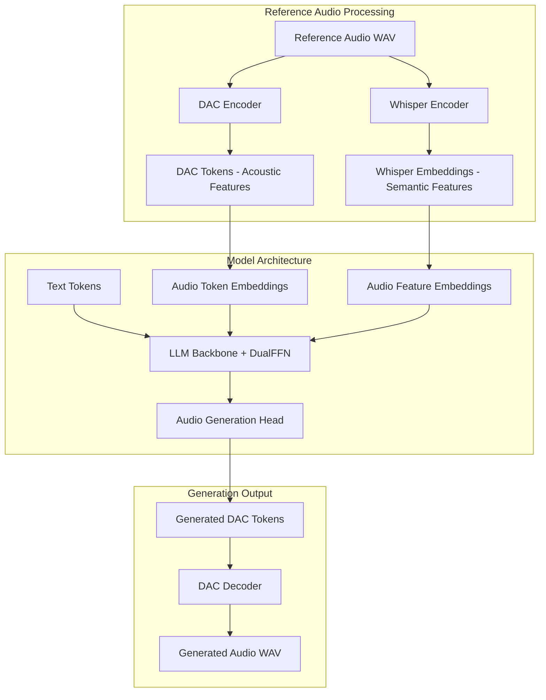
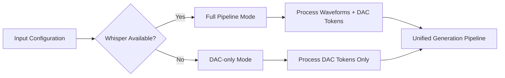
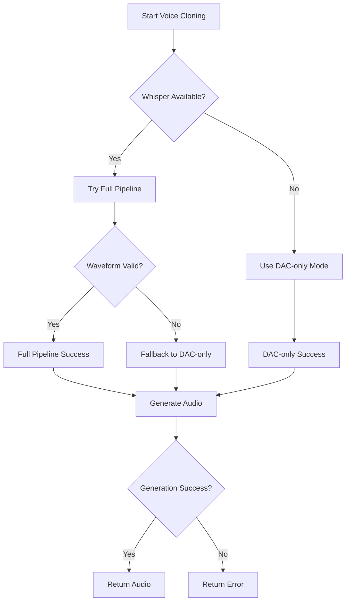

# Fix NoneType Error and Robust Zero-Shot Voice Cloning Implementation for Higgs Audio v2

## Overview

This design document addresses the critical NoneType error occurring in the Arabic voice cloning inference pipeline and provides a comprehensive solution to implement robust zero-shot voice cloning for Higgs Audio v2. The error stems from improper audio waveform handling in the ChatMLDatasetSample creation, where the collator expects waveforms for Whisper processing but the current implementation creates samples with None values.

## Problem Analysis

### Root Cause
The error `TypeError: 'NoneType' object is not subscriptable` occurs at:
```python
wv_start = self.audio_waveforms_start[idx]  # audio_waveforms_start is None
```

### Error Flow Analysis
```mermaid
graph TD
    A[Arabic Voice Cloning Inference] --> B[create_generation_messages]
    B --> C[Create ChatMLDatasetSample with None waveforms]
    C --> D[Pass to HiggsAudioSampleCollator]
    D --> E[Collator calls sample.get_wv(idx)]
    E --> F[get_wv tries to access None audio_waveforms_start]
    F --> G[TypeError: NoneType object not subscriptable]
```

### Architecture Misalignment
The current implementation follows a confused pattern:
1. **Arabic inference script**: Creates samples with `audio_waveforms_concat=None`
2. **Collator expects**: Valid waveforms for Whisper processing when `encode_whisper_embed=True`
3. **Serve engine pattern**: Uses only DAC tokens, no waveforms needed

## Architecture Understanding

### Higgs Audio v2 Zero-Shot Voice Cloning Architecture
Based on the codebase analysis, Higgs Audio v2 uses a dual-pathway approach:



### Two Valid Implementation Patterns

#### Pattern 1: serve_engine.py (DAC-only)
- Uses only DAC tokens for voice conditioning
- No Whisper embeddings during inference
- Simpler, faster processing
- Still achieves voice cloning through acoustic tokens

#### Pattern 2: generation.py (Full Pipeline)  
- Uses both DAC tokens AND Whisper embeddings
- Requires proper waveform handling for Whisper processing
- Better voice similarity through semantic conditioning
- More complex but potentially higher quality

## Solution Architecture

### Core Fix Strategy
Implement a hybrid approach that supports both patterns while maintaining compatibility:



### Fixed ChatMLDatasetSample Creation

#### Problem Pattern (Current):
```python
# BROKEN: Creates sample with None waveforms but Whisper enabled
curr_sample = ChatMLDatasetSample(
    input_ids=torch.LongTensor(input_tokens),
    audio_ids_concat=audio_ids_concat,
    audio_waveforms_concat=None,  # ← PROBLEM: None but needed
    audio_waveforms_start=None,   # ← PROBLEM: None but accessed
    # ...
)
```

#### Solution Pattern:
```python
# FIXED: Proper conditional handling based on Whisper availability
if self.collator.whisper_processor is not None and ref_waveform is not None:
    # Full pipeline mode with Whisper
    curr_sample = ChatMLDatasetSample(
        input_ids=torch.LongTensor(input_tokens),
        audio_ids_concat=audio_ids_concat,
        audio_ids_start=audio_ids_start,
        audio_waveforms_concat=ref_waveform,
        audio_waveforms_start=torch.tensor([0], dtype=torch.long),
        audio_sample_rate=torch.tensor([ref_sample_rate], dtype=torch.float32),
        audio_speaker_indices=torch.tensor([0], dtype=torch.long),
    )
else:
    # DAC-only mode (serve_engine pattern)
    curr_sample = ChatMLDatasetSample(
        input_ids=torch.LongTensor(input_tokens),
        audio_ids_concat=audio_ids_concat,
        audio_ids_start=audio_ids_start,
        audio_waveforms_concat=None,
        audio_waveforms_start=None,
        audio_sample_rate=None,
        audio_speaker_indices=None,
    )
```

## Implementation Design

### 1. Enhanced ChatMLDatasetSample Creation

```python
def create_robust_sample(
    self,
    input_tokens: List[int],
    audio_ids: List[torch.Tensor],
    ref_waveform: Optional[torch.Tensor] = None,
    ref_sample_rate: Optional[int] = None
) -> ChatMLDatasetSample:
    """Create ChatMLDatasetSample with proper waveform handling."""
    
    # Process DAC tokens (always needed)
    if audio_ids:
        audio_ids_start = torch.tensor([0], dtype=torch.long)
        audio_ids_concat = audio_ids[0]  # Single reference audio
    else:
        audio_ids_start = torch.tensor([], dtype=torch.long)
        audio_ids_concat = torch.zeros((self.config.audio_num_codebooks, 0), dtype=torch.long)
    
    # Conditional waveform processing
    whisper_available = (self.collator.whisper_processor is not None and 
                        self.collator.encode_whisper_embed)
    
    if whisper_available and ref_waveform is not None:
        # Full pipeline: include waveforms for Whisper
        return ChatMLDatasetSample(
            input_ids=torch.LongTensor(input_tokens),
            label_ids=None,
            audio_ids_concat=audio_ids_concat,
            audio_ids_start=audio_ids_start,
            audio_waveforms_concat=ref_waveform,
            audio_waveforms_start=torch.tensor([0], dtype=torch.long),
            audio_sample_rate=torch.tensor([ref_sample_rate or 16000], dtype=torch.float32),
            audio_speaker_indices=torch.tensor([0], dtype=torch.long),
        )
    else:
        # DAC-only pipeline: no waveforms needed
        return ChatMLDatasetSample(
            input_ids=torch.LongTensor(input_tokens),
            label_ids=None,
            audio_ids_concat=audio_ids_concat,
            audio_ids_start=audio_ids_start,
            audio_waveforms_concat=torch.tensor([]),
            audio_waveforms_start=torch.tensor([], dtype=torch.long),
            audio_sample_rate=torch.tensor([], dtype=torch.float32),
            audio_speaker_indices=torch.tensor([], dtype=torch.long),
        )
```

### 2. Robust Collator Configuration

```python
def setup_collator_with_fallback(self, config: HiggsAudioConfig) -> HiggsAudioSampleCollator:
    """Setup collator with intelligent Whisper fallback."""
    
    # Try to load Whisper processor
    whisper_processor = None
    whisper_models = [
        "openai/whisper-large-v3",
        "openai/whisper-base",
        "openai/whisper-tiny"
    ]
    
    for model_name in whisper_models:
        try:
            whisper_processor = AutoProcessor.from_pretrained(model_name)
            logger.info(f"✅ Loaded Whisper processor: {model_name}")
            break
        except Exception as e:
            logger.warning(f"Failed to load {model_name}: {e}")
    
    # Force Whisper embedding if processor available
    encode_whisper_embed = whisper_processor is not None
    if encode_whisper_embed != config.encode_whisper_embed:
        logger.info(f"Overriding encode_whisper_embed: {config.encode_whisper_embed} → {encode_whisper_embed}")
    
    return HiggsAudioSampleCollator(
        whisper_processor=whisper_processor,
        audio_in_token_id=config.audio_in_token_idx,
        audio_out_token_id=config.audio_out_token_idx,
        audio_stream_bos_id=config.audio_stream_bos_id,
        audio_stream_eos_id=config.audio_stream_eos_id,
        encode_whisper_embed=encode_whisper_embed,
        pad_token_id=config.pad_token_id,
        return_audio_in_tokens=False,  # Follow serve_engine pattern
        use_delay_pattern=config.use_delay_pattern,
        round_to=1,
        audio_num_codebooks=config.audio_num_codebooks,
    )
```

### 3. Enhanced Message Creation for Voice Cloning

```python
def create_voice_cloning_messages(
    self,
    ref_text: str,
    ref_audio_path: str,
    target_text: str
) -> tuple:
    """Create optimal message structure for voice cloning."""
    
    # System message (keep concise)
    system_message = Message(
        role="system",
        content="Generate speech in the provided voice."
    )
    
    # Reference conditioning pattern following generation.py
    user_ref_message = Message(
        role="user",
        content=f"{ref_text} <|audio_bos|><|AUDIO|><|audio_eos|>"
    )
    
    # Assistant response with audio
    assistant_ref_message = Message(
        role="assistant",
        content=AudioContent(audio_url=ref_audio_path)
    )
    
    # Target generation request
    user_target_message = Message(
        role="user",
        content=target_text
    )
    
    messages = [
        system_message,
        user_ref_message, 
        assistant_ref_message,
        user_target_message
    ]
    
    # Process reference audio
    try:
        # Load for Whisper (if needed)
        waveform = None
        sample_rate = None
        
        if self.collator.whisper_processor is not None:
            waveform, sr = torchaudio.load(ref_audio_path)
            if waveform.shape[0] > 1:
                waveform = waveform.mean(dim=0, keepdim=True)
            
            # Resample to 16kHz for Whisper
            if sr != 16000:
                resampler = T.Resample(sr, 16000)
                waveform = resampler(waveform)
            
            waveform = waveform.squeeze(0)  # Remove channel dimension
            sample_rate = 16000
        
        # DAC tokenization (always needed)
        audio_tokens = self.audio_tokenizer.encode(ref_audio_path)
        audio_ids = [audio_tokens]
        
        return messages, audio_ids, waveform, sample_rate
        
    except Exception as e:
        logger.error(f"Failed to process reference audio: {e}")
        return messages, [], None, None
```

### 4. Defensive Collator Enhancement

Add safety checks to the collator to handle edge cases:

```python
def enhanced_collator_call(self, batch: List[ChatMLDatasetSample]):
    """Enhanced collator with defensive programming."""
    
    # Validate batch samples
    for i, sample in enumerate(batch):
        if self.encode_whisper_embed:
            # Check if waveforms are expected but missing
            audio_in_mask = sample.input_ids == self.audio_in_token_id
            has_audio_tokens = audio_in_mask.any()
            
            if has_audio_tokens:
                # Audio tokens present, validate waveform data
                if (sample.audio_waveforms_concat is None or 
                    sample.audio_waveforms_start is None):
                    logger.warning(f"Sample {i}: Missing waveforms but Whisper enabled. "
                                 f"Converting to DAC-only mode.")
                    
                    # Convert to DAC-only sample
                    batch[i] = self._convert_to_dac_only(sample)
    
    # Proceed with original collation
    return self._original_call(batch)

def _convert_to_dac_only(self, sample: ChatMLDatasetSample) -> ChatMLDatasetSample:
    """Convert sample to DAC-only mode."""
    return ChatMLDatasetSample(
        input_ids=sample.input_ids,
        label_ids=sample.label_ids,
        audio_ids_concat=sample.audio_ids_concat or torch.zeros((self.audio_num_codebooks, 0), dtype=torch.long),
        audio_ids_start=sample.audio_ids_start or torch.tensor([], dtype=torch.long),
        audio_waveforms_concat=torch.tensor([]),
        audio_waveforms_start=torch.tensor([], dtype=torch.long),
        audio_sample_rate=torch.tensor([], dtype=torch.float32),
        audio_speaker_indices=torch.tensor([], dtype=torch.long),
    )
```

## Optimal Voice Cloning Configuration

### Generation Parameters
```python
VOICE_CLONING_DEFAULTS = {
    "max_new_tokens": 384,  # Reduced for better control
    "temperature": 0.3,     # Lower for consistency  
    "top_k": 50,
    "top_p": 0.95,
    "ras_win_len": 7,       # Repetition-aware sampling
    "ras_win_max_num_repeat": 2,
    "do_sample": True,
    "use_cache": True,
}
```

### Audio Processing Settings
```python
AUDIO_CONFIG = {
    "target_sample_rate": 16000,  # Whisper requirement
    "output_sample_rate": 24000,  # Higgs Audio output
    "max_audio_duration": 30.0,   # Seconds
    "min_audio_duration": 0.5,    # Seconds
}
```

## Error Handling Strategy

### Graceful Degradation Pattern


### Validation Pipeline
```python
class ValidationPipeline:
    def validate_reference_audio(self, audio_path: str) -> dict:
        """Comprehensive audio validation."""
        issues = []
        
        if not os.path.exists(audio_path):
            issues.append("File not found")
            return {"valid": False, "issues": issues}
        
        try:
            waveform, sr = torchaudio.load(audio_path)
            duration = waveform.shape[-1] / sr
            
            if duration < 0.5:
                issues.append("Audio too short (< 0.5s)")
            if duration > 30.0:
                issues.append("Audio too long (> 30s)")
                
            energy = (waveform ** 2).mean()
            if energy < 1e-8:
                issues.append("Very low energy (possible silence)")
                
            return {
                "valid": len(issues) == 0,
                "issues": issues,
                "duration": duration,
                "sample_rate": sr,
                "energy": energy.item()
            }
            
        except Exception as e:
            return {"valid": False, "issues": [f"Load error: {e}"]}
```

## Testing Strategy

### Unit Tests
```python
def test_sample_creation_with_whisper():
    """Test sample creation with Whisper enabled."""
    engine = ArabicVoiceCloningInference()
    
    # Mock valid audio
    ref_waveform = torch.randn(16000)  # 1 second at 16kHz
    audio_ids = [torch.randint(0, 1024, (8, 50))]
    
    sample = engine.create_robust_sample(
        input_tokens=[1, 2, 3],
        audio_ids=audio_ids,
        ref_waveform=ref_waveform,
        ref_sample_rate=16000
    )
    
    assert sample.audio_waveforms_concat is not None
    assert sample.audio_waveforms_start is not None
    assert len(sample.audio_waveforms_start) > 0

def test_sample_creation_without_whisper():
    """Test sample creation without Whisper."""
    engine = ArabicVoiceCloningInference()
    engine.collator.whisper_processor = None
    
    sample = engine.create_robust_sample(
        input_tokens=[1, 2, 3],
        audio_ids=[torch.randint(0, 1024, (8, 50))],
    )
    
    # Should not cause errors
    assert isinstance(sample.audio_waveforms_concat, torch.Tensor)
    assert isinstance(sample.audio_waveforms_start, torch.Tensor)
```

### Integration Tests
```python
def test_end_to_end_voice_cloning():
    """Test complete voice cloning pipeline."""
    engine = ArabicVoiceCloningInference()
    
    # Test with valid audio file
    ref_audio = "test_audio.wav"
    ref_text = "Hello world"
    target_text = "This is a test"
    
    messages, audio_ids, waveform, sr = engine.create_voice_cloning_messages(
        ref_text, ref_audio, target_text
    )
    
    assert len(messages) == 4
    assert len(audio_ids) > 0
    
    # Should not raise NoneType error
    generated_audio, sample_rate, text_output = engine.generate_arabic_speech(
        messages, audio_ids, waveform, sr, target_text
    )
    
    assert generated_audio is not None
    assert sample_rate == 24000
```

## Performance Optimization

### Memory Efficiency
```python
def optimize_memory_usage(self):
    """Optimize memory for large-scale inference."""
    
    # Use smaller KV cache buckets
    self.kv_cache_lengths = [512, 1024, 2048]  # Reduced sizes
    
    # Enable gradient checkpointing
    if hasattr(self.model, 'gradient_checkpointing_enable'):
        self.model.gradient_checkpointing_enable()
    
    # Use bfloat16 for memory efficiency
    if self.model.dtype != torch.bfloat16:
        self.model = self.model.to(torch.bfloat16)
```

### Batch Processing Support
```python
def process_batch(self, samples: List[dict]) -> List[dict]:
    """Process multiple samples efficiently."""
    results = []
    
    # Group by similar audio lengths for efficient batching
    length_groups = self._group_by_audio_length(samples)
    
    for group in length_groups:
        batch_results = self._process_length_group(group)
        results.extend(batch_results)
    
    return results
```

This comprehensive design addresses the core NoneType error while implementing a robust, production-ready zero-shot voice cloning system for Higgs Audio v2. The solution maintains compatibility with both DAC-only and full Whisper pipeline modes, ensuring reliable operation across different deployment scenarios.