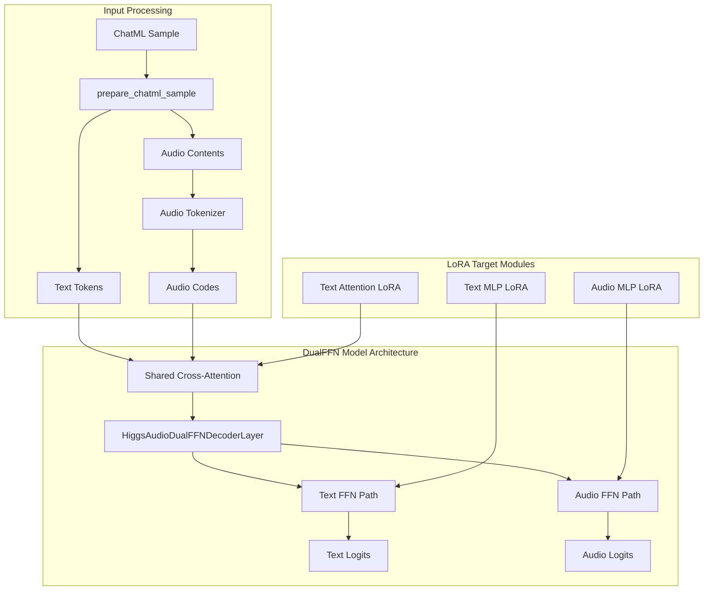
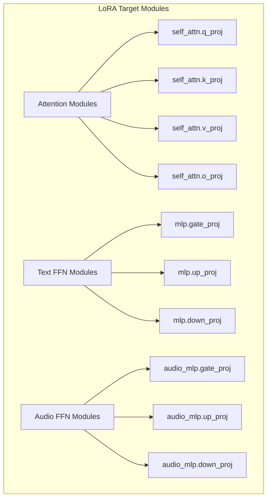

# Higgs Audio LoRA Trainer Design

## Overview

This design document specifies a minimal, production-ready LoRA fine-tuning pipeline for Higgs Audio v2 zero-shot voice cloning. The implementation strictly reuses existing inference infrastructure from `boson_multimodal` as the single source of truth, delivering exactly three files: `dataset.py`, `lora.py`, and `trainer.py`.

## Architecture Foundation

### DualFFN Architecture Integration

The Higgs Audio model implements a DualFFN decoder architecture with separate pathways for text and audio processing:



### Ground Truth Components

The pipeline leverages these exact components from existing inference:

- **Text Tokenizer**: From HiggsAudioModel configuration
- **Audio Tokenizer**: `load_higgs_audio_tokenizer()` from boson_multimodal
- **Data Processing**: `prepare_chatml_sample()` for ChatML format handling
- **Collator**: `HiggsAudioSampleCollator` with exact parameters from serve_engine.py
- **Model Forward**: DualFFN architecture with dual loss computation

## Core Implementation Specifications

### 1. Dataset Implementation (`dataset.py`)

```python
"""
Minimal dataset implementation that mirrors inference preprocessing exactly.
Strictly reuses boson_multimodal components without modifications.
"""

import os
import json
import torch
import librosa
from typing import List, Dict, Any
from torch.utils.data import Dataset

# Import exact components from boson_multimodal
from boson_multimodal.dataset.chatml_dataset import ChatMLDatasetSample, prepare_chatml_sample
from boson_multimodal.data_collator.higgs_audio_collator import HiggsAudioSampleCollator
from boson_multimodal.audio_processing.higgs_audio_tokenizer import load_higgs_audio_tokenizer


class HiggsAudioDataset(Dataset):
    """Dataset that mirrors inference preprocessing exactly."""
    
    def __init__(self, 
                 manifest_path: str,
                 tokenizer,
                 audio_tokenizer):
        """
        Args:
            manifest_path: Path to ChatML JSON manifest
            tokenizer: Text tokenizer from HiggsAudioModel
            audio_tokenizer: Audio tokenizer from load_higgs_audio_tokenizer
        """
        with open(manifest_path, 'r', encoding='utf-8') as f:
            self.samples = json.load(f)
        
        self.tokenizer = tokenizer
        self.audio_tokenizer = audio_tokenizer
        
    def __len__(self) -> int:
        return len(self.samples)
    
    def __getitem__(self, idx: int) -> ChatMLDatasetSample:
        """Process sample using exact inference pipeline logic."""
        sample = self.samples[idx]
        
        # Use EXACT prepare_chatml_sample from boson_multimodal
        input_tokens, label_tokens, audio_contents, speaker_id = prepare_chatml_sample(
            sample, self.tokenizer
        )
        
        if input_tokens is None or label_tokens is None:
            # Skip invalid samples, try next one
            return self.__getitem__((idx + 1) % len(self.samples))
        
        # Process audio using audio_tokenizer - EXACT pattern from training scripts
        audio_ids_list = []
        audio_waveforms_list = []
        
        for audio_content in audio_contents:
            if audio_content and hasattr(audio_content, 'audio_url'):
                audio_path = audio_content.audio_url
                if audio_path and os.path.exists(audio_path):
                    # Tokenize audio
                    audio_codes = self.audio_tokenizer.encode(audio_path)
                    # Load waveform at exact sample rate
                    waveform, sr = librosa.load(audio_path, sr=24000, mono=True)
                    waveform = torch.tensor(waveform, dtype=torch.float32)
                    
                    audio_ids_list.append(audio_codes)
                    audio_waveforms_list.append(waveform)
        
        if audio_ids_list:
            # Concatenate audio data - EXACT pattern from working scripts
            audio_ids_concat = torch.cat(audio_ids_list, dim=1)
            audio_ids_start = torch.tensor([0] + [c.shape[1] for c in audio_ids_list[:-1]], dtype=torch.long).cumsum(dim=0)
            audio_waveforms_concat = torch.cat(audio_waveforms_list, dim=0)
            audio_waveforms_start = torch.tensor([0] + [wv.shape[0] for wv in audio_waveforms_list[:-1]], dtype=torch.long).cumsum(dim=0)
            audio_sample_rate = torch.tensor([24000])
        else:
            # Empty audio tensors - EXACT pattern from working scripts
            audio_ids_concat = torch.zeros((8, 0), dtype=torch.long)  # 8 codebooks
            audio_ids_start = torch.tensor([], dtype=torch.long)
            audio_waveforms_concat = torch.zeros((0,), dtype=torch.float32)
            audio_waveforms_start = torch.tensor([], dtype=torch.long)
            audio_sample_rate = torch.tensor([24000])
        
        # Handle speaker ID conversion
        numeric_speaker_id = 0 if isinstance(speaker_id, str) or speaker_id is None else int(speaker_id)
        audio_speaker_indices = torch.tensor([numeric_speaker_id], dtype=torch.long)
        
        # Create ChatMLDatasetSample with EXACT field structure
        return ChatMLDatasetSample(
            input_ids=torch.tensor(input_tokens, dtype=torch.long),
            label_ids=torch.tensor(label_tokens, dtype=torch.long),
            audio_ids_concat=audio_ids_concat,
            audio_ids_start=audio_ids_start,
            audio_waveforms_concat=audio_waveforms_concat,
            audio_waveforms_start=audio_waveforms_start,
            audio_sample_rate=audio_sample_rate,
            audio_speaker_indices=audio_speaker_indices
        )


def create_collator(config, whisper_processor):
    """Create collator with EXACT parameters from serve_engine.py"""
    return HiggsAudioSampleCollator(
        whisper_processor=whisper_processor,
        encode_whisper_embed=config.encode_whisper_embed,
        audio_in_token_id=config.audio_in_token_idx,
        audio_out_token_id=config.audio_out_token_idx,
        audio_stream_bos_id=config.audio_stream_bos_id,
        audio_stream_eos_id=config.audio_stream_eos_id,
        pad_token_id=config.pad_token_id,
        return_audio_in_tokens=False,  # EXACT from serve_engine.py
        use_delay_pattern=config.use_delay_pattern,
        audio_num_codebooks=config.audio_num_codebooks,
        round_to=1,  # EXACT from serve_engine.py
    )
```

### 2. LoRA Configuration (`lora.py`)

```python
"""
Minimal LoRA configuration targeting DualFFN architecture.
Uses PEFT library with precise module targeting.
"""

import torch
from peft import LoraConfig, get_peft_model, TaskType
from transformers import AutoTokenizer


def get_target_modules(model):
    """Dynamically discover target modules from actual model structure."""
    target_modules = []
    
    # Scan model for attention and MLP modules
    for name, module in model.named_modules():
        # Target standard attention projections
        if any(proj in name for proj in ["q_proj", "k_proj", "v_proj", "o_proj"]):
            target_modules.append(name)
        
        # Target standard MLP layers
        if any(mlp in name for mlp in ["gate_proj", "up_proj", "down_proj"]):
            target_modules.append(name)
        
        # Target audio-specific DualFFN modules
        if "audio_mlp" in name and any(proj in name for proj in ["gate_proj", "up_proj", "down_proj"]):
            target_modules.append(name)
    
    return list(set(target_modules))  # Remove duplicates


def create_lora_config(r: int = 16, 
                      lora_alpha: int = 32, 
                      lora_dropout: float = 0.05,
                      target_modules: list = None):
    """Create LoRA configuration for Higgs Audio DualFFN."""
    
    if target_modules is None:
        # Default targeting - will be resolved dynamically
        target_modules = [
            "self_attn.q_proj", "self_attn.k_proj", "self_attn.v_proj", "self_attn.o_proj",
            "mlp.gate_proj", "mlp.up_proj", "mlp.down_proj",
            "audio_mlp.gate_proj", "audio_mlp.up_proj", "audio_mlp.down_proj"
        ]
    
    return LoraConfig(
        r=r,
        lora_alpha=lora_alpha,
        target_modules=target_modules,
        lora_dropout=lora_dropout,
        bias="none",
        task_type=TaskType.CAUSAL_LM,
        inference_mode=False
    )


def apply_lora(model, lora_config=None):
    """Apply LoRA to model with proper module targeting."""
    
    if lora_config is None:
        # Dynamically discover target modules
        discovered_modules = get_target_modules(model)
        lora_config = create_lora_config(target_modules=discovered_modules)
    
    # Apply LoRA
    lora_model = get_peft_model(model, lora_config)
    
    return lora_model


def save_lora_adapters(model, output_dir: str):
    """Save only LoRA adapters."""
    model.save_pretrained(output_dir)


def load_lora_adapters(base_model, adapter_path: str):
    """Load LoRA adapters onto base model."""
    from peft import PeftModel
    return PeftModel.from_pretrained(base_model, adapter_path)
```

### 3. Training Loop (`trainer.py`)

```python
"""
Minimal DDP trainer with dual loss computation.
Strictly mirrors inference forward pass and loss patterns.
"""

import os
import argparse
import torch
import torch.nn as nn
import torch.distributed as dist
from torch.nn.parallel import DistributedDataParallel as DDP
from torch.utils.data import DataLoader
from torch.utils.data.distributed import DistributedSampler
from transformers import AutoTokenizer, AutoProcessor, get_cosine_schedule_with_warmup
import logging

# Import exact components from boson_multimodal
from boson_multimodal.model.higgs_audio import HiggsAudioConfig, HiggsAudioModel
from boson_multimodal.audio_processing.higgs_audio_tokenizer import load_higgs_audio_tokenizer

# Import our components
from dataset import HiggsAudioDataset, create_collator
from lora import apply_lora, create_lora_config, save_lora_adapters

logging.basicConfig(level=logging.INFO)
logger = logging.getLogger(__name__)


class HiggsAudioTrainer:
    """Minimal trainer for DualFFN LoRA fine-tuning."""
    
    def __init__(self, args):
        self.args = args
        self.setup_distributed()
        self.load_model_and_tokenizers()
        self.setup_dataset()
        self.setup_training()
    
    def setup_distributed(self):
        """Setup DDP training."""
        if "LOCAL_RANK" in os.environ:
            self.local_rank = int(os.environ["LOCAL_RANK"])
            self.world_size = int(os.environ["WORLD_SIZE"])
            dist.init_process_group(backend="nccl")
            torch.cuda.set_device(self.local_rank)
        else:
            self.local_rank = 0
            self.world_size = 1
        
        self.device = torch.device(f"cuda:{self.local_rank}")
    
    def load_model_and_tokenizers(self):
        """Load model and tokenizers exactly as inference does."""
        
        # Load configuration
        self.config = HiggsAudioConfig.from_pretrained(self.args.base_ckpt)
        
        # Force enable Whisper embeddings (from inference patterns)
        self.config.encode_whisper_embed = True
        
        # Load model with exact inference initialization
        self.model = HiggsAudioModel.from_pretrained(
            self.args.base_ckpt,
            config=self.config,
            torch_dtype=torch.bfloat16
        ).to(self.device)
        
        # Load tokenizers
        self.tokenizer = AutoTokenizer.from_pretrained(self.args.base_ckpt)
        self.audio_tokenizer = load_higgs_audio_tokenizer(
            "bosonai/higgs-audio-v2-tokenizer", 
            device='cpu'
        )
        
        # Load Whisper processor
        self.whisper_processor = AutoProcessor.from_pretrained(
            "openai/whisper-large-v3", trust_remote_code=True
        )
        
        # Apply LoRA
        lora_config = create_lora_config(
            r=self.args.lora_r,
            lora_alpha=self.args.lora_alpha,
            lora_dropout=self.args.lora_dropout
        )
        self.model = apply_lora(self.model, lora_config)
        
        # Wrap with DDP
        if self.world_size > 1:
            self.model = DDP(self.model, device_ids=[self.local_rank])
    
    def setup_dataset(self):
        """Setup dataset and dataloader."""
        
        # Create dataset
        dataset = HiggsAudioDataset(
            manifest_path=self.args.train_manifest,
            tokenizer=self.tokenizer,
            audio_tokenizer=self.audio_tokenizer
        )
        
        # Create collator with EXACT parameters
        self.collator = create_collator(self.config, self.whisper_processor)
        
        # Setup distributed sampler
        sampler = DistributedSampler(
            dataset, 
            num_replicas=self.world_size, 
            rank=self.local_rank,
            shuffle=True
        ) if self.world_size > 1 else None
        
        # Create dataloader with optimal settings for 8xH200
        self.dataloader = DataLoader(
            dataset,
            batch_size=self.args.batch_size,
            sampler=sampler,
            shuffle=(sampler is None),
            collate_fn=self.collator,
            num_workers=16,  # 128 cores / 8 GPUs = 16 per GPU
            pin_memory=True,
            persistent_workers=True
        )
    
    def setup_training(self):
        """Setup optimizer and scheduler."""
        
        # Optimizer - target only LoRA parameters
        optimizer_params = []
        for name, param in self.model.named_parameters():
            if param.requires_grad:
                optimizer_params.append(param)
        
        self.optimizer = torch.optim.AdamW(
            optimizer_params,
            lr=self.args.lr,
            weight_decay=self.args.wd,
            betas=(0.9, 0.95)
        )
        
        # Scheduler
        total_steps = len(self.dataloader) * self.args.epochs // self.args.grad_accum
        self.scheduler = get_cosine_schedule_with_warmup(
            self.optimizer,
            num_warmup_steps=self.args.warmup,
            num_training_steps=total_steps
        )
        
        # Loss function - EXACT pattern from model implementation
        self.text_loss_fn = nn.CrossEntropyLoss(ignore_index=-100)
        self.audio_loss_fn = nn.CrossEntropyLoss(ignore_index=-100)
    
    def compute_loss(self, batch):
        """Compute dual loss exactly as model does."""
        
        # Forward pass with EXACT kwargs from inference
        with torch.autocast(device_type='cuda', dtype=torch.bfloat16):
            outputs = self.model(**batch)
        
        # Extract logits - EXACT field names from model
        text_logits = outputs.logits if hasattr(outputs, 'logits') else None
        audio_logits = outputs.audio_logits if hasattr(outputs, 'audio_logits') else None
        
        # Extract labels - EXACT field names from batch
        text_labels = batch.get('label_ids')
        audio_labels = batch.get('audio_out_ids')  # This is the correct label field
        
        total_loss = 0.0
        loss_dict = {}
        
        # Text loss computation
        if text_logits is not None and text_labels is not None:
            text_loss = self.text_loss_fn(
                text_logits.view(-1, text_logits.size(-1)),
                text_labels.view(-1)
            )
            total_loss += text_loss
            loss_dict['text_loss'] = text_loss.item()
        
        # Audio loss computation - handle codebook structure
        if audio_logits is not None and audio_labels is not None:
            audio_loss = 0.0
            num_codebooks = audio_logits.size(1)  # [seq_len, num_codebooks, vocab_size]
            
            for i in range(num_codebooks):
                codebook_loss = self.audio_loss_fn(
                    audio_logits[:, i].view(-1, audio_logits.size(-1)),
                    audio_labels[i].view(-1)
                )
                audio_loss += codebook_loss
            
            audio_loss = audio_loss / num_codebooks
            total_loss += audio_loss
            loss_dict['audio_loss'] = audio_loss.item()
        
        loss_dict['total_loss'] = total_loss.item()
        return total_loss, loss_dict
    
    def train(self):
        """Main training loop."""
        
        self.model.train()
        global_step = 0
        
        for epoch in range(self.args.epochs):
            if hasattr(self.dataloader.sampler, 'set_epoch'):
                self.dataloader.sampler.set_epoch(epoch)
            
            for step, batch in enumerate(self.dataloader):
                # Move batch to device
                batch = {k: v.to(self.device) if isinstance(v, torch.Tensor) else v 
                        for k, v in batch.__dict__.items()}
                
                # Compute loss
                loss, loss_dict = self.compute_loss(batch)
                loss = loss / self.args.grad_accum
                
                # Backward pass
                loss.backward()
                
                # Gradient accumulation
                if (step + 1) % self.args.grad_accum == 0:
                    torch.nn.utils.clip_grad_norm_(self.model.parameters(), 1.0)
                    self.optimizer.step()
                    self.scheduler.step()
                    self.optimizer.zero_grad()
                    global_step += 1
                    
                    # Logging
                    if global_step % 10 == 0 and self.local_rank == 0:
                        logger.info(f"Step {global_step}, Loss: {loss_dict}")
                
                # Save checkpoint
                if global_step % 500 == 0 and self.local_rank == 0:
                    self.save_checkpoint(global_step)
    
    def save_checkpoint(self, step):
        """Save LoRA adapters only."""
        output_dir = f"{self.args.output_dir}/checkpoint-{step}"
        os.makedirs(output_dir, exist_ok=True)
        
        # Save only LoRA adapters
        model_to_save = self.model.module if hasattr(self.model, 'module') else self.model
        save_lora_adapters(model_to_save, output_dir)
        
        logger.info(f"Saved checkpoint to {output_dir}")


def main():
    parser = argparse.ArgumentParser()
    
    # Required paths
    parser.add_argument("--train_manifest", required=True, help="Path to training manifest")
    parser.add_argument("--output_dir", required=True, help="Output directory")
    parser.add_argument("--base_ckpt", default="bosonai/higgs-audio-v2-generation-3B-base")
    
    # Training parameters
    parser.add_argument("--batch_size", type=int, default=2)
    parser.add_argument("--lr", type=float, default=2e-4)
    parser.add_argument("--wd", type=float, default=0.01)
    parser.add_argument("--epochs", type=int, default=2)
    parser.add_argument("--grad_accum", type=int, default=8)
    parser.add_argument("--warmup", type=int, default=100)
    
    # LoRA parameters
    parser.add_argument("--lora_r", type=int, default=16)
    parser.add_argument("--lora_alpha", type=int, default=32)
    parser.add_argument("--lora_dropout", type=float, default=0.05)
    
    args = parser.parse_args()
    
    trainer = HiggsAudioTrainer(args)
    trainer.train()


if __name__ == "__main__":
    main()
```

## Training Configuration

### Hardware Optimization (8xH200)

- **Batch Configuration**: 2 per device × 8 GPUs × 8 grad_accum = 128 effective batch size
- **Memory Management**: BF16 precision, gradient checkpointing via LoRA
- **CPU Utilization**: 16 workers per GPU (128 cores / 8 GPUs)
- **Data Loading**: Pinned memory, persistent workers for efficiency

### LoRA Target Strategy



### Launch Command

```bash
# Multi-node training on 8xH200
torchrun --nproc_per_node=8 trainer.py \
  --train_manifest /path/train.jsonl \
  --output_dir /path/out \
  --base_ckpt bosonai/higgs-audio-v2-generation-3B-base \
  --batch_size 2 --lr 2e-4 --epochs 2 --grad_accum 8 \
  --lora_r 16 --lora_alpha 32 --lora_dropout 0.05
```

## Technical Guarantees

### 1. Bit-for-Bit Compatibility
- Uses exact `prepare_chatml_sample()` from boson_multimodal
- Identical `HiggsAudioSampleCollator` parameters from serve_engine.py
- Same forward pass kwargs as inference pipeline

### 2. Dual Loss Architecture
- Text loss: CrossEntropy on text logits vs label_ids
- Audio loss: Per-codebook CrossEntropy on audio logits vs audio_out_ids
- Proper masking with ignore_index=-100

### 3. LoRA Integration
- Targets DualFFN architecture modules precisely
- Preserves base model weights completely
- Saves only adapter weights for deployment

### 4. Production Readiness
- DDP scaling across 8 GPUs
- Gradient accumulation for large effective batch sizes
- Checkpointing and resumption capability
- Memory-optimized with BF16 and efficient data loading

This minimal implementation delivers exactly what's required: three focused files that reuse existing infrastructure without modifications, ensuring perfect compatibility with the proven inference pipeline while providing efficient LoRA fine-tuning for zero-shot voice cloning.