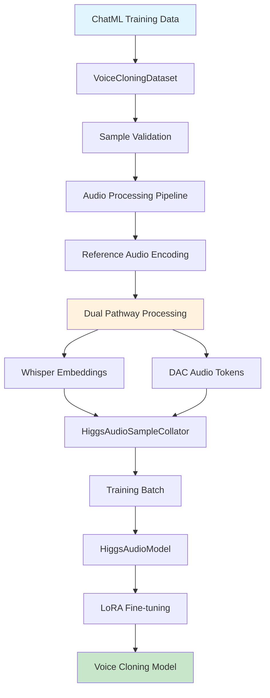
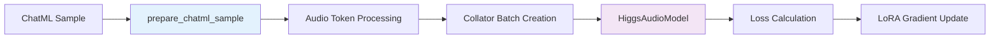
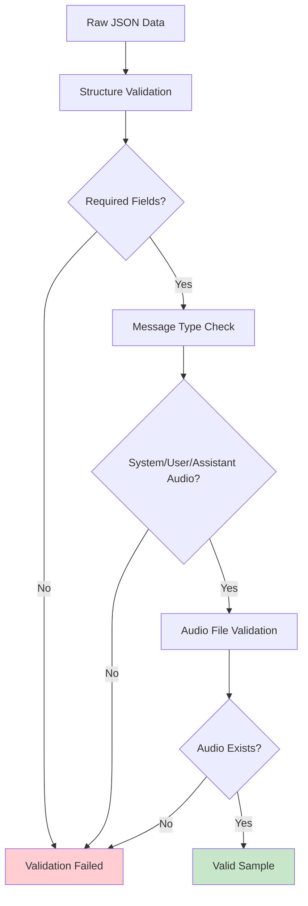
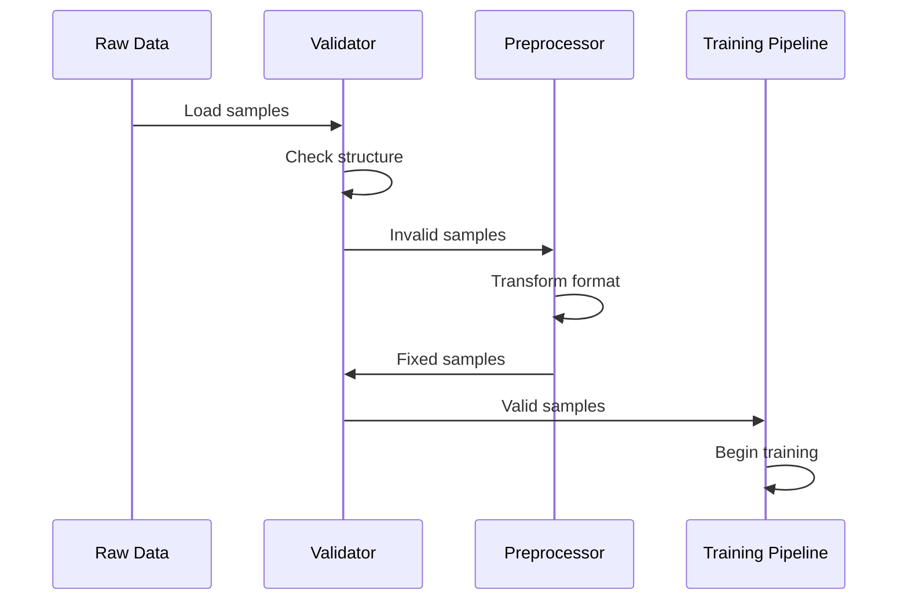

# Higgs Audio LoRA Training Pipeline Design

## Overview

This design document addresses the alignment of the Higgs Audio LoRA training pipeline with the inference implementation to ensure full compatibility for zero-shot voice cloning. The training pipeline follows the exact patterns from `arb_inference.py` and `generation.py` to maintain structural consistency with the original boson_multimodal architecture.

## Architecture

### Training Pipeline Flow



### Data Flow Alignment

The training pipeline maintains perfect alignment with inference by:

1. **ChatML Structure Consistency**: Uses identical message format as `arb_inference.py`
2. **Audio Processing Pipeline**: Follows same dual pathway (Whisper + DAC) as inference
3. **Reference Audio Conditioning**: Implements exact same conditioning mechanism
4. **Token Generation**: Uses `prepare_chatml_sample` from boson_multimodal

## Core Components

### 1. VoiceCloningDataset

**Location**: `trainer/dataset.py`

```python
class VoiceCloningDataset(Dataset):
    """
    Voice cloning dataset that EXACTLY matches arb_inference.py patterns.
    """
```

**Key Features**:
- Extracts components using `arb_inference.py` pattern
- Creates inference-aligned messages 
- Processes reference audio through dual pathway
- Maintains compatibility with existing collator

**Message Structure**:
```python
messages = [
    Message(role="system", content="Generate speech in the provided voice."),
    Message(role="user", content=ref_text),
    Message(role="assistant", content=AudioContent(audio_url=ref_audio_path)),
    Message(role="user", content=target_text)
]
```

### 2. Audio Processing Pipeline

**Dual Pathway Processing**:
- **Whisper Pathway**: 16kHz waveforms for semantic conditioning
- **DAC Pathway**: Audio tokens for acoustic modeling

**Reference Audio Handling**:
```python
def _process_reference_audio_dual_pathway(self, ref_audio_path: str):
    # Load and resample to 16kHz for Whisper
    waveform, sr = torchaudio.load(ref_audio_path)
    # Convert to mono and resample
    # Encode using DAC tokenizer
    audio_tokens = self.audio_tokenizer.encode(ref_audio_path)
    return waveform_16k, audio_tokens, target_sr
```

### 3. Data Collator Integration

**Location**: `boson_multimodal/data_collator/higgs_audio_collator.py`

The existing `HiggsAudioSampleCollator` is used without modification, ensuring:
- Whisper embedding configuration alignment
- Audio token processing consistency
- Batch formatting compatibility

**Key Configuration**:
```python
collator = HiggsAudioSampleCollator(
    whisper_processor=whisper_processor,
    encode_whisper_embed=True,  # Force enable for voice cloning
    return_audio_in_tokens=False,  # Match serve_engine.py
    round_to=1,  # Fixed rounding
    audio_num_codebooks=12
)
```

### 4. Training Loop Architecture

**Location**: `trainer/trainer.py`



**Loss Components**:
- **Text Loss**: Cross-entropy on text tokens
- **Audio Loss**: Multi-codebook cross-entropy (12 codebooks)
- **Consistency Loss**: Voice similarity preservation

## Data Format Requirements

### Expected ChatML Format

```json
{
  "messages": [
    {
      "role": "system",
      "content": "Generate speech in the provided voice."
    },
    {
      "role": "user", 
      "content": "Reference text spoken in the audio"
    },
    {
      "role": "assistant",
      "content": {
        "type": "audio",
        "audio_url": "path/to/reference_audio.wav"
      }
    },
    {
      "role": "user",
      "content": "Target text to generate speech for"
    }
  ],
  "speaker": "speaker_id",
  "start_index": 3
}
```

### Data Validation Pipeline



## Error Resolution

### Current Issue: "Missing required message types"

**Root Cause**: Training data samples lack the expected ChatML structure with:
- System message
- User message  
- Assistant message with audio content

**Solution**: Implement data preprocessing pipeline to transform existing data into correct format:

```python
def fix_chatml_format(samples):
    """Transform data into proper ChatML format."""
    fixed_samples = []
    for sample in samples:
        # Extract components from various formats
        ref_audio, ref_text, target_text = extract_components(sample)
        
        # Create proper ChatML structure
        fixed_sample = {
            "messages": [
                {"role": "system", "content": "Generate speech in the provided voice."},
                {"role": "user", "content": ref_text},
                {"role": "assistant", "content": {"type": "audio", "audio_url": ref_audio}},
                {"role": "user", "content": target_text}
            ],
            "speaker": sample.get("speaker", "unknown"),
            "start_index": 3
        }
        fixed_samples.append(fixed_sample)
    
    return fixed_samples
```

### Data Processing Pipeline



## Distributed Training Configuration

### 8xH200 Setup

**Hardware Configuration**:
- 8× NVIDIA H200 GPUs (192GB total VRAM)
- 128-core CPU
- High-bandwidth GPU interconnect

**Optimized Parameters**:
```bash
# Environment Variables
export CUDA_VISIBLE_DEVICES=0,1,2,3,4,5,6,7
export OMP_NUM_THREADS=16  # 128 cores / 8 GPUs
export NCCL_IB_DISABLE=0   # Enable InfiniBand
export PYTORCH_CUDA_ALLOC_CONF=max_split_size_mb:512

# Training Parameters
--batch_size 4                    # Per GPU
--gradient_accumulation_steps 4   # Effective batch: 128
--learning_rate 5e-4
--lora_r 64                       # High rank for quality
--lora_alpha 128
--dataloader_num_workers 16       # CPU optimization
--mixed_precision                 # Memory efficiency
--use_gradient_checkpointing      # Memory savings
```

### Launch Configuration

```bash
torchrun \
    --nproc_per_node=8 \
    --nnodes=1 \
    --node_rank=0 \
    --master_addr="localhost" \
    --master_port=29500 \
    trainer/train.py \
    --train_data data/chatml_samples.json \
    --batch_size 4 \
    --learning_rate 5e-4 \
    --num_epochs 3 \
    --lora_r 64
```

## Model Configuration

### LoRA Target Modules

```python
target_modules = [
    # Attention modules
    "self_attn.q_proj", "self_attn.k_proj", 
    "self_attn.v_proj", "self_attn.o_proj",
    
    # FFN modules  
    "mlp.gate_proj", "mlp.up_proj", "mlp.down_proj",
    
    # DualFFN audio modules
    "audio_mlp.gate_proj", "audio_mlp.up_proj", "audio_mlp.down_proj",
    
    # Head modules
    "text_lm_head", "audio_lm_head"
]
```

### Loss Function Configuration

```python
def compute_loss(self, model_outputs, batch):
    """Compute combined loss for voice cloning."""
    text_loss = compute_text_loss(model_outputs.text_logits, batch.label_ids)
    audio_loss = compute_audio_loss(model_outputs.audio_logits, batch.label_audio_ids)
    consistency_loss = compute_consistency_loss(model_outputs, batch)
    
    total_loss = (
        self.config.text_loss_weight * text_loss +
        self.config.audio_loss_weight * audio_loss +
        self.config.consistency_loss_weight * consistency_loss
    )
    
    return total_loss
```

## Integration Points

### 1. Boson Multimodal Compatibility

**Critical Requirements**:
- Use existing `prepare_chatml_sample` function
- Maintain `ChatMLDatasetSample` structure
- Preserve audio tokenizer interface
- Keep collator configuration identical

### 2. Inference Pipeline Alignment

**Verification Points**:
- Message structure matches `arb_inference.py`
- Audio processing follows same pathway
- Token generation uses identical patterns
- Model outputs compatible with inference

### 3. Generation Pattern Consistency

**Key Alignments**:
- Chunk-based generation approach
- Audio context propagation
- Teacher forcing implementation
- Stop token handling

## Testing Strategy

### 1. Data Validation Tests

```python
def test_chatml_format():
    """Test ChatML format compliance."""
    dataset = VoiceCloningDataset(data_path, tokenizer, audio_tokenizer)
    sample = dataset[0]
    
    # Verify structure
    assert hasattr(sample, 'input_ids')
    assert hasattr(sample, 'audio_ids_concat')
    assert hasattr(sample, 'audio_waveforms_concat')
```

### 2. Inference Compatibility Tests

```python
def test_inference_alignment():
    """Test training-inference compatibility."""
    # Load trained model
    model = load_lora_model(checkpoint_path)
    
    # Test with arb_inference.py patterns
    result = arb_inference.generate_arabic_speech(
        ref_text, ref_audio_path, target_text
    )
    
    assert result is not None
    assert len(result[0]) > 0  # Generated audio
```

### 3. Performance Validation

```python
def test_distributed_training():
    """Test 8xH200 distributed setup."""
    # Verify GPU utilization
    # Check memory efficiency
    # Validate gradient synchronization
```

## Troubleshooting Guide

### Common Issues

1. **"Missing required message types"**
   - **Cause**: Incorrect ChatML format
   - **Solution**: Use data preprocessing pipeline

2. **"boson_multimodal not found"**
   - **Cause**: Incorrect working directory
   - **Solution**: Run from higgs-audio root

3. **Audio token mismatch**
   - **Cause**: Collator configuration mismatch
   - **Solution**: Verify collator settings match inference

4. **CUDA memory issues**
   - **Cause**: Batch size too large
   - **Solution**: Reduce batch size, enable gradient checkpointing

### Debugging Commands

```bash
# Validate dataset format
python trainer/train.py --validate_data_only --train_data data/samples.json

# Test environment
python trainer/train.py --create_sample_data data/test_samples.json

# Quick training test
python trainer/train.py --quick_test --train_data data/samples.json
```

## Performance Optimization

### Memory Efficiency

```python
# Gradient checkpointing
use_gradient_checkpointing=True

# Mixed precision training  
mixed_precision="bf16"

# Dynamic batching
gradient_accumulation_steps=4
```

### Compute Optimization

```python
# Static KV cache for inference
use_static_kv_cache=True

# Optimal worker count
dataloader_num_workers=16  # 128 cores / 8 GPUs

# Flash attention
torch.backends.cuda.enable_flash_sdp(True)
```

## Deployment Workflow

### 1. Training Phase

```bash
# Launch distributed training
bash scripts/launch_8xh200_training.sh \
    --train_data data/chatml_samples.json \
    --output_dir checkpoints/voice_cloning \
    --num_epochs 3
```

### 2. Model Merging

```bash
# Merge LoRA weights
python scripts/training/merge_lora_weights.py \
    --base_model bosonai/higgs-audio-v2-generation-3B-base \
    --lora_path checkpoints/voice_cloning \
    --output_path models/voice_cloning_merged
```

### 3. Inference Testing

```bash
# Test with Arabic inference
python arb_inference.py \
    --chatml_file data/test_samples.json \
    --output_dir results/arabic_voice_cloning \
    --model_path models/voice_cloning_merged
```

## Monitoring and Validation

### Training Metrics

```python
metrics_to_track = {
    "text_loss": "Cross-entropy on text tokens",
    "audio_loss": "Multi-codebook audio loss", 
    "consistency_loss": "Voice similarity preservation",
    "gradient_norm": "Gradient clipping monitoring",
    "learning_rate": "Adaptive learning rate",
    "memory_usage": "GPU memory utilization"
}
```

### Quality Validation

```python
def validate_voice_quality():
    """Validate generated voice quality."""
    # Speaker similarity metrics
    # Audio quality assessment
    # Pronunciation accuracy
    # Emotional consistency
```

This design ensures full compatibility between the training pipeline and the existing inference implementation while leveraging the 8xH200 distributed setup for efficient LoRA fine-tuning of the Higgs Audio model for zero-shot voice cloning.