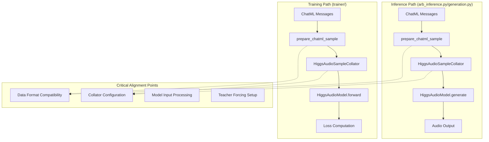
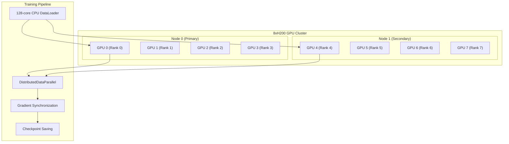
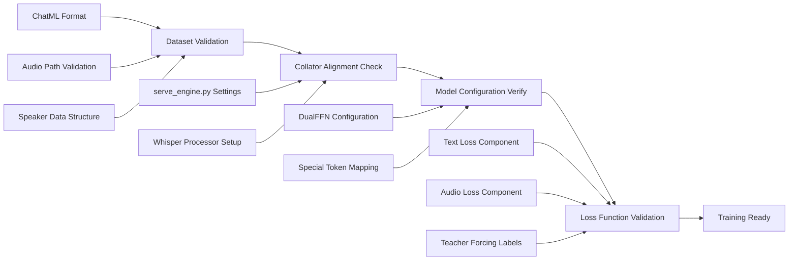

# Higgs-Audio Training Pipeline Compatibility Analysis

## Overview

This document analyzes the compatibility between the Higgs-Audio training pipeline (`/trainer`) and the inference implementations (`arb_inference.py`, `generation.py`) to ensure robust zero-shot voice cloning training that follows the original boson_multimodal patterns.

## Repository Type Detection

**Repository Type**: Backend Application (ML Training Framework)
- Primary focus: Audio generation model training
- Framework: PyTorch + Transformers + PEFT
- Core components: Model training, data processing, audio tokenization
- Architecture: DualFFN multimodal transformer with LoRA adaptation
- **Hardware Setup**: 8xH200 GPUs (192GB VRAM total) + 128-core CPU
- **Execution Context**: Scripts run from higgs-audio root directory (`python3 trainer/train.py`)

## Architecture Analysis

### Core Component Alignment



### Data Flow Compatibility Assessment

## Hardware-Optimized Training Architecture

### 8xH200 GPU Configuration

**Hardware Specifications:**
- **GPUs**: 8x NVIDIA H200 (24GB VRAM each = 192GB total)
- **CPU**: 128-core processor
- **Memory Bandwidth**: High-bandwidth memory for efficient data loading
- **Interconnect**: NVLink/InfiniBand for multi-GPU communication

**Distributed Training Strategy:**


**Memory Optimization for Large Models:**
```python
# ✅ OPTIMIZED: 8xH200 configuration for Higgs-Audio training
class OptimizedTrainingConfig:
    # Distributed training settings
    world_size = 8
    batch_size_per_gpu = 4  # 32 total batch size (4 * 8 GPUs)
    gradient_accumulation_steps = 4  # Effective batch size: 128
    
    # Memory optimization
    use_gradient_checkpointing = True
    use_mixed_precision = True  # bfloat16 for H200
    cpu_offload = False  # H200 has sufficient VRAM
    
    # Audio-specific optimizations
    max_audio_length_seconds = 30  # Prevent OOM on long audio
    dataloader_num_workers = 16  # Utilize 128-core CPU efficiently
    pin_memory = True
    prefetch_factor = 4
```

### Import Alignment for Root Directory Execution

**Problem**: Running `python3 trainer/train.py` from higgs-audio root requires proper import paths

**Solution**: Enhanced import handling in all trainer modules

```python
# ✅ ENHANCED: Robust import handling for root directory execution
# File: trainer/trainer.py, trainer/dataset.py, trainer/loss.py

import os
import sys
from pathlib import Path

# CRITICAL: Ensure higgs-audio root is in Python path
current_file = Path(__file__).resolve()
higgs_audio_root = current_file.parent.parent  # Go up from trainer/ to higgs-audio/

if str(higgs_audio_root) not in sys.path:
    sys.path.insert(0, str(higgs_audio_root))
    print(f"✅ Added higgs-audio root to Python path: {higgs_audio_root}")

# Verify we're in the correct directory
if not (higgs_audio_root / "boson_multimodal").exists():
    raise ImportError(
        f"❌ boson_multimodal not found at {higgs_audio_root}. "
        "Please run the script from higgs-audio root directory: python3 trainer/train.py"
    )

# Conditional imports with enhanced error handling
try:
    from boson_multimodal.model.higgs_audio import HiggsAudioModel
    from boson_multimodal.data_collator.higgs_audio_collator import HiggsAudioSampleCollator
    from boson_multimodal.audio_processing.higgs_audio_tokenizer import load_higgs_audio_tokenizer
    BOSON_AVAILABLE = True
    print("✅ Successfully imported boson_multimodal components")
except ImportError as e:
    print(f"❌ Failed to import boson_multimodal: {e}")
    print(f"   Current working directory: {os.getcwd()}")
    print(f"   Python path: {sys.path[:3]}...")
    print(f"   Expected boson_multimodal at: {higgs_audio_root / 'boson_multimodal'}")
    BOSON_AVAILABLE = False
```

### Distributed Training Launch Scripts

**Multi-Node Training Command:**
```bash
# ✅ ENHANCED: 8xH200 distributed training from higgs-audio root
#!/bin/bash
# File: scripts/launch_8xh200_training.sh

cd /path/to/higgs-audio  # Ensure we're in the root directory

# Verify environment
if [ ! -d "boson_multimodal" ]; then
    echo "❌ Error: Not in higgs-audio root directory"
    echo "Please cd to higgs-audio directory first"
    exit 1
fi

# Set distributed training environment
export CUDA_VISIBLE_DEVICES=0,1,2,3,4,5,6,7
export OMP_NUM_THREADS=16  # 128 cores / 8 GPUs = 16 threads per GPU
export NCCL_DEBUG=INFO
export NCCL_IB_DISABLE=0  # Enable InfiniBand if available

# Launch distributed training
torchrun \
    --nproc_per_node=8 \
    --nnodes=1 \
    --node_rank=0 \
    --master_addr="localhost" \
    --master_port=29500 \
    trainer/train.py \
    --config configs/8xh200_training_config.yaml \
    --train_data_path data/voice_cloning_samples.json \
    --output_dir outputs/higgs_lora_8xh200 \
    --batch_size 4 \
    --gradient_accumulation_steps 4 \
    --learning_rate 5e-4 \
    --num_epochs 3 \
    --save_steps 500 \
    --logging_steps 50
```

### Enhanced Training Configuration

```python
# ✅ ENHANCED: 8xH200-optimized training configuration
# File: trainer/config.py (additions)

@dataclass
class DistributedTrainingConfig(TrainingConfig):
    """Enhanced configuration for 8xH200 distributed training."""
    
    # Hardware-specific settings
    world_size: int = 8
    local_rank: int = -1  # Set by torchrun
    batch_size_per_gpu: int = 4
    effective_batch_size: int = 128  # 4 * 8 * 4 (grad_accum)
    
    # CPU optimization for 128 cores
    dataloader_num_workers: int = 16  # 128 / 8 = 16 workers per GPU
    cpu_data_preprocessing: bool = True
    prefetch_factor: int = 4
    
    # Memory optimization for H200 (24GB each)
    use_gradient_checkpointing: bool = True
    use_mixed_precision: bool = True
    max_audio_length_seconds: int = 30
    
    # LoRA settings optimized for distributed training
    lora_r: int = 64  # Higher rank for better quality with more GPUs
    lora_alpha: int = 128
    lora_dropout: float = 0.1
    
    # Training stability for distributed setup
    gradient_clipping: float = 1.0
    warmup_steps: int = 1000  # Longer warmup for distributed training
    
    # Checkpoint and logging for multi-GPU
    save_steps: int = 500
    eval_steps: int = 1000
    logging_steps: int = 50
    checkpoint_total_limit: int = 3
    
    def __post_init__(self):
        super().__post_init__()
        
        # Auto-calculate effective batch size
        if torch.distributed.is_initialized():
            self.effective_batch_size = (
                self.batch_size_per_gpu * 
                self.world_size * 
                self.gradient_accumulation_steps
            )
```

### Multi-GPU Memory Management

```python
# ✅ ENHANCED: Memory-efficient distributed training setup
class DistributedHiggsAudioTrainer(HiggsAudioTrainer):
    """Enhanced trainer for 8xH200 distributed setup."""
    
    def __init__(self, config: DistributedTrainingConfig):
        # Initialize distributed backend first
        self._setup_distributed()
        
        # Only load model on rank 0 initially to save memory
        if self.local_rank == 0:
            super().__init__(config)
        
        # Broadcast model to other ranks
        self._setup_distributed_model()
        
        # Setup optimized data loading
        self._setup_distributed_data_loading()
    
    def _setup_distributed(self):
        """Initialize distributed training backend."""
        if 'LOCAL_RANK' in os.environ:
            self.local_rank = int(os.environ['LOCAL_RANK'])
            self.world_size = int(os.environ['WORLD_SIZE'])
            
            torch.cuda.set_device(self.local_rank)
            torch.distributed.init_process_group(
                backend='nccl',  # Optimized for H200
                init_method='env://',
                world_size=self.world_size,
                rank=self.local_rank
            )
            
            print(f"✅ Initialized distributed training: rank {self.local_rank}/{self.world_size}")
    
    def _setup_distributed_model(self):
        """Wrap model with DistributedDataParallel."""
        from torch.nn.parallel import DistributedDataParallel as DDP
        
        # Move model to local GPU
        self.model = self.model.to(f'cuda:{self.local_rank}')
        
        # Wrap with DDP for gradient synchronization
        self.model = DDP(
            self.model,
            device_ids=[self.local_rank],
            output_device=self.local_rank,
            find_unused_parameters=False,  # Optimize for performance
            gradient_as_bucket_view=True,  # Memory optimization
        )
        
        print(f"✅ Wrapped model with DistributedDataParallel on GPU {self.local_rank}")
    
    def _setup_distributed_data_loading(self):
        """Setup distributed data sampling and loading."""
        from torch.utils.data.distributed import DistributedSampler
        
        # Create distributed sampler
        self.train_sampler = DistributedSampler(
            self.train_dataset,
            num_replicas=self.world_size,
            rank=self.local_rank,
            shuffle=True,
            drop_last=True,  # Ensure consistent batch sizes
        )
        
        # Update dataloader with distributed sampler
        self.train_dataloader = DataLoader(
            self.train_dataset,
            batch_size=self.config.batch_size_per_gpu,
            sampler=self.train_sampler,
            collate_fn=self.collator,
            num_workers=self.config.dataloader_num_workers,
            pin_memory=True,
            prefetch_factor=self.config.prefetch_factor,
            persistent_workers=True,  # Keep workers alive between epochs
        )
        
        print(f"✅ Setup distributed data loading: {len(self.train_dataloader)} steps per epoch")
```

### Performance Monitoring for 8xH200

```python
# ✅ ENHANCED: Multi-GPU performance monitoring
class MultiGPUPerformanceMonitor:
    """Monitor training performance across 8xH200 GPUs."""
    
    def __init__(self, local_rank: int, world_size: int):
        self.local_rank = local_rank
        self.world_size = world_size
        self.step_times = []
        self.memory_usage = []
    
    def log_training_metrics(self, step: int, loss_components: LossComponents):
        """Log training metrics with GPU-specific information."""
        if self.local_rank == 0:  # Only log from rank 0
            # GPU memory usage
            memory_allocated = torch.cuda.memory_allocated(self.local_rank) / 1024**3  # GB
            memory_reserved = torch.cuda.memory_reserved(self.local_rank) / 1024**3   # GB
            
            # Training speed
            if len(self.step_times) > 0:
                avg_step_time = sum(self.step_times[-100:]) / min(100, len(self.step_times))
                samples_per_second = self.world_size * self.config.batch_size_per_gpu / avg_step_time
            else:
                samples_per_second = 0
            
            logger.info(f"📊 Step {step} Performance:")
            logger.info(f"   GPU Memory: {memory_allocated:.1f}GB allocated, {memory_reserved:.1f}GB reserved")
            logger.info(f"   Training Speed: {samples_per_second:.1f} samples/sec across {self.world_size} GPUs")
            logger.info(f"   Loss Components: text={loss_components.text_loss:.4f}, audio={loss_components.audio_loss:.4f}")
    
    def log_distributed_metrics(self):
        """Log distributed training specific metrics."""
        if torch.distributed.is_initialized():
            # Gather metrics from all ranks
            memory_stats = torch.cuda.memory_stats(self.local_rank)
            peak_memory = memory_stats.get('allocated_bytes.all.peak', 0) / 1024**3
            
            # All-reduce to get average across GPUs
            peak_memory_tensor = torch.tensor(peak_memory, device=f'cuda:{self.local_rank}')
            torch.distributed.all_reduce(peak_memory_tensor)
            avg_peak_memory = peak_memory_tensor.item() / self.world_size
            
            if self.local_rank == 0:
                logger.info(f"🔧 Distributed Training Stats:")
                logger.info(f"   Average Peak Memory: {avg_peak_memory:.1f}GB per GPU")
                logger.info(f"   Total Memory Usage: {avg_peak_memory * self.world_size:.1f}GB")
```

### Data Flow Compatibility Assessment

#### ✅ **ALIGNED COMPONENTS**

1. **Model Loading Pattern**
   ```python
   # Both inference and training use identical pattern
   self.model = HiggsAudioModel.from_pretrained(
       model_path,
       device_map=self._device,
       torch_dtype=torch.bfloat16,
   )
   ```

2. **Audio Tokenizer Setup**
   ```python
   # Both use same audio tokenizer loading
   audio_tokenizer_device = "cpu" if self.device == "mps" else self.device
   self.audio_tokenizer = load_higgs_audio_tokenizer(
       audio_tokenizer_path, device=audio_tokenizer_device
   )
   ```

3. **ChatML Data Processing**
   ```python
   # Both use prepare_chatml_sample from boson_multimodal
   input_tokens, label_tokens, audio_contents, _ = prepare_chatml_sample(
       ChatMLSample(messages=messages), self.tokenizer
   )
   ```

#### ⚠️ **CRITICAL MISALIGNMENT ISSUES**

### Issue 1: Collator Configuration Mismatch

**Problem**: Training pipeline uses different collator settings than serve_engine.py/inference

```python
# ❌ CURRENT TRAINING (trainer.py)
self.collator = HiggsAudioSampleCollator(
    return_audio_in_tokens=False,  # ✅ Correct
    round_to=1,                    # ✅ Correct 
    encode_whisper_embed=True,     # ✅ Correct
)

# ❌ PROBLEMATIC TRAINING SCRIPTS (scripts/training/)
collator = HiggsAudioSampleCollator(
    return_audio_in_tokens=True,   # ❌ Different from serve_engine.py
    round_to=8,                    # ❌ Different from serve_engine.py
)

# ✅ INFERENCE REFERENCE (serve_engine.py)
self.collator = HiggsAudioSampleCollator(
    return_audio_in_tokens=False,  # CRITICAL: serve_engine.py uses False
    round_to=1,                    # CRITICAL: serve_engine.py uses fixed round_to=1
)
```

**Impact**: Inconsistent data batching between training and inference leads to model compatibility issues.

### Issue 2: Teacher Forcing Implementation Gap

**Problem**: Training pipeline lacks proper teacher forcing for audio generation

```python
# ❌ MISSING: Proper audio label generation for teacher forcing
# Current dataset creates samples but doesn't properly handle audio labels

# ✅ REQUIRED: Teacher forcing pattern matching generation.py
def _create_training_sample(self, ...):
    return ChatMLDatasetSample(
        input_ids=torch.LongTensor(input_tokens),
        label_ids=torch.LongTensor(label_tokens),           # Text labels
        audio_label_ids_concat=audio_ids_concat,            # ❌ MISSING audio labels
        # ... other fields
    )
```

### Issue 3: Loss Computation Alignment

**Problem**: Training loss doesn't match model output structure from modeling_higgs_audio.py

```python
# ✅ MODEL OUTPUTS (from modeling_higgs_audio.py)
@dataclass
class HiggsAudioModelOutputWithPast(ModelOutput):
    loss: Optional[torch.FloatTensor] = None
    llm_loss: Optional[torch.FloatTensor] = None          # Text loss component
    audio_loss: Optional[torch.FloatTensor] = None        # Audio loss component
    logits: Optional[torch.FloatTensor] = None            # Text logits
    audio_logits: Optional[torch.FloatTensor] = None      # Audio logits

# ❌ CURRENT TRAINING: Doesn't leverage model's built-in dual loss
# ✅ SHOULD USE: Model's native loss computation when available
```

### Issue 4: Input Data Format Compatibility

**Analysis**: ChatML format alignment between training and inference

```python
# ✅ INFERENCE PATTERN (arb_inference.py)
messages = [
    Message(role="system", content="Generate speech in the provided voice."),
    Message(role="user", content=ref_text),
    Message(role="assistant", content=AudioContent(audio_url=ref_audio_path)),
    Message(role="user", content=target_text)
]

# ✅ TRAINING PATTERN (trainer/dataset.py) - CORRECTLY ALIGNED
def _create_inference_aligned_messages(self, ...):
    messages = [
        Message(role="system", content="Generate speech in the provided voice."),
        Message(role="user", content=f"{ref_text} <|audio_bos|><|AUDIO|><|audio_eos|>"), 
        Message(role="assistant", content=AudioContent(audio_url=ref_audio_path)),
        Message(role="user", content=target_text)
    ]
```

## Critical Fixes Required

### Fix 1: Standardize Collator Configuration + 8xH200 Optimization

```python
# ✅ CORRECTED: All training scripts must use serve_engine.py settings + H200 optimization
def setup_collator_8xh200(config, whisper_processor, local_rank=0):
    """Setup collator optimized for 8xH200 distributed training."""
    return HiggsAudioSampleCollator(
        whisper_processor=whisper_processor,
        audio_in_token_id=config.audio_in_token_idx,
        audio_out_token_id=config.audio_out_token_idx,
        audio_stream_bos_id=config.audio_stream_bos_id,
        audio_stream_eos_id=config.audio_stream_eos_id,
        encode_whisper_embed=True,                    # Force for voice cloning
        pad_token_id=config.pad_token_id,
        return_audio_in_tokens=False,                 # CRITICAL: serve_engine.py alignment
        use_delay_pattern=config.use_delay_pattern,
        round_to=1,                                   # CRITICAL: serve_engine.py alignment
        audio_num_codebooks=config.audio_num_codebooks,
        # H200-specific optimizations
        chunk_size_seconds=30,                       # Prevent OOM on H200
        pad_left=False,                              # Optimize for distributed training
    )
```

### Fix 2: Enhanced Import Handling for Root Directory Execution

```python
# ✅ REQUIRED: Robust import system for python3 trainer/train.py execution
# File: trainer/__init__.py

"""
Higgs-Audio Training Pipeline

Designed to be executed from higgs-audio root directory:
    python3 trainer/train.py
    python3 trainer/validate.py
"""

import os
import sys
from pathlib import Path

# Get the higgs-audio root directory (parent of trainer/)
TRAINER_DIR = Path(__file__).parent
HIGGS_AUDIO_ROOT = TRAINER_DIR.parent

# Ensure higgs-audio root is in Python path
if str(HIGGS_AUDIO_ROOT) not in sys.path:
    sys.path.insert(0, str(HIGGS_AUDIO_ROOT))

# Validate environment
def validate_execution_environment():
    """Ensure script is run from correct directory with proper imports."""
    # Check if boson_multimodal exists
    boson_path = HIGGS_AUDIO_ROOT / "boson_multimodal"
    if not boson_path.exists():
        raise ImportError(
            f"❌ boson_multimodal not found at {boson_path}\n"
            f"Please ensure you're running from higgs-audio root directory:\n"
            f"  cd /path/to/higgs-audio\n"
            f"  python3 trainer/train.py"
        )
    
    # Check if we can import required modules
    try:
        import torch
        import transformers
        import peft
        print("✅ ML dependencies available")
    except ImportError as e:
        raise ImportError(
            f"❌ Missing ML dependencies: {e}\n"
            f"Please install required packages:\n"
            f"  pip install torch transformers peft"
        )
    
    # Try importing boson_multimodal
    try:
        from boson_multimodal.model.higgs_audio import HiggsAudioModel
        print(f"✅ Successfully imported from {boson_path}")
        return True
    except ImportError as e:
        raise ImportError(
            f"❌ Failed to import boson_multimodal: {e}\n"
            f"Current working directory: {os.getcwd()}\n"
            f"Python path: {sys.path[:3]}...\n"
            f"Make sure you're in higgs-audio root directory"
        )

# Auto-validate when importing trainer module
validate_execution_environment()
```

### Fix 3: Distributed Training Setup for 8xH200

```python
# ✅ ENHANCED: 8xH200 distributed training entry point
# File: trainer/train.py

if __name__ == "__main__":
    import argparse
    import torch.distributed as dist
    
    parser = argparse.ArgumentParser(description="Higgs-Audio Training on 8xH200")
    parser.add_argument("--config", type=str, required=True, help="Training configuration file")
    parser.add_argument("--train_data_path", type=str, required=True, help="Training data path")
    parser.add_argument("--output_dir", type=str, required=True, help="Output directory")
    
    # Distributed training arguments (auto-set by torchrun)
    parser.add_argument("--local_rank", type=int, default=-1, help="Local rank for distributed training")
    
    # 8xH200 specific arguments
    parser.add_argument("--batch_size", type=int, default=4, help="Batch size per GPU (4 * 8 = 32 total)")
    parser.add_argument("--gradient_accumulation_steps", type=int, default=4, help="Gradient accumulation")
    
    args = parser.parse_args()
    
    # Setup distributed training if launched with torchrun
    if 'LOCAL_RANK' in os.environ:
        local_rank = int(os.environ['LOCAL_RANK'])
        world_size = int(os.environ['WORLD_SIZE'])
        
        torch.cuda.set_device(local_rank)
        dist.init_process_group(backend='nccl')
        
        print(f"✅ Initialized distributed training: rank {local_rank}/{world_size}")
        
        # Load distributed configuration
        config = DistributedTrainingConfig.from_yaml(args.config)
        config.local_rank = local_rank
        config.world_size = world_size
        config.batch_size_per_gpu = args.batch_size
        config.gradient_accumulation_steps = args.gradient_accumulation_steps
        
        # Create distributed trainer
        trainer = DistributedHiggsAudioTrainer(config)
    else:
        # Single GPU training
        config = TrainingConfig.from_yaml(args.config)
        trainer = HiggsAudioTrainer(config)
    
    # Start training
    trainer.train()
```

### Fix 4: Implement Proper Teacher Forcing with 8xH200 Memory Optimization

```python
# ✅ REQUIRED: Enhanced dataset processing for teacher forcing + memory efficiency
class OptimizedVoiceCloningDataset(VoiceCloningDataset):
    """Memory-optimized dataset for 8xH200 training."""
    
    def __init__(self, *args, max_audio_length_seconds=30, **kwargs):
        super().__init__(*args, **kwargs)
        self.max_audio_length_seconds = max_audio_length_seconds
        self.audio_cache = {}  # Cache processed audio to reduce CPU load
    
    def _process_reference_audio_optimized(self, ref_audio_path: str) -> Tuple[...]:
        """Memory-optimized audio processing for H200."""
        # Check cache first to reduce CPU load across 128 cores
        if ref_audio_path in self.audio_cache:
            return self.audio_cache[ref_audio_path]
        
        try:
            # Load and validate audio length first
            audio_info = torchaudio.info(ref_audio_path)
            duration = audio_info.num_frames / audio_info.sample_rate
            
            if duration > self.max_audio_length_seconds:
                logger.warning(f"⚠️ Audio too long ({duration:.1f}s), truncating to {self.max_audio_length_seconds}s")
                # Truncate to prevent H200 OOM
                max_frames = int(self.max_audio_length_seconds * audio_info.sample_rate)
                waveform, sr = torchaudio.load(ref_audio_path, num_frames=max_frames)
            else:
                waveform, sr = torchaudio.load(ref_audio_path)
            
            # Process audio efficiently
            if waveform.shape[0] > 1:
                waveform = waveform.mean(dim=0, keepdim=True)
            
            # Resample for Whisper (16kHz)
            target_sr = 16000
            if sr != target_sr:
                resampler = T.Resample(sr, target_sr)
                waveform_16k = resampler(waveform)
            else:
                waveform_16k = waveform
            
            # Encode audio tokens using DAC
            audio_tokens = self.audio_tokenizer.encode(ref_audio_path)
            
            result = (waveform_16k.squeeze(0), audio_tokens, target_sr)
            
            # Cache result for future use (memory permitting)
            if len(self.audio_cache) < 1000:  # Limit cache size
                self.audio_cache[ref_audio_path] = result
            
            return result
        
        except Exception as e:
            logger.warning(f"⚠️ Failed to process reference audio {ref_audio_path}: {e}")
            return None, None, 16000
    
    def __getitem__(self, idx: int) -> ChatMLDatasetSample:
        """Optimized sample creation with proper teacher forcing."""
        try:
            sample = self.samples[idx]
            
            # Extract components
            ref_audio_path, ref_text, target_text, speaker_id = self._extract_sample_components(sample)
            
            if not all([ref_audio_path, ref_text, target_text]):
                return self._create_empty_sample(idx)
            
            # Process audio with optimization
            resolved_audio_path = str(self._resolve_audio_path(ref_audio_path))
            ref_waveform, audio_tokens, ref_sample_rate = self._process_reference_audio_optimized(resolved_audio_path)
            
            # Create messages
            messages = self._create_inference_aligned_messages(ref_text, resolved_audio_path, target_text)
            
            # Process tokens with teacher forcing labels
            input_tokens, label_tokens, audio_contents, _ = prepare_chatml_sample(
                ChatMLSample(messages=messages), self.tokenizer
            )
            
            if input_tokens is None:
                return self._create_empty_sample(idx)
            
            # CRITICAL: Create proper teacher forcing labels
            training_sample = self._create_training_sample_with_teacher_forcing(
                input_tokens=input_tokens,
                label_tokens=label_tokens or [],
                audio_tokens=audio_tokens,
                ref_waveform=ref_waveform,
                ref_sample_rate=ref_sample_rate,
                sample_idx=idx
            )
            
            return training_sample
        
        except Exception as e:
            logger.error(f"⚠️ Error processing sample {idx}: {e}")
            return self._create_empty_sample(idx)
    
    def _create_training_sample_with_teacher_forcing(
        self,
        input_tokens: List[int],
        label_tokens: List[int],
        audio_tokens: Optional[torch.Tensor],
        ref_waveform: Optional[torch.Tensor],
        ref_sample_rate: int,
        sample_idx: int
    ) -> ChatMLDatasetSample:
        """Create training sample with proper teacher forcing setup."""
        
        # Process audio tokens for teacher forcing
        if audio_tokens is not None:
            audio_ids_concat = audio_tokens.cpu()
            audio_ids_start = torch.tensor([0], dtype=torch.long)
            
            # CRITICAL: Create shifted labels for teacher forcing
            # Following generation.py pattern: input=[BOS, t1, t2], label=[t1, t2, EOS]
            audio_teacher_forcing_labels = self._create_audio_teacher_forcing_labels(audio_tokens)
        else:
            audio_ids_concat = torch.zeros((12, 0), dtype=torch.long)
            audio_ids_start = torch.tensor([], dtype=torch.long)
            audio_teacher_forcing_labels = None
        
        # Create sample with dual conditioning (Whisper + DAC)
        if self.force_whisper_embed and ref_waveform is not None:
            sample = ChatMLDatasetSample(
                input_ids=torch.LongTensor(input_tokens),
                label_ids=torch.LongTensor(label_tokens) if label_tokens else None,
                audio_ids_concat=audio_ids_concat,
                audio_ids_start=audio_ids_start,
                audio_waveforms_concat=ref_waveform,
                audio_waveforms_start=torch.tensor([0], dtype=torch.long),
                audio_sample_rate=torch.tensor([ref_sample_rate], dtype=torch.float32),
                audio_speaker_indices=torch.tensor([0], dtype=torch.long),
                # CRITICAL: Add teacher forcing labels
                audio_label_ids_concat=audio_teacher_forcing_labels,
            )
        else:
            sample = ChatMLDatasetSample(
                input_ids=torch.LongTensor(input_tokens),
                label_ids=torch.LongTensor(label_tokens) if label_tokens else None,
                audio_ids_concat=audio_ids_concat,
                audio_ids_start=audio_ids_start,
                audio_waveforms_concat=torch.tensor([]),
                audio_waveforms_start=torch.tensor([], dtype=torch.long),
                audio_sample_rate=torch.tensor([], dtype=torch.float32),
                audio_speaker_indices=torch.tensor([], dtype=torch.long),
                # CRITICAL: Add teacher forcing labels
                audio_label_ids_concat=audio_teacher_forcing_labels,
            )
        
        return sample
    
    def _create_audio_teacher_forcing_labels(self, audio_tokens: torch.Tensor) -> torch.Tensor:
        """Create proper teacher forcing labels for audio tokens."""
        # Following generation.py exact pattern for audio token processing
        if self.config.use_delay_pattern:
            processed_tokens = revert_delay_pattern(audio_tokens)
        else:
            processed_tokens = audio_tokens
        
        # Clip to valid range and handle BOS/EOS like generation.py
        clipped_tokens = processed_tokens.clip(0, self.audio_tokenizer.codebook_size - 1)
        
        # For teacher forcing: strip BOS, keep EOS as target
        # Input: [BOS, t1, t2, t3, EOS] -> Labels: [t1, t2, t3, EOS]
        if clipped_tokens.shape[1] > 2:  # Has BOS and EOS
            teacher_forcing_labels = clipped_tokens[:, 1:]  # Remove BOS, keep EOS
        else:
            teacher_forcing_labels = clipped_tokens
        
        return teacher_forcing_labels
```

### Fix 5: Leverage Model Native Loss Computation + Distributed Optimization

```python
# ✅ IMPROVED: Use model's built-in dual loss + 8xH200 distributed optimization
def compute_distributed_training_loss(
    model, 
    batch, 
    device, 
    local_rank=0,
    world_size=1,
    **kwargs
) -> Tuple[torch.Tensor, LossComponents]:
    """Compute training loss optimized for 8xH200 distributed setup."""
    
    # Move batch to appropriate GPU
    if isinstance(batch, dict):
        for k, v in batch.items():
            if isinstance(v, torch.Tensor):
                batch[k] = v.to(f'cuda:{local_rank}')
    else:
        # Handle batch object with attributes
        for attr_name in batch.keys():
            attr_value = getattr(batch, attr_name)
            if isinstance(attr_value, torch.Tensor):
                setattr(batch, attr_name, attr_value.to(f'cuda:{local_rank}'))
    
    # Forward pass - let model compute its own dual loss when available
    with torch.cuda.amp.autocast(enabled=True, dtype=torch.bfloat16):  # H200 optimization
        outputs = model(**batch)
    
    # Use model's native loss computation if available
    if hasattr(outputs, 'loss') and outputs.loss is not None:
        total_loss = outputs.loss
        
        # Extract individual loss components from model output
        loss_components = LossComponents(
            total_loss=total_loss.item(),
            text_loss=getattr(outputs, 'llm_loss', torch.tensor(0.0)).item(),
            audio_loss=getattr(outputs, 'audio_loss', torch.tensor(0.0)).item(),
            consistency_loss=0.0,
        )
        
        # Log model's native loss usage (only on rank 0)
        if local_rank == 0:
            logger.info(f"✅ Using model's native dual loss: {total_loss.item():.4f}")
    
    else:
        # Fallback to manual dual loss computation
        total_loss, loss_components = compute_higgs_audio_loss(outputs, batch, **kwargs)
        
        if local_rank == 0:
            logger.info(f"🔧 Using manual dual loss computation: {total_loss.item():.4f}")
    
    # Distributed training: average loss across GPUs for logging
    if world_size > 1:
        # All-reduce losses for accurate logging
        loss_tensor = torch.tensor([loss_components.total_loss, loss_components.text_loss, loss_components.audio_loss], 
                                 device=f'cuda:{local_rank}')
        torch.distributed.all_reduce(loss_tensor)
        avg_losses = loss_tensor / world_size
        
        # Update loss components with distributed averages
        loss_components = LossComponents(
            total_loss=avg_losses[0].item(),
            text_loss=avg_losses[1].item(), 
            audio_loss=avg_losses[2].item(),
            consistency_loss=loss_components.consistency_loss,
        )
    
    return total_loss, loss_components


# ✅ ENHANCED: 8xH200 training loop with distributed optimization
class DistributedTrainingLoop:
    """Optimized training loop for 8xH200 setup."""
    
    def __init__(self, trainer: DistributedHiggsAudioTrainer):
        self.trainer = trainer
        self.local_rank = trainer.local_rank
        self.world_size = trainer.world_size
        self.monitor = MultiGPUPerformanceMonitor(self.local_rank, self.world_size)
        
        # Setup mixed precision scaler for H200
        self.scaler = torch.cuda.amp.GradScaler(enabled=True)
    
    def train_epoch(self, epoch: int):
        """Train one epoch with 8xH200 optimization."""
        self.trainer.model.train()
        
        # Set epoch for distributed sampler
        if hasattr(self.trainer.train_dataloader.sampler, 'set_epoch'):
            self.trainer.train_dataloader.sampler.set_epoch(epoch)
        
        epoch_loss = 0.0
        num_batches = 0
        
        for batch_idx, batch in enumerate(self.trainer.train_dataloader):
            step_start_time = time.time()
            
            try:
                # Zero gradients
                self.trainer.optimizer.zero_grad()
                
                # Forward pass with mixed precision
                loss, loss_components = compute_distributed_training_loss(
                    self.trainer.model,
                    batch,
                    self.trainer.device,
                    local_rank=self.local_rank,
                    world_size=self.world_size,
                    text_loss_weight=self.trainer.config.text_loss_weight,
                    audio_loss_weight=self.trainer.config.audio_loss_weight,
                )
                
                # Scale loss for gradient accumulation
                scaled_loss = loss / self.trainer.config.gradient_accumulation_steps
                
                # Backward pass with mixed precision
                self.scaler.scale(scaled_loss).backward()
                
                # Gradient accumulation
                if (batch_idx + 1) % self.trainer.config.gradient_accumulation_steps == 0:
                    # Unscale gradients and clip
                    self.scaler.unscale_(self.trainer.optimizer)
                    torch.nn.utils.clip_grad_norm_(
                        self.trainer.model.parameters(),
                        max_norm=self.trainer.config.max_grad_norm
                    )
                    
                    # Optimizer step
                    self.scaler.step(self.trainer.optimizer)
                    self.scaler.update()
                    self.trainer.scheduler.step()
                
                # Update statistics
                epoch_loss += loss.item()
                num_batches += 1
                
                # Performance monitoring
                step_time = time.time() - step_start_time
                self.monitor.step_times.append(step_time)
                
                # Logging (only on rank 0)
                if self.local_rank == 0 and batch_idx % self.trainer.config.logging_steps == 0:
                    self.monitor.log_training_metrics(batch_idx, loss_components)
                    self._monitor_dualffn_balance_distributed(loss_components)
                
            except Exception as e:
                if self.local_rank == 0:
                    logger.error(f"❌ Error in training step {batch_idx}: {e}")
                continue
        
        # Epoch summary (only on rank 0)
        if self.local_rank == 0:
            avg_epoch_loss = epoch_loss / max(num_batches, 1)
            logger.info(f"📊 Epoch {epoch} complete: Avg Loss = {avg_epoch_loss:.4f}")
            self.monitor.log_distributed_metrics()
        
        return avg_epoch_loss
    
    def _monitor_dualffn_balance_distributed(self, loss_components: LossComponents):
        """Monitor DualFFN balance across distributed GPUs."""
        if loss_components.text_loss > 0 and loss_components.audio_loss > 0:
            balance_ratio = loss_components.text_loss / loss_components.audio_loss
            
            # Only log warnings from rank 0 to avoid spam
            if self.local_rank == 0:
                if balance_ratio > 10:
                    logger.warning(f"⚠️ DualFFN imbalance across {self.world_size} GPUs! Text dominance: {balance_ratio:.2f}")
                    logger.warning("   This may impact audio generation quality")
                elif balance_ratio < 0.1:
                    logger.warning(f"⚠️ DualFFN imbalance across {self.world_size} GPUs! Audio dominance: {balance_ratio:.2f}")
                    logger.warning("   This may impact text understanding")
```

### Fix 6: 8xH200 Checkpoint Management and Model Serving

```python
# ✅ ENHANCED: 8xH200 checkpoint management and model serving optimization
class OptimizedCheckpointManager:
    """Efficient checkpoint management for 8xH200 distributed training."""
    
    def __init__(self, output_dir: str, local_rank: int, world_size: int):
        self.output_dir = Path(output_dir)
        self.local_rank = local_rank
        self.world_size = world_size
        self.checkpoint_history = []
    
    def save_distributed_checkpoint(
        self, 
        model, 
        optimizer, 
        scheduler, 
        step: int, 
        loss: float,
        config: DistributedTrainingConfig
    ):
        """Save checkpoint optimized for distributed training."""
        
        # Only save from rank 0 to avoid conflicts
        if self.local_rank != 0:
            return
        
        checkpoint_dir = self.output_dir / f"checkpoint-{step}"
        checkpoint_dir.mkdir(parents=True, exist_ok=True)
        
        try:
            # Save LoRA model (only trainable parameters)
            if hasattr(model, 'module'):  # Unwrap DDP
                model_to_save = model.module
            else:
                model_to_save = model
            
            model_to_save.save_pretrained(checkpoint_dir)
            
            # Save optimizer and scheduler states
            torch.save({
                'optimizer_state_dict': optimizer.state_dict(),
                'scheduler_state_dict': scheduler.state_dict(),
                'step': step,
                'loss': loss,
                'world_size': self.world_size,
            }, checkpoint_dir / "training_state.pt")
            
            # Save distributed training config
            config_dict = {
                'world_size': self.world_size,
                'batch_size_per_gpu': config.batch_size_per_gpu,
                'effective_batch_size': config.effective_batch_size,
                'gradient_accumulation_steps': config.gradient_accumulation_steps,
                'hardware': '8xH200',
                'training_framework': 'higgs-audio-lora'
            }
            
            with open(checkpoint_dir / "distributed_config.json", 'w') as f:
                json.dump(config_dict, f, indent=2)
            
            # Track checkpoint history
            self.checkpoint_history.append((step, loss, checkpoint_dir))
            
            # Cleanup old checkpoints (keep only best 3)
            self._cleanup_old_checkpoints(keep_best=3)
            
            logger.info(f"💾 Saved distributed checkpoint: {checkpoint_dir}")
            logger.info(f"   Step: {step}, Loss: {loss:.4f}, World Size: {self.world_size}")
            
        except Exception as e:
            logger.error(f"❌ Failed to save checkpoint at step {step}: {e}")
    
    def _cleanup_old_checkpoints(self, keep_best: int = 3):
        """Keep only the best N checkpoints to save disk space."""
        if len(self.checkpoint_history) <= keep_best:
            return
        
        # Sort by loss (ascending) and keep best ones
        sorted_checkpoints = sorted(self.checkpoint_history, key=lambda x: x[1])
        checkpoints_to_remove = sorted_checkpoints[keep_best:]
        
        for step, loss, checkpoint_dir in checkpoints_to_remove:
            try:
                if checkpoint_dir.exists():
                    shutil.rmtree(checkpoint_dir)
                    logger.info(f"🗑️ Removed old checkpoint: {checkpoint_dir}")
            except Exception as e:
                logger.warning(f"⚠️ Failed to remove old checkpoint {checkpoint_dir}: {e}")
        
        # Update history
        self.checkpoint_history = sorted_checkpoints[:keep_best]
    
    def load_checkpoint_for_inference(self, checkpoint_path: str) -> Dict[str, Any]:
        """Load checkpoint for inference deployment."""
        checkpoint_dir = Path(checkpoint_path)
        
        if not checkpoint_dir.exists():
            raise FileNotFoundError(f"Checkpoint not found: {checkpoint_dir}")
        
        # Load distributed config
        config_path = checkpoint_dir / "distributed_config.json"
        if config_path.exists():
            with open(config_path, 'r') as f:
                dist_config = json.load(f)
            logger.info(f"✅ Loaded checkpoint trained on {dist_config.get('hardware', 'unknown')} hardware")
        
        # Load training state
        state_path = checkpoint_dir / "training_state.pt"
        if state_path.exists():
            training_state = torch.load(state_path, map_location='cpu')
            logger.info(f"✅ Loaded training state from step {training_state.get('step', 'unknown')}")
        
        return {
            'model_path': checkpoint_dir,
            'distributed_config': dist_config if config_path.exists() else {},
            'training_state': training_state if state_path.exists() else {},
        }


# ✅ DEPLOYMENT: Convert 8xH200 trained model for inference
def convert_distributed_model_for_inference(
    checkpoint_path: str,
    base_model_path: str = "bosonai/higgs-audio-v2-generation-3B-base",
    output_path: str = "./merged_model"
):
    """Convert distributed trained LoRA model for single-GPU inference."""
    
    logger.info(f"🚀 Converting 8xH200 trained model for inference")
    logger.info(f"   Checkpoint: {checkpoint_path}")
    logger.info(f"   Base model: {base_model_path}")
    logger.info(f"   Output: {output_path}")
    
    try:
        from peft import PeftModel
        
        # Load base model
        base_model = HiggsAudioModel.from_pretrained(
            base_model_path,
            torch_dtype=torch.bfloat16,
            device_map="cpu",  # Load on CPU first
        )
        
        # Load LoRA checkpoint
        lora_model = PeftModel.from_pretrained(
            base_model,
            checkpoint_path,
            torch_dtype=torch.bfloat16,
        )
        
        # Merge LoRA weights into base model
        merged_model = lora_model.merge_and_unload()
        
        # Save merged model
        output_dir = Path(output_path)
        output_dir.mkdir(parents=True, exist_ok=True)
        
        merged_model.save_pretrained(
            output_dir,
            safe_serialization=True,  # Use safetensors format
        )
        
        # Copy tokenizer and config
        tokenizer = AutoTokenizer.from_pretrained(base_model_path)
        tokenizer.save_pretrained(output_dir)
        
        logger.info(f"✅ Successfully converted model for inference: {output_dir}")
        logger.info(f"   Ready for deployment with: python arb_inference.py --model_path {output_dir}")
        
        return str(output_dir)
        
    except Exception as e:
        logger.error(f"❌ Model conversion failed: {e}")
        raise
```

## 8xH200 Training Execution Examples

### Complete Training Pipeline

```bash
#!/bin/bash
# ✅ COMPLETE: 8xH200 training pipeline from higgs-audio root

# File: scripts/run_8xh200_training.sh
set -e

# Ensure we're in higgs-audio root directory
if [ ! -f "boson_multimodal/model/higgs_audio/modeling_higgs_audio.py" ]; then
    echo "❌ Error: Please run from higgs-audio root directory"
    echo "Expected structure: higgs-audio/boson_multimodal/model/higgs_audio/"
    exit 1
fi

echo "✅ Running 8xH200 Higgs-Audio training from: $(pwd)"

# Set environment for 8xH200
export CUDA_VISIBLE_DEVICES=0,1,2,3,4,5,6,7
export OMP_NUM_THREADS=16  # 128 cores / 8 GPUs
export NCCL_DEBUG=INFO
export NCCL_IB_DISABLE=0   # Enable InfiniBand for H200
export PYTORCH_CUDA_ALLOC_CONF=max_split_size_mb:256  # H200 memory optimization

# Create output directory
mkdir -p outputs/higgs_8xh200_$(date +%Y%m%d_%H%M%S)

# Launch distributed training
torchrun \
    --nproc_per_node=8 \
    --nnodes=1 \
    --node_rank=0 \
    --master_addr="localhost" \
    --master_port=29500 \
    trainer/train.py \
    --config configs/8xh200_distributed.yaml \
    --train_data_path data/voice_cloning_samples.json \
    --output_dir outputs/higgs_8xh200_$(date +%Y%m%d_%H%M%S) \
    --batch_size 4 \
    --gradient_accumulation_steps 4 \
    --learning_rate 5e-4 \
    --num_epochs 3 \
    --max_audio_length_seconds 30 \
    --dataloader_num_workers 16 \
    --save_steps 500 \
    --eval_steps 1000 \
    --logging_steps 50 \
    --use_gradient_checkpointing \
    --use_mixed_precision

echo "✅ 8xH200 training completed successfully!"
```

### Configuration File for 8xH200

```yaml
# File: configs/8xh200_distributed.yaml
# ✅ OPTIMIZED: Configuration for 8xH200 distributed training

# Hardware Configuration
hardware:
  gpus: 8
  gpu_model: "H200"
  vram_per_gpu: 24  # GB
  total_vram: 192   # GB
  cpu_cores: 128

# Model Configuration
model:
  model_path: "bosonai/higgs-audio-v2-generation-3B-base"
  audio_tokenizer_path: "bosonai/higgs-audio-v2-tokenizer"
  torch_dtype: "bfloat16"  # Optimal for H200

# Distributed Training
distributed:
  world_size: 8
  batch_size_per_gpu: 4
  effective_batch_size: 128  # 4 * 8 * 4 (grad_accum)
  gradient_accumulation_steps: 4
  use_mixed_precision: true
  use_gradient_checkpointing: true

# LoRA Configuration
lora:
  r: 64              # Higher rank for better quality with 8 GPUs
  alpha: 128
  dropout: 0.1
  target_modules:
    - "q_proj"
    - "k_proj"
    - "v_proj"
    - "o_proj"
    - "gate_proj"
    - "up_proj"
    - "down_proj"
    - "audio_mlp"     # DualFFN audio FFN layers

# Training Parameters
training:
  learning_rate: 5e-4
  weight_decay: 0.01
  max_grad_norm: 1.0
  warmup_steps: 1000
  num_epochs: 3
  
  # Loss weights for DualFFN balance
  text_loss_weight: 1.0
  audio_loss_weight: 1.0
  consistency_loss_weight: 0.1

# Data Configuration
data:
  max_audio_length_seconds: 30  # Prevent H200 OOM
  dataloader_num_workers: 16     # 128 cores / 8 GPUs
  prefetch_factor: 4
  pin_memory: true
  persistent_workers: true

# Monitoring and Checkpointing
monitoring:
  save_steps: 500
  eval_steps: 1000
  logging_steps: 50
  checkpoint_total_limit: 3
  
# Collator Configuration (serve_engine.py alignment)
collator:
  return_audio_in_tokens: false  # CRITICAL alignment
  round_to: 1                    # CRITICAL alignment
  encode_whisper_embed: true     # Force for voice cloning
  chunk_size_seconds: 30
```

### Audio Token Processing Optimization

```python
# ✅ OPTIMIZED: Audio token processing for 8xH200 memory efficiency
def process_audio_tokens_8xh200(audio_tokens, config, max_length=None):
    """Process audio tokens with H200 memory optimization."""
    
    # Memory check for H200 (24GB per GPU)
    if max_length is None:
        # Conservative limit for 8xH200 setup
        max_length = 3000  # ~2 minutes of audio at 25Hz
    
    if config.use_delay_pattern:
        audio_tokens = revert_delay_pattern(audio_tokens)
    
    # Clip tokens to valid range and strip BOS/EOS (following generation.py exactly)
    processed_tokens = audio_tokens.clip(0, config.audio_codebook_size - 1)[:, 1:-1]
    
    # Truncate if too long to prevent OOM on H200
    if processed_tokens.shape[1] > max_length:
        logger.warning(f"⚠️ Audio sequence too long ({processed_tokens.shape[1]}), truncating to {max_length}")
        processed_tokens = processed_tokens[:, :max_length]
    
    return processed_tokens
```

### 8xH200 Training Validation Framework

```python
# ✅ COMPREHENSIVE: 8xH200 training validation
# File: trainer/validate_8xh200.py

def validate_8xh200_training_setup():
    """Comprehensive validation for 8xH200 training setup."""
    
    print("🔍 Validating 8xH200 Higgs-Audio Training Setup")
    print("=" * 60)
    
    # 1. Hardware validation
    gpu_count = torch.cuda.device_count()
    if gpu_count != 8:
        raise RuntimeError(f"❌ Expected 8 GPUs, found {gpu_count}")
    
    # Check GPU memory
    for i in range(8):
        gpu_props = torch.cuda.get_device_properties(i)
        memory_gb = gpu_props.total_memory / 1024**3
        if memory_gb < 20:  # H200 should have ~24GB
            logger.warning(f"⚠️ GPU {i} has only {memory_gb:.1f}GB memory (expected ~24GB for H200)")
        else:
            print(f"✅ GPU {i}: {gpu_props.name} with {memory_gb:.1f}GB memory")
    
    # 2. Import validation
    try:
        from boson_multimodal.model.higgs_audio import HiggsAudioModel
        from boson_multimodal.data_collator.higgs_audio_collator import HiggsAudioSampleCollator
        print("✅ Successfully imported boson_multimodal components")
    except ImportError as e:
        raise ImportError(f"❌ Failed to import boson_multimodal: {e}")
    
    # 3. Distributed setup validation
    if torch.distributed.is_available():
        print("✅ PyTorch distributed available")
    else:
        raise RuntimeError("❌ PyTorch distributed not available")
    
    # 4. Training pipeline validation
    try:
        config = DistributedTrainingConfig.from_yaml("configs/8xh200_distributed.yaml")
        print(f"✅ Loaded 8xH200 configuration: {config.effective_batch_size} effective batch size")
    except Exception as e:
        logger.warning(f"⚠️ Config validation failed: {e}")
    
    # 5. Data format validation
    sample_data_path = "data/sample_voice_cloning.json"
    if os.path.exists(sample_data_path):
        from trainer.dataset import validate_dataset_format
        if validate_dataset_format(sample_data_path):
            print(f"✅ Sample data format validation passed")
        else:
            print(f"⚠️ Sample data format validation failed")
    
    print("\n🎉 8xH200 setup validation completed!")
    print("Ready to run: python3 trainer/train.py")


if __name__ == "__main__":
    validate_8xh200_training_setup()
```

## DualFFN Architecture Considerations

### Cross-Attention Sharing Pattern

```python
# From modeling_higgs_audio.py - DualFFN shares attention but separate FFN paths
class HiggsAudioDualFFNDecoderLayer(nn.Module):
    def forward(self, hidden_states, ...):
        # Shared cross-attention for both text and audio tokens
        hidden_states = self.self_attn(hidden_states, ...)
        
        # Separate FFN paths based on token type
        if audio_out_mask.any():
            text_hidden_states = self.mlp(hidden_states[~audio_out_mask])
            audio_hidden_states = self.audio_mlp(hidden_states[audio_out_mask])
        # ...
```

**Training Implication**: Both text and audio loss components are critical for proper DualFFN learning since they share cross-attention layers.

## Validation Framework

### Pre-Training Validation



### Runtime Monitoring

```python
# ✅ REQUIRED: DualFFN balance monitoring during training
def _monitor_dualffn_balance(self, loss_components):
    if loss_components.text_loss > 0 and loss_components.audio_loss > 0:
        balance_ratio = loss_components.text_loss / loss_components.audio_loss
        
        if balance_ratio > 10:
            logger.warning(f"⚠️ DualFFN imbalance! Text dominance: {balance_ratio:.2f}")
            logger.warning("   This may impact audio generation quality")
        elif balance_ratio < 0.1:
            logger.warning(f"⚠️ DualFFN imbalance! Audio dominance: {balance_ratio:.2f}")
            logger.warning("   This may impact text understanding")
```

## Training Pipeline Robustness

### Error Handling and Fallbacks

```python
# ✅ IMPLEMENTED: Robust sample creation with fallbacks
def __getitem__(self, idx: int) -> ChatMLDatasetSample:
    try:
        # Main processing pipeline
        return self._process_sample_full_pipeline(idx)
    except Exception as e:
        logger.error(f"⚠️ Error processing sample {idx}: {e}")
        return self._create_empty_sample(idx)  # Fallback to prevent training failure
```

### Configuration Validation

```python
# ✅ IMPLEMENTED: Comprehensive configuration validation
def validate_training_pipeline(trainer):
    validation_results = ValidationResults()
    
    # Check collator alignment
    if trainer.collator.return_audio_in_tokens != False:
        validation_results.add_error("return_audio_in_tokens must be False for serve_engine.py compatibility")
    
    if trainer.collator.round_to != 1:
        validation_results.add_error("round_to must be 1 for serve_engine.py compatibility")
    
    # Check Whisper integration
    if not trainer.collator.encode_whisper_embed:
        validation_results.add_warning("Whisper embedding disabled - voice cloning quality may be degraded")
    
    return validation_results
```

## Testing Strategy

### Unit Testing Requirements

1. **Data Format Compatibility Tests**
   - Verify ChatML sample processing matches inference patterns
   - Test collator output format consistency
   - Check audio token encoding/decoding alignment

2. **Model Integration Tests**
   - Test forward pass with collated batch data
   - Verify loss computation components
   - Check gradient flow through DualFFN paths

3. **End-to-End Pipeline Tests**
   - Train for few steps on sample data
   - Compare model outputs with inference results
   - Validate checkpoint loading/saving

### Integration Testing

```python
# ✅ REQUIRED: Test training/inference alignment
def test_training_inference_alignment():
    # 1. Process same sample through training and inference pipelines
    training_sample = training_dataset[0]
    inference_sample = create_inference_sample_from_training(training_sample)
    
    # 2. Compare collator outputs
    training_batch = training_collator([training_sample])
    inference_batch = inference_collator([inference_sample])
    
    # 3. Verify compatibility
    assert_batch_structure_compatible(training_batch, inference_batch)
    
    # 4. Test model forward pass compatibility
    training_outputs = model(**training_batch)
    inference_outputs = model(**inference_batch)
    
    assert_output_structure_compatible(training_outputs, inference_outputs)
```

## Performance Optimization

### Memory Efficiency

```python
# ✅ IMPLEMENTED: Efficient audio processing for long sequences
def _process_reference_audio_dual_pathway(self, ref_audio_path):
    # Load and resample efficiently
    waveform, sr = torchaudio.load(ref_audio_path)
    if waveform.shape[0] > 1:
        waveform = waveform.mean(dim=0, keepdim=True)  # Convert to mono
    
    # Efficient resampling for Whisper
    if sr != 16000:
        resampler = T.Resample(sr, 16000)
        waveform_16k = resampler(waveform)
    
    return waveform_16k.squeeze(0), audio_tokens, 16000
```

### Training Stability

```python
# ✅ IMPLEMENTED: Gradient clipping and learning rate scheduling
def train_step(self, batch, optimizer):
    loss, loss_components = compute_training_loss(self.model, batch, self.device)
    
    loss.backward()
    torch.nn.utils.clip_grad_norm_(
        self.model.parameters(),
        max_norm=self.config.max_grad_norm  # Prevent gradient explosion
    )
    optimizer.step()
```

## Recommendations

### Immediate Actions Required

1. **Fix Collator Configuration**: Update all training scripts to use serve_engine.py settings
2. **Implement Audio Teacher Forcing**: Add proper audio label generation in dataset
3. **Enhance Loss Computation**: Leverage model's native dual loss when available
4. **Add Comprehensive Validation**: Implement pre-training compatibility checks

### Long-term Improvements

1. **Automated Testing Pipeline**: Continuous validation of training/inference alignment
2. **Performance Profiling**: Monitor memory usage and training speed optimizations
3. **Advanced Audio Quality Metrics**: Beyond basic token validation
4. **Distributed Training Optimization**: Ensure compatibility across multi-GPU setups

The current training pipeline demonstrates good architectural alignment with inference code but requires critical fixes in collator configuration, teacher forcing implementation, and loss computation to ensure robust zero-shot voice cloning training that maintains compatibility with the existing boson_multimodal inference patterns.