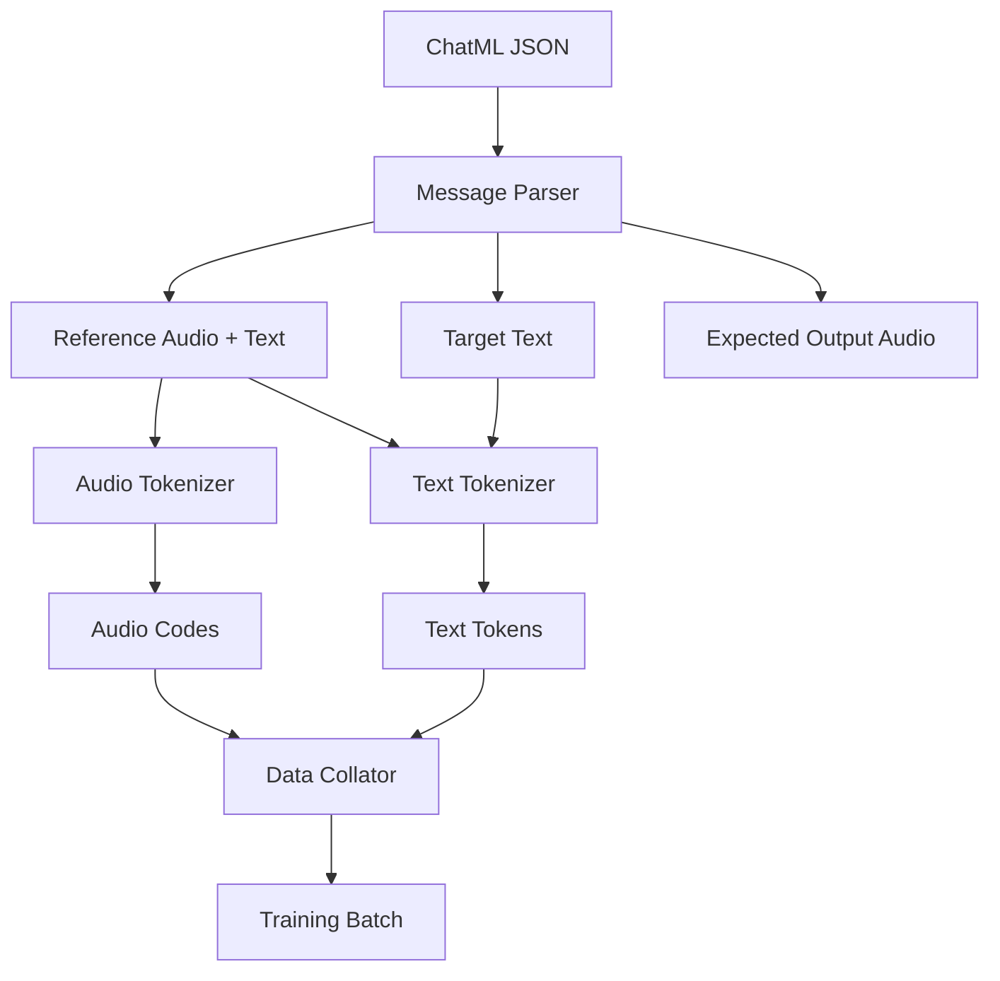
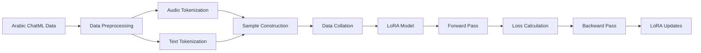

# LoRA Fine-tuning Higgs Audio for Arabic Zero-Shot Voice Cloning

## Overview

This document outlines the design for implementing LoRA (Low-Rank Adaptation) fine-tuning of the Higgs Audio v2 model to support Arabic zero-shot voice cloning. The system will adapt the pre-trained model to handle a new language (Arabic) while maintaining its zero-shot voice cloning capabilities through reference audio conditioning.

## Technology Stack

- **Base Model**: Higgs Audio v2 (3B parameters with 2.2B audio adapter)
- **Fine-tuning Method**: LoRA (Low-Rank Adaptation)
- **Audio Processing**: Higgs Audio Tokenizer with unified semantic and acoustic encoding
- **Framework**: PyTorch with Transformers library
- **Data Format**: ChatML format with multimodal content (text + audio)
- **Language Support**: Arabic (new language for the model)

## Architecture Analysis

### Zero-Shot Voice Cloning Mechanism

Based on the source code analysis, Higgs Audio implements zero-shot voice cloning through:

1. **Reference Audio Tokenization**:
   ```python
   # From higgs_audio_tokenizer.py
   audio_tokens = audio_tokenizer.encode(prompt_audio_path)
   ```

2. **Audio-Text Conditioning**:
   - Reference audio is tokenized into discrete codes
   - Audio codes are embedded alongside text tokens
   - The model learns to condition generated speech on reference audio patterns

3. **Multimodal Input Processing**:
   ```python
   # From generation.py - prepare_generation_context()
   messages.append(Message(
       role="user", 
       content=f"[SPEAKER{spk_id}] {prompt_text}" if num_speakers > 1 else prompt_text,
   ))
   messages.append(Message(
       role="assistant",
       content=AudioContent(audio_url=prompt_audio_path),
   ))
   ```

### Model Components for Voice Cloning

1. **Audio Encoder**: Processes reference audio into semantic and acoustic features
2. **Dual FFN Architecture**: Handles both text and audio token processing
3. **Audio Tokenizer**: Unified tokenizer capturing semantic and acoustic information
4. **Cross-Modal Attention**: Conditions text generation on audio features

## Data Pipeline Architecture

### Input Data Structure



### Data Processing Flow

1. **ChatML Parsing**:
   - Extract reference audio, reference text, and target text
   - Maintain speaker identity and conversation context

2. **Audio Processing**:
   ```python
   # Audio tokenization pipeline
   audio_codes = audio_tokenizer.encode(reference_audio_path)
   target_audio_codes = audio_tokenizer.encode(target_audio_path)
   ```

3. **Text Processing**:
   - Tokenize Arabic text using the model's tokenizer
   - Handle out-of-vocabulary tokens for new language

4. **Sample Construction**:
   ```python
   ChatMLDatasetSample(
       input_ids=input_tokens,
       label_ids=label_tokens, 
       audio_ids_concat=audio_codes,
       audio_waveforms_concat=waveforms,
       # ... other fields
   )
   ```

## Training Architecture

### LoRA Configuration

```python
# LoRA target modules for Higgs Audio
lora_config = {
    "target_modules": [
        "self_attn.q_proj",
        "self_attn.k_proj", 
        "self_attn.v_proj",
        "self_attn.o_proj",
        "mlp.gate_proj",
        "mlp.up_proj",
        "mlp.down_proj",
        # Audio-specific modules
        "audio_mlp.gate_proj",
        "audio_mlp.up_proj", 
        "audio_mlp.down_proj"
    ],
    "r": 16,
    "lora_alpha": 32,
    "lora_dropout": 0.1
}
```

### Training Pipeline



## Zero-Shot Inference Pipeline

### Inference Script Architecture

```python
class ArabicVoiceCloningInference:
    def __init__(self, model_path, lora_path, audio_tokenizer_path):
        self.model = HiggsAudioModel.from_pretrained(model_path)
        self.load_lora_weights(lora_path)
        self.audio_tokenizer = load_higgs_audio_tokenizer(audio_tokenizer_path)
        
    def generate_arabic_speech(self, chatml_data):
        # Process reference audio and text
        # Generate target speech
        pass
```

### Inference Flow

1. **Input Processing**:
   ```python
   def process_chatml_sample(self, sample):
       ref_audio = sample["messages"][1]["content"][1]["audio_url"]
       ref_text = sample["messages"][1]["content"][0]["text"] 
       target_text = sample["messages"][1]["content"][2]["text"]
       
       return ref_audio, ref_text, target_text
   ```

2. **Reference Audio Encoding**:
   ```python
   ref_audio_codes = self.audio_tokenizer.encode(ref_audio_path)
   ```

3. **Message Construction**:
   ```python
   messages = [
       Message(role="system", content=system_prompt),
       Message(role="user", content=ref_text),
       Message(role="assistant", content=AudioContent(audio_url=ref_audio)),
       Message(role="user", content=target_text)
   ]
   ```

4. **Generation**:
   ```python
   output = self.model.generate(
       messages=messages,
       audio_ids=[ref_audio_codes],
       temperature=0.3,
       max_new_tokens=1024
   )
   ```

## Implementation Components

### 1. Data Loader

```python
class ArabicChatMLDataset(Dataset):
    def __init__(self, chatml_file, audio_tokenizer, text_tokenizer):
        self.data = self.load_chatml(chatml_file)
        self.audio_tokenizer = audio_tokenizer
        self.text_tokenizer = text_tokenizer
        
    def __getitem__(self, idx):
        sample = self.data[idx]
        return self.process_sample(sample)
        
    def process_sample(self, sample):
        # Extract reference and target data
        # Tokenize audio and text
        # Return ChatMLDatasetSample
        pass
```

### 2. Training Script

```python
def train_arabic_lora():
    # Load base model
    model = HiggsAudioModel.from_pretrained(MODEL_PATH)
    
    # Apply LoRA
    model = apply_lora(model, lora_config)
    
    # Setup data
    dataset = ArabicChatMLDataset(DATA_PATH, audio_tokenizer, tokenizer)
    collator = HiggsAudioSampleCollator(...)
    
    # Training loop
    trainer = Trainer(
        model=model,
        train_dataset=dataset,
        data_collator=collator,
        args=training_args
    )
    
    trainer.train()
```

### 3. Inference Script

```python
def inference_pipeline(chatml_file, output_dir):
    inference_engine = ArabicVoiceCloningInference(
        model_path=MODEL_PATH,
        lora_path=LORA_PATH, 
        audio_tokenizer_path=TOKENIZER_PATH
    )
    
    with open(chatml_file) as f:
        samples = json.load(f)
        
    for i, sample in enumerate(samples):
        audio_output = inference_engine.generate_arabic_speech(sample)
        save_audio(audio_output, f"{output_dir}/output_{i}.wav")
```

## Model Configuration

### Audio Tokenizer Settings

```python
audio_tokenizer_config = {
    "n_q": 12,  # Number of codebooks
    "codebook_size": 1024,
    "sample_rate": 16000,
    "semantic_model": "hubert_base_general",
    "frame_rate": 50  # 50 Hz frame rate
}
```

### Model Architecture Parameters

```python
model_config = {
    "audio_adapter_type": "dual_ffn",
    "audio_num_codebooks": 12,
    "encode_whisper_embed": True,
    "encode_audio_in_tokens": False,
    "use_delay_pattern": False,
    "audio_dual_ffn_layers": [8, 16, 24]  # Example layers
}
```

## Data Preprocessing

### Arabic Text Normalization

```python
def normalize_arabic_text(text):
    # Remove diacritics
    # Normalize punctuation
    # Handle special characters
    return normalized_text
```

### Audio Preprocessing

```python
def preprocess_audio(audio_path):
    # Load and resample to 16kHz
    # Normalize loudness
    # Ensure proper format
    return processed_audio
```

## Training Configuration

### LoRA Training Parameters

```python
training_args = {
    "output_dir": "./arabic_lora_checkpoints",
    "num_train_epochs": 10,
    "per_device_train_batch_size": 2,
    "gradient_accumulation_steps": 8,
    "learning_rate": 1e-4,
    "warmup_steps": 100,
    "logging_steps": 10,
    "save_steps": 500,
    "use_lora": True,
    "lora_r": 16,
    "lora_alpha": 32
}
```

### Memory Optimization

- Gradient checkpointing enabled
- Mixed precision training (bf16)
- LoRA reduces memory footprint significantly
- Batch size optimization for 16GB GPU

## Testing Strategy

### Unit Testing

1. **Data Loading Tests**:
   - ChatML parsing correctness
   - Audio tokenization validation
   - Text tokenization for Arabic

2. **Model Integration Tests**:
   - LoRA weight loading
   - Forward pass validation
   - Generation pipeline testing

3. **Audio Quality Tests**:
   - Voice similarity metrics
   - Audio quality assessment
   - Arabic pronunciation accuracy

### Performance Evaluation

1. **Voice Similarity**: Cosine similarity of speaker embeddings
2. **Audio Quality**: SNR, MOS scores
3. **Language Fidelity**: Arabic phoneme accuracy
4. **Generation Speed**: Inference time measurements

## Error Handling

### Common Issues and Solutions

1. **Out-of-Vocabulary Tokens**:
   - Extend tokenizer vocabulary if needed
   - Use subword tokenization for Arabic

2. **Audio Format Issues**:
   - Standardize audio preprocessing
   - Handle various sample rates

3. **Memory Constraints**:
   - Dynamic batch sizing
   - Gradient accumulation
   - Model sharding if needed

## Deployment Considerations

### Model Serving

```python
class ArabicVoiceService:
    def __init__(self):
        self.model = self.load_finetuned_model()
        
    def clone_voice(self, ref_audio, ref_text, target_text):
        # Inference pipeline
        return generated_audio
```

### API Integration

- REST API for voice cloning requests
- WebSocket for real-time generation
- Batch processing capabilities

## Monitoring and Logging

### Training Metrics

- Loss curves for text and audio components
- Learning rate scheduling
- LoRA parameter updates tracking

### Inference Metrics

- Generation latency
- Audio quality scores
- User satisfaction metrics