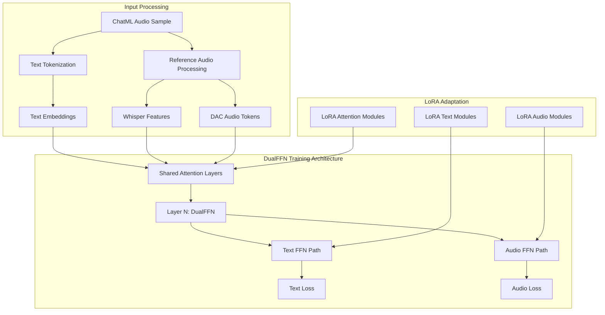

# LoRA Fine-tuning Training Pipeline for Higgs Audio Zero-Shot Voice Cloning

## Overview

This design document outlines a comprehensive LoRA fine-tuning training pipeline for Higgs Audio v2 to enhance zero-shot voice cloning capabilities with Arabic language support. The system leverages the proven inference pipeline from `arabic_voice_cloning_inference.py` and implements teacher-forcing training with DualFFN architecture optimization.

## Architecture Foundation

### Higgs Audio v2 DualFFN Architecture



### Training Data Structure

Based on the provided ChatML format:
```json
{
  "messages": [
    {"role": "system", "content": "You are a helpful assistant..."},
    {"role": "user", "content": [
      {"type": "text", "text": "Reference Arabic text"},
      {"type": "audio", "audio_url": "path/to/ref_audio.wav"},
      {"type": "text", "text": "Please generate speech..."}
    ]},
    {"role": "assistant", "content": [
      {"type": "text", "text": "Target Arabic text"},
      {"type": "audio", "audio_url": "path/to/target_audio.wav"}
    ]}
  ]
}
```

## Core Training Pipeline Components

### 1. Multi-GPU Distributed Data Loading

```python
class DistributedChatMLDataset(Dataset):
    """High-performance distributed dataset for ChatML audio samples."""
    
    def __init__(
        self,
        chatml_file: str,
        audio_tokenizer,
        text_tokenizer,
        max_audio_length: int = 30,
        max_text_length: int = 512,
        num_workers: int = 128,
        prefetch_factor: int = 4
    ):
        self.data = self._load_and_validate_data(chatml_file)
        self.audio_tokenizer = audio_tokenizer
        self.text_tokenizer = text_tokenizer
        self.max_audio_length = max_audio_length
        self.max_text_length = max_text_length
        
        # Pre-validate all audio files for faster training
        self._validate_audio_files()
        
    def _load_and_validate_data(self, chatml_file: str) -> List[Dict]:
        """Load and validate ChatML data with comprehensive error checking."""
        with open(chatml_file, 'r', encoding='utf-8') as f:
            raw_data = json.load(f)
        
        validated_data = []
        for idx, sample in enumerate(raw_data):
            try:
                # Extract and validate components
                ref_audio, ref_text, target_text, target_audio = self._extract_sample_components(sample)
                
                # Validate audio file accessibility
                if not os.path.exists(ref_audio) or not os.path.exists(target_audio):
                    logger.warning(f"Missing audio files for sample {idx}")
                    continue
                
                validated_data.append({
                    'sample_id': idx,
                    'ref_audio': ref_audio,
                    'ref_text': ref_text,
                    'target_text': target_text,
                    'target_audio': target_audio,
                    'speaker': sample.get('speaker', f'speaker_{idx}'),
                    'duration': sample.get('misc', {}).get('duration', 0)
                })
                
            except Exception as e:
                logger.error(f"Failed to process sample {idx}: {e}")
                continue
        
        logger.info(f"Loaded {len(validated_data)} valid samples from {len(raw_data)} total")
        return validated_data
    
    def __getitem__(self, idx: int) -> ChatMLDatasetSample:
        """Create training sample with teacher forcing setup."""
        sample_data = self.data[idx]
        
        # Create ChatML messages following inference pattern
        messages = self._create_training_messages(sample_data)
        
        # Prepare sample using boson_multimodal infrastructure
        input_tokens, label_tokens, audio_contents, audio_paths = prepare_chatml_sample(
            ChatMLSample(messages=messages), 
            self.text_tokenizer
        )
        
        # Process reference audio for dual conditioning
        ref_waveform, ref_sample_rate = self._process_reference_audio(sample_data['ref_audio'])
        ref_audio_tokens = self.audio_tokenizer.encode(sample_data['ref_audio'])
        
        # Process target audio for labels  
        target_audio_tokens = self.audio_tokenizer.encode(sample_data['target_audio'])
        
        # Create ChatMLDatasetSample with proper teacher forcing setup
        return ChatMLDatasetSample(
            input_ids=torch.LongTensor(input_tokens),
            label_ids=torch.LongTensor(label_tokens),
            audio_ids_concat=torch.cat([ref_audio_tokens, target_audio_tokens], dim=1),
            audio_ids_start=torch.tensor([0, ref_audio_tokens.shape[1]], dtype=torch.long),
            audio_waveforms_concat=ref_waveform,
            audio_waveforms_start=torch.tensor([0, len(ref_waveform)], dtype=torch.long),
            audio_sample_rate=torch.tensor([ref_sample_rate], dtype=torch.float32),
            audio_speaker_indices=torch.tensor([0], dtype=torch.long),
            audio_label_ids_concat=target_audio_tokens
        )
```

### 2. Enhanced LoRA Configuration for Higgs Audio

```python
class HiggsAudioLoRAConfig:
    """Specialized LoRA configuration for Higgs Audio DualFFN architecture."""
    
    @staticmethod
    def get_lora_config(
        r: int = 16,
        lora_alpha: int = 32,
        lora_dropout: float = 0.1,
        target_modules_mode: str = "comprehensive"
    ) -> LoraConfig:
        """Get optimized LoRA configuration for Higgs Audio."""
        
        if target_modules_mode == "comprehensive":
            target_modules = [
                # Llama backbone attention modules
                "self_attn.q_proj", "self_attn.k_proj", 
                "self_attn.v_proj", "self_attn.o_proj",
                
                # Llama backbone FFN modules  
                "mlp.gate_proj", "mlp.up_proj", "mlp.down_proj",
                
                # Audio-specific DualFFN modules
                "audio_mlp.gate_proj", "audio_mlp.up_proj", "audio_mlp.down_proj",
                
                # Audio feature projector
                "audio_tower.encoder_proj", "audio_encoder_proj",
                
                # Audio output head
                "lm_head", "audio_head.projector"
            ]
        elif target_modules_mode == "audio_focused":
            target_modules = [
                "audio_mlp.gate_proj", "audio_mlp.up_proj", "audio_mlp.down_proj",
                "audio_tower.encoder_proj", "audio_encoder_proj",
                "audio_head.projector"
            ]
        elif target_modules_mode == "attention_only":
            target_modules = [
                "self_attn.q_proj", "self_attn.k_proj", 
                "self_attn.v_proj", "self_attn.o_proj"
            ]
        
        return LoraConfig(
            r=r,
            lora_alpha=lora_alpha,
            target_modules=target_modules,
            lora_dropout=lora_dropout,
            bias="none",
            task_type=TaskType.CAUSAL_LM,
            inference_mode=False,
            modules_to_save=["audio_head", "lm_head"]  # Save these completely
        )

def apply_lora_to_higgs_audio(model: HiggsAudioModel, lora_config: LoraConfig) -> HiggsAudioModel:
    """Apply LoRA to Higgs Audio model with proper module targeting."""
    
    # Apply LoRA to the model
    lora_model = get_peft_model(model, lora_config)
    
    # Enable gradient computation for specific modules
    for name, module in lora_model.named_modules():
        if any(target in name for target in ["audio_head", "audio_encoder_proj"]):
            for param in module.parameters():
                param.requires_grad = True
    
    return lora_model
```

### 3. Optimized Training Collator

```python
class OptimizedHiggsAudioTrainingCollator:
    """Training-optimized collator with proper label alignment and masking."""
    
    def __init__(self, config: HiggsAudioConfig, whisper_processor, **kwargs):
        self.base_collator = HiggsAudioSampleCollator(
            whisper_processor=whisper_processor,
            audio_in_token_id=config.audio_in_token_idx,
            audio_out_token_id=config.audio_out_token_idx,
            audio_stream_bos_id=config.audio_stream_bos_id,
            audio_stream_eos_id=config.audio_stream_eos_id,
            encode_whisper_embed=config.encode_whisper_embed,
            pad_token_id=config.pad_token_id,
            return_audio_in_tokens=config.encode_audio_in_tokens,
            use_delay_pattern=config.use_delay_pattern,
            round_to=1,
            audio_num_codebooks=config.audio_num_codebooks,
            **kwargs
        )
        self.config = config
        
    def __call__(self, batch: List[ChatMLDatasetSample]) -> Dict[str, torch.Tensor]:
        """Enhanced collation with proper label creation for teacher forcing."""
        
        # Use official collator for complex processing
        batch_input = self.base_collator(batch)
        
        # Create aligned audio labels for teacher forcing
        label_audio_ids = self._create_audio_labels(batch_input, batch)
        
        # Enhanced attention masking for audio regions
        attention_mask = self._create_enhanced_attention_mask(batch_input)
        
        return {
            'input_ids': batch_input.input_ids,
            'attention_mask': attention_mask,
            'labels': batch_input.label_ids,
            'audio_features': batch_input.audio_features,
            'audio_feature_attention_mask': batch_input.audio_feature_attention_mask,
            'audio_out_ids': batch_input.audio_out_ids,
            'audio_out_ids_start': batch_input.audio_out_ids_start,
            'audio_in_ids': batch_input.audio_in_ids,
            'audio_in_ids_start': batch_input.audio_in_ids_start,
            'label_audio_ids': label_audio_ids
        }
    
    def _create_audio_labels(self, batch_input, original_batch) -> torch.Tensor:
        """Create properly aligned audio labels for loss computation."""
        
        if batch_input.audio_out_ids is None:
            return None
            
        # Use target audio tokens as labels with proper shifting
        label_audio_ids = batch_input.audio_out_ids.clone()
        
        # Apply delay pattern if used in model
        if self.config.use_delay_pattern:
            label_audio_ids = self._apply_delay_pattern_to_labels(label_audio_ids)
        
        return label_audio_ids
```

### 4. Comprehensive Loss Function

```python
class HiggsAudioTrainingLoss(nn.Module):
    """Comprehensive loss function for DualFFN training with proper weighting."""
    
    def __init__(
        self,
        config: HiggsAudioConfig,
        text_loss_weight: float = 1.0,
        audio_loss_weight: float = 1.0,
        contrastive_loss_weight: float = 0.1
    ):
        super().__init__()
        self.config = config
        self.text_loss_weight = text_loss_weight
        self.audio_loss_weight = audio_loss_weight
        self.contrastive_loss_weight = contrastive_loss_weight
        
        self.text_loss_fn = nn.CrossEntropyLoss(ignore_index=-100)
        self.audio_loss_fn = nn.CrossEntropyLoss(ignore_index=-100)
        
    def forward(
        self,
        text_logits: torch.Tensor,
        audio_logits: torch.Tensor,
        text_labels: torch.Tensor,
        audio_labels: torch.Tensor,
        audio_features: Optional[torch.Tensor] = None
    ) -> Dict[str, torch.Tensor]:
        """Compute comprehensive training loss."""
        
        losses = {}
        total_loss = 0.0
        
        # Text generation loss (standard language modeling)
        if text_logits is not None and text_labels is not None:
            text_loss = self.text_loss_fn(
                text_logits.view(-1, text_logits.size(-1)),
                text_labels.view(-1)
            )
            losses['text_loss'] = text_loss
            total_loss += self.text_loss_weight * text_loss
            
        # Audio generation loss (for each codebook)
        if audio_logits is not None and audio_labels is not None:
            audio_loss = 0.0
            num_codebooks = audio_logits.size(1)
            
            for i in range(num_codebooks):
                codebook_loss = self.audio_loss_fn(
                    audio_logits[:, i].view(-1, audio_logits.size(-1)),
                    audio_labels[i].view(-1)
                )
                audio_loss += codebook_loss
                
            audio_loss = audio_loss / num_codebooks
            losses['audio_loss'] = audio_loss
            total_loss += self.audio_loss_weight * audio_loss
            
        # Voice similarity contrastive loss (optional)
        if audio_features is not None and self.contrastive_loss_weight > 0:
            contrastive_loss = self._compute_voice_similarity_loss(audio_features)
            losses['contrastive_loss'] = contrastive_loss
            total_loss += self.contrastive_loss_weight * contrastive_loss
            
        losses['total_loss'] = total_loss
        return losses
    
    def _compute_voice_similarity_loss(self, audio_features: torch.Tensor) -> torch.Tensor:
        """Compute contrastive loss for voice similarity."""
        # Implementation for voice similarity loss
        # This encourages generated audio to be similar to reference audio
        batch_size = audio_features.size(0)
        
        if batch_size < 2:
            return torch.tensor(0.0, device=audio_features.device)
            
        # Simple cosine similarity loss
        normalized_features = F.normalize(audio_features, dim=-1)
        similarity_matrix = torch.mm(normalized_features, normalized_features.t())
        
        # Create positive and negative pairs
        positive_pairs = torch.eye(batch_size, device=audio_features.device)
        contrastive_loss = F.mse_loss(similarity_matrix, positive_pairs)
        
        return contrastive_loss
```

### 5. High-Performance Multi-GPU Trainer

```python
class HiggsAudioLoRATrainer:
    """Optimized trainer for multi-GPU LoRA fine-tuning."""
    
    def __init__(
        self,
        model_path: str = "bosonai/higgs-audio-v2-generation-3B-base",
        audio_tokenizer_path: str = "bosonai/higgs-audio-v2-tokenizer",
        lora_config: Optional[LoraConfig] = None,
        training_args: Optional[TrainingArguments] = None
    ):
        self.setup_distributed_training()
        self.load_model_and_tokenizers(model_path, audio_tokenizer_path)
        self.setup_lora(lora_config)
        self.setup_training_components(training_args)
        
    def setup_distributed_training(self):
        """Configure optimal distributed training settings."""
        if torch.cuda.device_count() > 1:
            torch.distributed.init_process_group(backend='nccl')
            self.local_rank = int(os.environ.get('LOCAL_RANK', 0))
            torch.cuda.set_device(self.local_rank)
        else:
            self.local_rank = 0
            
    def load_model_and_tokenizers(self, model_path: str, audio_tokenizer_path: str):
        """Load Higgs Audio model and tokenizers."""
        
        # Load model configuration
        self.config = HiggsAudioConfig.from_pretrained(model_path)
        
        # Force enable Whisper embeddings (from inference knowledge)
        self.config.encode_whisper_embed = True
        
        # Load model
        self.model = HiggsAudioModel.from_pretrained(
            model_path,
            config=self.config,
            torch_dtype=torch.bfloat16
        )
        
        # Load tokenizers
        self.tokenizer = AutoTokenizer.from_pretrained(model_path)
        self.audio_tokenizer = load_higgs_audio_tokenizer(
            audio_tokenizer_path, 
            device='cpu'  # Will be moved to GPU later
        )
        
        # Load Whisper processor
        try:
            from transformers import AutoProcessor
            self.whisper_processor = AutoProcessor.from_pretrained(
                "openai/whisper-large-v3", trust_remote_code=True
            )
        except:
            self.whisper_processor = AutoProcessor.from_pretrained(
                "openai/whisper-base", trust_remote_code=True
            )
            
    def setup_lora(self, lora_config: Optional[LoraConfig]):
        """Apply LoRA configuration to model."""
        if lora_config is None:
            lora_config = HiggsAudioLoRAConfig.get_lora_config()
            
        self.model = apply_lora_to_higgs_audio(self.model, lora_config)
        logger.info(f"Applied LoRA: {self.model.get_peft_model_state_dict().keys()}")
        
    def setup_training_components(self, training_args: Optional[TrainingArguments]):
        """Setup training components with optimal settings."""
        
        if training_args is None:
            training_args = self.get_optimized_training_args()
            
        # Setup data collator
        self.data_collator = OptimizedHiggsAudioTrainingCollator(
            config=self.config,
            whisper_processor=self.whisper_processor
        )
        
        # Setup loss function
        self.loss_fn = HiggsAudioTrainingLoss(
            config=self.config,
            text_loss_weight=1.0,
            audio_loss_weight=2.0,  # Emphasize audio quality
            contrastive_loss_weight=0.1
        )
        
        self.training_args = training_args
        
    def get_optimized_training_args(self) -> TrainingArguments:
        """Get optimized training arguments for 8xH200 setup."""
        return TrainingArguments(
            output_dir="./higgs_audio_lora_checkpoints",
            
            # Multi-GPU optimization
            per_device_train_batch_size=2,  # Adjust based on memory
            per_device_eval_batch_size=2,
            gradient_accumulation_steps=4,
            dataloader_num_workers=16,  # Utilize 128 cores efficiently
            dataloader_prefetch_factor=4,
            
            # Training schedule
            num_train_epochs=3,
            learning_rate=1e-4,
            warmup_steps=500,
            lr_scheduler_type="cosine",
            
            # Optimization
            optim="adamw_torch_fused",  # Faster optimizer
            weight_decay=0.01,
            max_grad_norm=1.0,
            
            # Memory optimization
            fp16=False,
            bf16=True,  # Better for H200
            gradient_checkpointing=True,
            remove_unused_columns=False,
            
            # Distributed training
            ddp_backend="nccl",
            ddp_find_unused_parameters=False,
            
            # Logging and saving
            logging_steps=10,
            save_steps=500,
            eval_steps=500,
            save_total_limit=3,
            evaluation_strategy="steps",
            
            # Performance optimizations
            torch_compile=True,  # PyTorch 2.0 compilation
            include_inputs_for_metrics=False,
            report_to=["tensorboard"],
        )
    
    def train(
        self,
        train_dataset: DistributedChatMLDataset,
        eval_dataset: Optional[DistributedChatMLDataset] = None
    ):
        """Execute training with comprehensive monitoring."""
        
        # Create custom trainer with loss override
        trainer = CustomHiggsAudioTrainer(
            model=self.model,
            args=self.training_args,
            train_dataset=train_dataset,
            eval_dataset=eval_dataset,
            data_collator=self.data_collator,
            tokenizer=self.tokenizer,
            loss_fn=self.loss_fn
        )
        
        # Add callbacks for monitoring
        trainer.add_callback(TrainingMonitorCallback())
        trainer.add_callback(AudioQualityCallback(self.audio_tokenizer))
        
        # Start training
        logger.info("Starting LoRA fine-tuning...")
        trainer.train()
        
        # Save final model
        trainer.save_model()
        logger.info("Training completed successfully!")

class CustomHiggsAudioTrainer(Trainer):
    """Custom trainer with proper loss computation for DualFFN."""
    
    def __init__(self, loss_fn: HiggsAudioTrainingLoss, **kwargs):
        super().__init__(**kwargs)
        self.loss_fn = loss_fn
        
    def compute_loss(self, model, inputs, return_outputs=False, num_items_in_batch=None):
        """Compute loss using custom loss function."""
        
        # Forward pass
        outputs = model(**inputs)
        
        # Extract logits and labels
        text_logits = outputs.logits if hasattr(outputs, 'logits') else None
        audio_logits = outputs.audio_logits if hasattr(outputs, 'audio_logits') else None
        
        text_labels = inputs.get('labels')
        audio_labels = inputs.get('label_audio_ids')
        audio_features = inputs.get('audio_features')
        
        # Compute comprehensive loss
        loss_dict = self.loss_fn(
            text_logits=text_logits,
            audio_logits=audio_logits,
            text_labels=text_labels,
            audio_labels=audio_labels,
            audio_features=audio_features
        )
        
        loss = loss_dict['total_loss']
        
        # Log individual loss components
        if self.state.global_step % self.args.logging_steps == 0:
            for loss_name, loss_value in loss_dict.items():
                if loss_name != 'total_loss':
                    self.log({f"train/{loss_name}": loss_value.item()})
        
        return (loss, outputs) if return_outputs else loss
```

### 6. Training Execution Script

```python
def main():
    """Main training execution function."""
    
    # Setup arguments
    parser = argparse.ArgumentParser()
    parser.add_argument("--train_data", required=True, help="Path to training ChatML JSON")
    parser.add_argument("--eval_data", help="Path to evaluation ChatML JSON")
    parser.add_argument("--model_path", default="bosonai/higgs-audio-v2-generation-3B-base")
    parser.add_argument("--audio_tokenizer_path", default="bosonai/higgs-audio-v2-tokenizer")
    parser.add_argument("--output_dir", default="./higgs_audio_lora_output")
    parser.add_argument("--lora_r", type=int, default=16)
    parser.add_argument("--lora_alpha", type=int, default=32)
    parser.add_argument("--batch_size", type=int, default=2)
    parser.add_argument("--learning_rate", type=float, default=1e-4)
    parser.add_argument("--num_epochs", type=int, default=3)
    
    args = parser.parse_args()
    
    # Configure LoRA
    lora_config = HiggsAudioLoRAConfig.get_lora_config(
        r=args.lora_r,
        lora_alpha=args.lora_alpha,
        target_modules_mode="comprehensive"
    )
    
    # Initialize trainer
    trainer = HiggsAudioLoRATrainer(
        model_path=args.model_path,
        audio_tokenizer_path=args.audio_tokenizer_path,
        lora_config=lora_config
    )
    
    # Load datasets
    train_dataset = DistributedChatMLDataset(
        chatml_file=args.train_data,
        audio_tokenizer=trainer.audio_tokenizer,
        text_tokenizer=trainer.tokenizer,
        num_workers=32  # Utilize CPU cores
    )
    
    eval_dataset = None
    if args.eval_data:
        eval_dataset = DistributedChatMLDataset(
            chatml_file=args.eval_data,
            audio_tokenizer=trainer.audio_tokenizer,
            text_tokenizer=trainer.tokenizer,
            num_workers=8
        )
    
    # Execute training
    trainer.train(train_dataset, eval_dataset)
    
    logger.info("Training pipeline completed successfully!")

if __name__ == "__main__":
    main()
```

## Training Configuration Summary

### Hardware Optimization (8xH200)
- **Batch Size**: 2 per device × 8 GPUs = 16 effective batch size
- **Gradient Accumulation**: 4 steps for 64 total batch size
- **CPU Utilization**: 128 cores with optimized data loading (32 workers)
- **Memory Optimization**: BF16, gradient checkpointing, optimized LoRA targeting

### LoRA Configuration
- **Rank (r)**: 16 for balance of adaptation and efficiency
- **Alpha**: 32 for stable learning
- **Target Modules**: Comprehensive coverage of DualFFN, attention, and audio heads
- **Dropout**: 0.1 for regularization

### Training Schedule
- **Learning Rate**: 1e-4 with cosine scheduler
- **Epochs**: 3 for 800-hour dataset
- **Warmup**: 500 steps for stable convergence
- **Evaluation**: Every 500 steps

This comprehensive training pipeline leverages the proven inference architecture while implementing robust teacher-forcing training optimized for zero-shot voice cloning with Arabic language enhancement.


