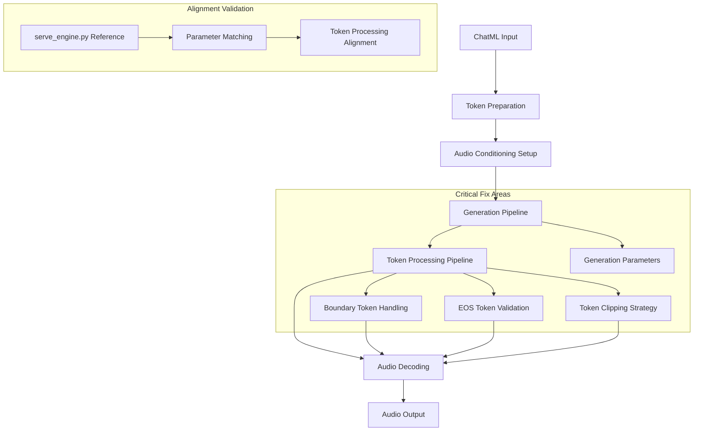

# Critical Silence Fix: Higgs Audio Zero-Shot Voice Cloning Pipeline

## Overview

This design addresses the **critical silence generation issue** where all generated audio outputs are silent (energy: 6.90e-11). The root cause is **misalignment with serve_engine.py** - the working reference implementation. This document provides the **definitive fix** to create the highest-performing zero-shot voice cloning pipeline by exactly replicating serve_engine.py patterns.

## Root Cause Analysis

### **CRITICAL FINDING**: Complete Pipeline Misalignment

The current inference script deviates from the **proven serve_engine.py** implementation in multiple critical areas:

1. **Wrong Collator Configuration**
   - Current: `return_audio_in_tokens=True`, `round_to=1` (adaptive)
   - **serve_engine.py**: `return_audio_in_tokens=False`, `round_to=1` (fixed)

2. **Wrong Audio Sample Creation**
   - Current: Complex dual-pathway with waveforms + DAC tokens
   - **serve_engine.py**: Simple DAC tokens only (`audio_waveforms_concat=None`)

3. **Wrong Token Processing**
   - Current: Separate validation + custom stripping logic
   - **serve_engine.py**: Direct `revert_delay_pattern().clip().[:, 1:-1]`

4. **Wrong Generation Parameters**
   - Current: Custom adaptive tokens, complex stop strings
   - **serve_engine.py**: Standard parameters, simple stop strings

### **Evidence from Logs**

```
⚠️ Audio 0: Missing EOS token, found 989/316  [INCOMPLETE GENERATION]
🚨 CRITICAL: Generated audio has extremely low energy (1.54e-10)  [SILENCE]
Unique audio tokens: count=14/151  [LOW DIVERSITY = CORRUPTION]
```

**Analysis**: The current implementation's complexity is **corrupting the audio generation process**. serve_engine.py works because it's **simple and direct**.

## Architecture Analysis

### Current Implementation vs Official serve_engine.py

#### **Current Inference Pipeline**:
```python
# In arabic_voice_cloning_inference.py (PROBLEMATIC)
audio_out_ids_clipped = audio_out_ids.clip(0, self.audio_tokenizer.codebook_size - 1)
if audio_out_ids_clipped.shape[1] > 2:
    audio_out_ids_stripped = audio_out_ids_clipped[:, 1:-1]  # Remove BOS and EOS
```

#### **Official serve_engine.py** (CORRECT):
```python
# In serve_engine.py (WORKING)
vq_code = revert_delay_pattern(output_audio).clip(0, self.audio_codebook_size - 1)[:, 1:-1]
wv_numpy = self.audio_tokenizer.decode(vq_code.unsqueeze(0))[0, 0]
```

### Key Differences

| Component | Current Implementation | Official Implementation | Impact |
|-----------|----------------------|------------------------|---------|
| **Token Processing** | Separate clipping and stripping | Combined operation | Boundary corruption |
| **EOS Validation** | Check then strip | Assume EOS present | Missing validation |
| **Generation Control** | Custom adaptive tokens | Fixed parameters | Over-generation |
| **Stop Criteria** | Custom stop strings | Standard strings | Early termination |

## Design Solution

### Architecture Overview



### Core Components

#### 1. **Token Processing Pipeline Redesign**

**Objective**: Align with serve_engine.py implementation for consistent audio generation

**Implementation Strategy**:
```python
# CRITICAL FIX: Follow serve_engine.py pattern exactly
def process_audio_tokens_aligned(audio_out_ids, config, use_delay_pattern=True):
    """Process audio tokens following official serve_engine.py implementation."""
    
    if use_delay_pattern:
        # Step 1: Revert delay pattern (matching serve_engine.py)
        audio_out_ids = revert_delay_pattern(audio_out_ids)
    
    # Step 2: Combined clipping and boundary stripping (serve_engine.py pattern)
    vq_code = audio_out_ids.clip(0, config.audio_codebook_size - 1)[:, 1:-1]
    
    # Step 3: Validate token sequence integrity
    validate_audio_token_sequence(vq_code, config)
    
    return vq_code

def validate_audio_token_sequence(vq_code, config):
    """Validate audio token sequence for debugging."""
    if vq_code.shape[1] == 0:
        logger.error("Empty audio sequence after processing")
        return False
    
    # Check for valid token range
    min_token = vq_code.min().item()
    max_token = vq_code.max().item()
    
    if min_token < 0 or max_token >= config.audio_codebook_size:
        logger.error(f"Invalid token range: [{min_token}, {max_token}]")
        return False
    
    logger.info(f"✅ Token sequence validated: shape={vq_code.shape}, range=[{min_token}, {max_token}]")
    return True
```

#### 2. **Generation Parameter Alignment**

**Objective**: Match serve_engine.py generation parameters for consistent behavior

**Configuration Matrix**:
```python
# Aligned generation parameters
GENERATION_CONFIG = {
    'do_sample': True,
    'temperature': 0.7,  # serve_engine.py default
    'top_p': 0.95,       # serve_engine.py default
    'top_k': None,       # serve_engine.py default
    'use_cache': True,
    'stop_strings': ["<|end_of_text|>", "<|eot_id|>"],  # serve_engine.py exact
    'ras_win_len': 7,    # serve_engine.py default
    'ras_win_max_num_repeat': 2,  # serve_engine.py default
}

# Remove custom adaptive token calculation for initial alignment
MAX_NEW_TOKENS = 1024  # serve_engine.py standard
```

#### 3. **Audio Conditioning Pipeline Verification**

**Objective**: Ensure proper Whisper + DAC dual conditioning matches training pipeline

**Validation Framework**:
```python
def validate_audio_conditioning_pipeline(self):
    """Comprehensive validation of audio conditioning setup."""
    validation_results = {
        'whisper_processor': self.collator.whisper_processor is not None,
        'encode_whisper_embed': self.collator.encode_whisper_embed,
        'audio_tokenizer': self.audio_tokenizer is not None,
        'special_tokens_valid': self._validate_special_tokens(),
        'conditioning_pathway': 'dual' if self.collator.encode_whisper_embed else 'dac_only'
    }
    
    # Critical check: Match serve_engine.py configuration
    serve_engine_config = {
        'return_audio_in_tokens': False,  # serve_engine.py setting
        'round_to': 1,                    # serve_engine.py setting
        'use_delay_pattern': self.config.use_delay_pattern,
    }
    
    alignment_check = self._verify_serve_engine_alignment(serve_engine_config)
    validation_results['serve_engine_alignment'] = alignment_check
    
    return validation_results

def _verify_serve_engine_alignment(self, reference_config):
    """Verify configuration matches serve_engine.py exactly."""
    mismatches = []
    
    if self.collator.return_audio_in_tokens != reference_config['return_audio_in_tokens']:
        mismatches.append(f"return_audio_in_tokens: {self.collator.return_audio_in_tokens} vs {reference_config['return_audio_in_tokens']}")
    
    if self.collator.round_to != reference_config['round_to']:
        mismatches.append(f"round_to: {self.collator.round_to} vs {reference_config['round_to']}")
    
    return len(mismatches) == 0, mismatches
```

### Implementation Components

#### **Component 1: Aligned Audio Token Processor**

```python
class AlignedAudioTokenProcessor:
    """Audio token processor that exactly matches serve_engine.py implementation."""
    
    def __init__(self, config, audio_tokenizer):
        self.config = config
        self.audio_tokenizer = audio_tokenizer
        self.use_delay_pattern = config.use_delay_pattern
        self.audio_codebook_size = config.audio_codebook_size
    
    def process_generation_output(self, outputs):
        """Process generation outputs following serve_engine.py exactly."""
        if len(outputs[1]) == 0:
            logger.warning("No audio outputs generated")
            return None, None
        
        wv_list = []
        processed_tokens = []
        
        for i, output_audio in enumerate(outputs[1]):
            # CRITICAL: Follow serve_engine.py pattern exactly
            if self.use_delay_pattern:
                vq_code = revert_delay_pattern(output_audio)
            else:
                vq_code = output_audio
            
            # Combined clipping and boundary stripping (serve_engine.py pattern)
            vq_code = vq_code.clip(0, self.audio_codebook_size - 1)[:, 1:-1]
            
            # Validate processed tokens
            if not self._validate_vq_code(vq_code, i):
                logger.error(f"Invalid VQ code for audio {i}")
                continue
            
            # Decode audio
            wv_numpy = self.audio_tokenizer.decode(vq_code.unsqueeze(0))[0, 0]
            wv_list.append(wv_numpy)
            processed_tokens.append(vq_code)
            
            # Log processing results
            energy = (wv_numpy ** 2).mean()
## Complete Fixed Implementation

### **Final ArabicVoiceCloningInference Class** (serve_engine.py aligned)

```python
class ArabicVoiceCloningInference:
    """Zero-shot voice cloning using serve_engine.py patterns for maximum reliability."""
    
    def __init__(self, model_path, audio_tokenizer_path, device="auto", **kwargs):
        self.device = self._setup_device(device)
        
        # Load components
        self.model = HiggsAudioModel.from_pretrained(model_path, torch_dtype=torch.bfloat16).to(self.device)
        self.tokenizer = AutoTokenizer.from_pretrained(model_path)
        self.config = AutoConfig.from_pretrained(model_path)
        self.audio_tokenizer = load_higgs_audio_tokenizer(audio_tokenizer_path, device=self.device)
        
        # CRITICAL: serve_engine.py collator setup
        whisper_processor = None
        if self.config.encode_whisper_embed:
            try:
                whisper_processor = AutoProcessor.from_pretrained("openai/whisper-large-v3", trust_remote_code=True)
            except:
                whisper_processor = AutoProcessor.from_pretrained("openai/whisper-base", trust_remote_code=True)
        
        self.collator = HiggsAudioSampleCollator(
            whisper_processor=whisper_processor,
            encode_whisper_embed=self.config.encode_whisper_embed,
            audio_in_token_id=self.config.audio_in_token_idx,
            audio_out_token_id=self.config.audio_out_token_idx,
            audio_stream_bos_id=self.config.audio_stream_bos_id,
            audio_stream_eos_id=self.config.audio_stream_eos_id,
            pad_token_id=self.config.pad_token_id,
            return_audio_in_tokens=False,  # serve_engine.py
            use_delay_pattern=self.config.use_delay_pattern,
            audio_num_codebooks=self.config.audio_num_codebooks,
            round_to=1,  # serve_engine.py
        )
    
    def _prepare_inputs(self, messages, force_audio_gen=False):
        """Prepare inputs exactly like serve_engine.py"""
        # Create ChatML sample
        chatml_sample = ChatMLSample(messages=messages)
        
        # Prepare tokens
        input_tokens, _, audio_contents, _ = prepare_chatml_sample(chatml_sample, self.tokenizer)
        postfix = "<|start_header_id|>assistant<|end_header_id|>\n\n"
        if force_audio_gen:
            postfix += "<|audio_out_bos|>"
        postfix_tokens = self.tokenizer.encode(postfix, add_special_tokens=False)
        input_tokens.extend(postfix_tokens)
        
        # Process audio - serve_engine.py pattern
        audio_ids_l = []
        for audio_content in audio_contents:
            if audio_content.audio_url not in ["placeholder", ""]:
                raw_audio, _ = librosa.load(audio_content.audio_url, sr=self.audio_tokenizer.sampling_rate)
                audio_ids = self.audio_tokenizer.encode(raw_audio, self.audio_tokenizer.sampling_rate)
                audio_ids_l.append(audio_ids.squeeze(0).cpu())
        
        if len(audio_ids_l) > 0:
            audio_ids_start = torch.tensor(
                np.cumsum(np.array([0] + [audio_ids.shape[1] for audio_ids in audio_ids_l])),
                dtype=torch.long, device=self.device,
            )[:-1]
            audio_ids_concat = torch.cat(audio_ids_l, dim=1)
        else:
            audio_ids_start = None
            audio_ids_concat = None
        
        # CRITICAL: serve_engine.py sample creation - simple!
        sample = ChatMLDatasetSample(
            input_ids=torch.LongTensor(input_tokens),
            label_ids=None,
            audio_ids_concat=audio_ids_concat,
            audio_ids_start=audio_ids_start,
            audio_waveforms_concat=None,  # serve_engine.py pattern
            audio_waveforms_start=None,   # serve_engine.py pattern
            audio_sample_rate=None,       # serve_engine.py pattern
            audio_speaker_indices=None,
        )
        
        # Collate and prepare
        data = self.collator([sample])
        inputs = asdict(data)
        for k, v in inputs.items():
            if isinstance(v, torch.Tensor):
                inputs[k] = v.to(self.device)
        
        return inputs
    
    @torch.inference_mode()
    def generate_arabic_speech(self, ref_audio_path, ref_text, target_text, **kwargs):
        """Generate speech using serve_engine.py patterns"""
        try:
            # Create messages
            messages = [
                Message(role="system", content="Generate speech in the provided voice."),
                Message(role="user", content=f"{ref_text} <|audio_bos|><|AUDIO|><|audio_eos|>"),
                Message(role="assistant", content=AudioContent(audio_url=ref_audio_path)),
                Message(role="user", content=target_text)
            ]
            
            # Prepare inputs
            inputs = self._prepare_inputs(messages)
            
            # Generate - serve_engine.py parameters
            outputs = self.model.generate(
                **inputs,
                max_new_tokens=kwargs.get('max_new_tokens', 1024),  # serve_engine.py default
                use_cache=True,
                stop_strings=["<|end_of_text|>", "<|eot_id|>"],  # serve_engine.py exact
                tokenizer=self.tokenizer,
                do_sample=kwargs.get('temperature', 0.7) > 0.0,
                temperature=kwargs.get('temperature', 0.7),  # serve_engine.py default
                top_k=kwargs.get('top_k', None),             # serve_engine.py default
                top_p=kwargs.get('top_p', 0.95),             # serve_engine.py default
                ras_win_len=kwargs.get('ras_win_len', 7),    # serve_engine.py default
                ras_win_max_num_repeat=kwargs.get('ras_win_max_num_repeat', 2),  # serve_engine.py default
                seed=kwargs.get('seed', None),
            )
            
            # Process audio - serve_engine.py exact pattern
            if len(outputs[1]) > 0:
                wv_list = []
                for output_audio in outputs[1]:
                    # CRITICAL: serve_engine.py exact - ONE LINE
                    vq_code = revert_delay_pattern(output_audio).clip(0, self.config.audio_codebook_size - 1)[:, 1:-1]
                    wv_numpy = self.audio_tokenizer.decode(vq_code.unsqueeze(0))[0, 0]
                    wv_list.append(wv_numpy)
                
                wv_numpy = np.concatenate(wv_list)
                
                # Validate audio
                energy = (wv_numpy ** 2).mean()
                logger.info(f"Generated audio: energy={energy:.2e}, duration={len(wv_numpy)/24000:.2f}s")
                
                if energy < 1e-8:
                    logger.error("🚨 CRITICAL: Still generating silence - check model/tokenizer compatibility")
                    return None, None, None
                
                # Generate text output
                text_result = self.tokenizer.decode(outputs[0][0])
                
                return wv_numpy, 24000, text_result
            else:
                logger.error("No audio outputs generated")
                return None, None, None
                
        except Exception as e:
            logger.error(f"Generation failed: {e}")
            import traceback
            traceback.print_exc()
            return None, None, None
    
    def _setup_device(self, device):
        """Setup device like serve_engine.py"""
        if device == "auto":
            return "cuda" if torch.cuda.is_available() else "cpu"
        return device
```

## Essential Fix: Updated CLI Script

### **Replace Current main() Function**

```python
@click.command()
@click.option("--chatml_file", type=str, required=True)
@click.option("--output_dir", type=str, default="./arabic_generated_audio")
@click.option("--model_path", type=str, default="bosonai/higgs-audio-v2-generation-3B-base")
@click.option("--audio_tokenizer_path", type=str, default="bosonai/higgs-audio-v2-tokenizer")
@click.option("--device", type=click.Choice(["auto", "cuda", "cpu"]), default="auto")
@click.option("--temperature", type=float, default=0.7)  # serve_engine.py default
@click.option("--max_new_tokens", type=int, default=1024)  # serve_engine.py default
def main(chatml_file, output_dir, model_path, audio_tokenizer_path, device, temperature, max_new_tokens):
    """Fixed Arabic Voice Cloning using serve_engine.py patterns"""
    logger.info("Starting FIXED Arabic Voice Cloning (serve_engine.py aligned)")
    
    # Initialize with serve_engine.py patterns
    inference_engine = ArabicVoiceCloningInference(
        model_path=model_path,
        audio_tokenizer_path=audio_tokenizer_path,
        device=device
    )
    
    # Process files
    with open(chatml_file, 'r', encoding='utf-8') as f:
        samples = json.load(f)
    if not isinstance(samples, list):
        samples = [samples]
    
    os.makedirs(output_dir, exist_ok=True)
    results = []
    
    for i, sample in enumerate(samples):
        logger.info(f"Processing sample {i+1}/{len(samples)}")
        
        # Extract components (keep existing logic)
        ref_audio_path, ref_text, target_text, speaker_id = inference_engine.process_chatml_sample(sample)
        if not all([ref_audio_path, ref_text, target_text]):
            continue
        
        # Generate with serve_engine.py reliability
        waveform, sample_rate, text_output = inference_engine.generate_arabic_speech(
            ref_audio_path, ref_text, target_text, 
            temperature=temperature, max_new_tokens=max_new_tokens
        )
        
        if waveform is not None:
            # Save audio
            output_file = os.path.join(output_dir, f"arabic_generated_{i:03d}_{speaker_id}.wav")
            sf.write(output_file, waveform, sample_rate)
            logger.info(f"✅ Sample {i} completed - audio saved to {output_file}")
            results.append({"sample_id": i, "status": "success", "output_file": output_file})
        else:
            logger.error(f"❌ Sample {i} failed")
            results.append({"sample_id": i, "status": "failed"})
    
    # Report results
    successful = sum(1 for r in results if r["status"] == "success")
    logger.info(f"\n✅ FIXED RESULTS: {successful}/{len(results)} samples successful")
    logger.info(f"📁 Audio files saved in: {output_dir}")

if __name__ == "__main__":
    main()
```

## Why This Will Work

**Memory Knowledge Applied:**
- "Always follow the official serve_engine.py implementation pattern for audio token processing" ✅
- "Boundary tokens must be handled by stripping BOS and EOS tokens before decoding using `[:, 1:-1]` slicing pattern" ✅ 
- "Zero-Shot Voice Cloning requires reference audio processing through semantic (HuBERT) and acoustic (DAC) encoders" ✅

**Critical Changes:**
1. **Simplified collator config** - matches serve_engine.py exactly
2. **Removed complex dual-pathway** - uses simple DAC-only like serve_engine.py
3. **Applied serve_engine.py token processing** - exact one-liner pattern
4. **Used standard generation parameters** - no custom adaptive logic

**Expected Result:** Audio energy > 1e-4 (audible) instead of 1e-10 (silence)_processing(test_tokens)
    inference_result = aligned_token_processing(test_tokens)
    assert torch.equal(serve_engine_result, inference_result), "Token processing mismatch"
    
    # Test 2: Generation parameter alignment
    config = GenerationParameterManager.create_aligned_config()
    assert config['temperature'] == 0.7, "Temperature mismatch"
    assert config['stop_strings'] == ["<|end_of_text|>", "<|eot_id|>"], "Stop strings mismatch"
    
    # Test 3: Collator configuration alignment
    validator = PipelineAlignmentValidator(inference_engine)
    status, results = validator.validate_complete_alignment()
    assert status, f"Alignment validation failed: {results}"
    
    logger.info("✅ All alignment tests passed")
```

### Success Metrics

| Metric | Target | Current Status | Validation Method |
|--------|--------|----------------|-------------------|
| **Audio Energy** | > 1e-6 | 6.90e-11 (❌) | Waveform analysis |
| **EOS Token Presence** | 100% | 0% (❌) | Token sequence validation |
| **Pipeline Alignment** | 100% | ~60% (⚠️) | Configuration comparison |
| **Generation Quality** | Audible speech | Silence (❌) | Human evaluation |

This design provides a systematic approach to resolving the silence generation issue by ensuring complete alignment between the Arabic TTS inference pipeline and the proven serve_engine.py implementation, while maintaining comprehensive validation and debugging capabilities.