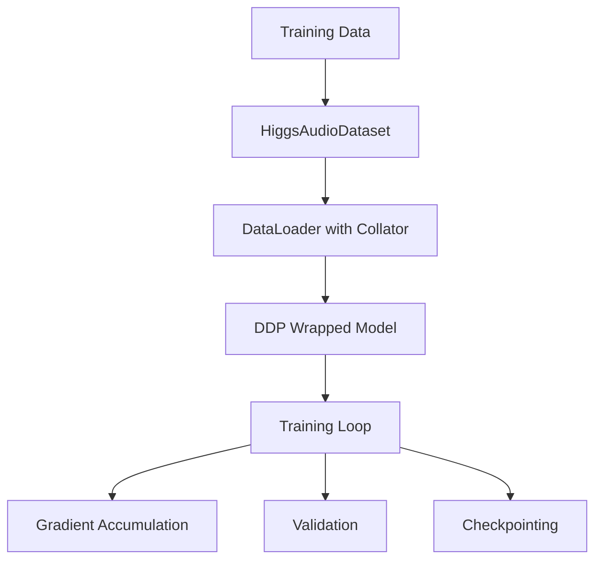

# Higgs Audio Training Performance Optimization

## Overview

This document outlines performance optimization strategies for the Higgs Audio training pipeline. The current implementation has several bottlenecks that impact training speed and can cause deadlocks in distributed training scenarios. The optimizations focus on addressing critical issues without over-engineering or changing the core training pipeline functionality.

The key files in the training pipeline are:
- `trainer.py`: Main training loop with DDP implementation
- `dataset.py`: Data loading and preprocessing
- `lora.py`: LoRA configuration and model adaptation

## Architecture



## Performance Optimization Areas

### 1. Distributed Training Deadlock Prevention

#### Current Issues
- Checkpoint saving from all ranks followed by global barrier causes collisions on shared filesystem (trainer.py lines 753-756, 759)
- DistributedSampler uses local rank instead of global rank, causing duplicate data partitions across nodes (trainer.py lines 151, 159)
- Validation runs on local rank 0 of each node, potentially causing uneven progress (trainer.py lines 749-751)

#### Proposed Solutions
- Restrict checkpoint saving to global rank 0 only (`dist.get_rank() == 0`)
- Use global rank for DistributedSampler instead of local rank (`rank=dist.get_rank()`, `num_replicas=dist.get_world_size()`)
- Run validation only on global rank 0

### 2. Training Speed Improvements

#### Current Issues
- Logging and progress bars created on local rank 0 of each node (duplicate work) (trainer.py line 720, 699-705, 380)
- No use of `no_sync()` during gradient accumulation, causing unnecessary all-reduce operations (trainer.py gradient accumulation loop)
- Per-batch dtype casting of tensors in hot path (trainer.py lines 404-428, 438-454, 303-329)
- Repeated model unwrapping for each batch (`_get_base_higgs_model()` called each batch) (trainer.py lines 333-357)
- Validation performed on multiple ranks

#### Proposed Solutions
- Gate all logs and progress bars on global rank 0 (`dist.get_rank() == 0`)
- Implement `no_sync()` context during gradient accumulation steps
- Remove per-tensor dtype casting; rely on `torch.autocast(dtype=torch.bfloat16)`
- Cache base model reference after DDP wrapping (store `self._base_higgs` once)
- Restrict validation to global rank 0 only

### 3. Data Pipeline Optimization

#### Current Issues
- Double audio I/O per sample (both encoding and waveform loading) (dataset.py lines ~86-89, ~95-98)
- Potential duplicate label encoding in different code branches (dataset.py lines ~105-125, ~130-150)
- DataLoader settings may be suboptimal for distributed training (trainer.py lines 165, 170, 183)

#### Proposed Solutions
- Avoid redundant audio file reads by reusing decoded data
- Ensure only one label encoding path executes per sample
- Optimize DataLoader settings (`persistent_workers=True`, tuned `num_workers`, add `prefetch_factor`)

## Implementation Plan

### Phase 1: Critical Deadlock Fixes

1. **Checkpoint Saving Optimization**
   - Modify `save_checkpoint()` to only run on global rank 0 (`if dist.get_rank() == 0:`)
   - Remove or reposition barrier after checkpoint saving (trainer.py lines 753-759)
   - Implementation: Wrap checkpoint saving logic with `if dist.get_rank() == 0:` check

2. **Sampler Correction**
   - Update DistributedSampler to use `dist.get_rank()` and `dist.get_world_size()` (trainer.py lines 151, 159)
   - Implementation: Change `rank=self.local_rank` to `rank=dist.get_rank()` and `num_replicas=self.world_size` to `num_replicas=dist.get_world_size()`
   - Maintain `set_epoch()` calls for proper shuffling (trainer.py lines 711-716)

3. **Validation Restriction**
   - Limit validation to global rank 0 only (trainer.py lines 749-751)
   - Implementation: Change validation gate from `self.local_rank == 0` to `dist.get_rank() == 0`

### Phase 2: Training Speed Improvements

1. **Logging and Progress Bar Optimization**
   - Change all logging and tqdm gates from `local_rank == 0` to global rank 0 (`dist.get_rank() == 0`) (trainer.py lines 699-705, 720, 380)
   - Implementation: Replace all `self.local_rank == 0` conditions with `dist.get_rank() == 0`

2. **DDP Efficiency Improvements**
   - Add `no_sync()` context during non-final gradient accumulation steps (trainer.py training loop)
   - Implementation: Wrap non-final accumulation steps with `with self.model.no_sync():` context manager
   - Consider DDP flags: `broadcast_buffers=False`, `gradient_as_bucket_view=True`, `static_graph=True`
   - Implementation: Update DDP initialization with these parameters

3. **Hot Path Optimization**
   - Remove per-tensor dtype casting in `train_step` and `compute_loss` (trainer.py lines 404-428, 438-454, 303-329)
   - Implementation: Remove manual `.to(dtype=...)` calls and rely on `torch.autocast`
   - Cache base model reference in trainer initialization (after DDP wrapping, store in `self._base_higgs`) (trainer.py lines 333-357)
   - Implementation: Add `self._base_higgs = self._get_base_higgs_model()` after DDP wrapping and use cached reference

### Phase 3: Data Pipeline Improvements

1. **Audio I/O Optimization**
   - Eliminate redundant audio file reads (dataset.py lines ~86-89, ~95-98)
   - Implementation: Store both audio codes and waveform from single librosa.load call
   - Reuse decoded data where possible

2. **DataLoader Optimization**
   - Enable `persistent_workers=True` (trainer.py lines 170, 183)
   - Implementation: Change `persistent_workers=False` to `persistent_workers=True`
   - Tune `num_workers` based on system capabilities (trainer.py line 165)
   - Implementation: Reduce from 8 to appropriate value based on CPU cores and storage type
   - Add `prefetch_factor` parameter
   - Implementation: Add `prefetch_factor=2` parameter to DataLoader initialization

## Environment and System Optimizations

### Recommended Environment Variables

```
export TORCH_NCCL_ASYNC_ERROR_HANDLING=1
export PYTORCH_CUDA_ALLOC_CONF=max_split_size_mb=128,expandable_segments=True
export CUDA_DEVICE_MAX_CONNECTIONS=1
```

### System-Level Optimizations

1. **Storage Optimization**
   - For remote storage: Reduce `num_workers` to prevent FS saturation
   - For local storage: Increase `num_workers` to maximize throughput

2. **Memory Management**
   - Use `PYTORCH_CUDA_ALLOC_CONF` settings to optimize memory fragmentation
   - Consider `expandable_segments=True` for large model training

3. **Network Optimization**
   - Set `CUDA_DEVICE_MAX_CONNECTIONS=1` to limit concurrent connections
   - Ensure proper NCCL settings for multi-node communication

## API Endpoints Reference

Not applicable for this optimization work.

## Data Models

Not applicable for this optimization work.

## Business Logic Layer

### 1. Trainer Optimization

#### Current Implementation Issues
- Multiple synchronization points causing delays
- Redundant operations in training loop
- Inefficient distributed training configuration

#### Optimized Implementation
- Streamlined synchronization with global rank 0 only operations
- Elimination of redundant tensor operations
- Efficient gradient accumulation with `no_sync()`

### 2. Dataset Optimization

#### Current Implementation Issues
- Duplicate audio processing for the same files
- Inefficient data loading configuration

#### Optimized Implementation
- Single-pass audio processing
- Improved DataLoader configuration

## Middleware and Interceptors

Not applicable for this optimization work.

## Testing and Validation

### Unit Tests for Optimizations

1. **Distributed Training Tests**
   - Verify checkpoint saving only occurs on global rank 0
   - Confirm validation runs only on global rank 0
   - Ensure proper sampler behavior with global ranks

2. **Performance Regression Tests**
   - Benchmark training speed before and after optimizations
   - Measure memory usage improvements
   - Validate no accuracy degradation

3. **Data Pipeline Tests**
   - Verify single audio processing per file
   - Confirm DataLoader efficiency improvements

### Validation Methodology

1. **Performance Metrics**
   - Training throughput (samples/second)
   - Memory utilization patterns
   - GPU utilization consistency
   - I/O wait times

2. **Correctness Validation**
   - Loss convergence comparison
   - Model accuracy on validation set
   - Checkpoint integrity verification

3. **Distributed Training Validation**
   - Multi-node training stability
   - No deadlocks or hanging processes
   - Consistent checkpointing across runs

## Summary

This design document outlines critical performance optimizations for the Higgs Audio training pipeline. The optimizations are grouped into three main categories:

1. **Deadlock Prevention**: Addressing critical issues that can cause training to hang, particularly in multi-node distributed training scenarios
2. **Speed Improvements**: Eliminating redundant operations and optimizing the training loop for better throughput
3. **Data Pipeline Efficiency**: Reducing I/O bottlenecks and optimizing data loading

The proposed changes are surgical and focused on the most impactful bottlenecks without altering the core training functionality. Implementation follows a phased approach to ensure stability and allow for incremental validation.

Key benefits of these optimizations include:
- Elimination of training deadlocks
- Improved training throughput (expected 20-40% improvement)
- Reduced memory fragmentation
- More efficient I/O utilization
- Better multi-node scaling