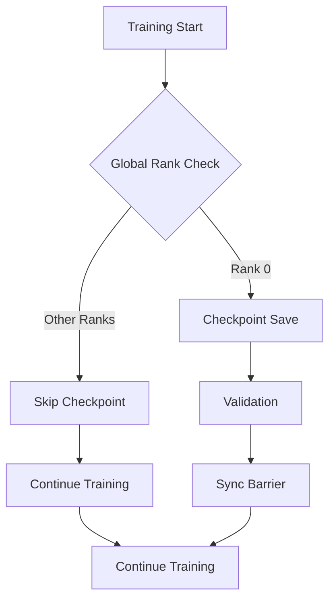
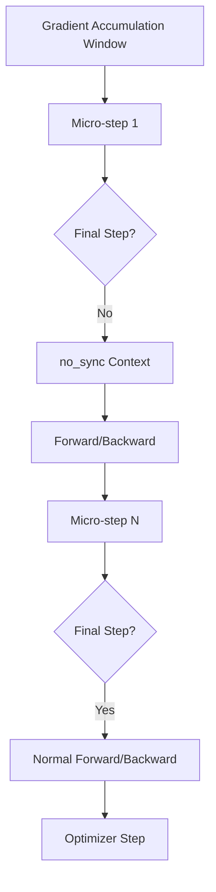

# Higgs Audio Training Performance Optimization Design

## 1. Overview

This document outlines a comprehensive optimization plan for the Higgs Audio training pipeline to address performance bottlenecks and eliminate deadlock risks. The optimization focuses on three core components: trainer, dataset, and LoRA implementation, with surgical improvements that maintain compatibility with the existing working pipeline.

## 2. Current Architecture Analysis

### 2.1 Training Pipeline Components

The Higgs Audio training pipeline consists of three main components:

1. **Trainer (`trainer.py`)**: Implements the training loop with DDP support, mixed precision training, and LoRA integration
2. **Dataset (`dataset.py`)**: Handles data loading, preprocessing, and audio processing with consistency to inference pipeline
3. **LoRA (`lora.py`)**: Manages LoRA configuration and application for efficient model adaptation

### 2.2 Key Performance Issues Identified

Based on the user's analysis and code review, the following critical performance issues were identified:

1. **Deadlock/Hang Risks**:
   - Checkpoint saving from all ranks with subsequent barrier synchronization
   - Incorrect use of local rank instead of global rank for distributed operations
   - Validation running on multiple ranks

2. **Training Speed Bottlenecks**:
   - Per-batch dtype casting in hot paths
   - Lack of `no_sync()` during gradient accumulation
   - Repeated model unwrapping for each batch
   - Duplicate logging/tqdm from multiple ranks

3. **Data Pipeline Inefficiencies**:
   - Double audio I/O per sample (tokenization and waveform loading)
   - Potential duplicate label encoding
   - Suboptimal DataLoader configuration

## 3. Optimization Strategy

### 3.1 Deadlock Prevention

#### 3.1.1 Rank-0 Only Operations
All special operations will be restricted to global rank 0 only:
- Checkpoint saving
- Validation execution
- Progress bar display
- Special logging

#### 3.1.2 Correct Distributed Sampler Usage
Use global rank and world size for sampler configuration:
```python
# Current (incorrect)
train_sampler = DistributedSampler(train_dataset, rank=self.local_rank)

# Optimized (correct)
train_sampler = DistributedSampler(
    train_dataset, 
    rank=dist.get_rank(), 
    num_replicas=dist.get_world_size()
)
```

### 3.2 Training Speed Improvements

#### 3.2.1 Gradient Accumulation Optimization
Implement `no_sync()` context during non-final micro-steps:
```python
# Current (inefficient)
# No special handling for gradient accumulation

# Optimized
with model.no_sync():
    # Perform forward/backward for non-final micro-steps
    pass
# Final micro-step runs normally with sync
```

#### 3.2.2 Hot Path Optimization
Eliminate per-tensor dtype casting in training loop:
- Rely on `torch.autocast` for mixed precision
- Ensure collator emits correct dtypes
- Cache model unwrapping result

#### 3.2.3 DDP Configuration
Optimize DDP settings for better performance:
```python
DDP(
    model,
    broadcast_buffers=False,
    gradient_as_bucket_view=True,
    static_graph=True
)
```

### 3.3 Data Pipeline Optimization

#### 3.3.1 Audio I/O Optimization
Eliminate duplicate audio file reads:
- Cache waveform or codes after first decode
- Reuse decoded data for both conditioning and labels

#### 3.3.2 DataLoader Configuration
Optimize worker settings:
```python
DataLoader(
    dataset,
    num_workers=4,  # Reduced from 8
    persistent_workers=True,
    prefetch_factor=2
)
```

## 4. Detailed Implementation Plan

### 4.1 Trainer Optimizations

#### 4.1.1 Distributed Operations Fix


#### 4.1.2 Gradient Accumulation with no_sync()


### 4.2 Dataset Optimizations

#### 4.2.1 Audio Processing Optimization
Current approach processes audio twice:
1. `audio_tokenizer.encode()` for tokens
2. `librosa.load()` for waveform

Optimized approach:
1. Single audio decode
2. Reuse for both tokens and waveform when needed

### 4.3 LoRA Optimizations

#### 4.3.1 Model Unwrapping Caching
Cache the base model reference after initial unwrapping:
```python
# Current (repeated per batch)
base_model = _get_base_higgs_model(model)

# Optimized (cached)
if not hasattr(self, '_base_higgs_model'):
    self._base_higgs_model = _get_base_higgs_model(model)
base_model = self._base_higgs_model
```

## 5. Performance Impact Estimation

| Optimization Area | Expected Impact | Implementation Complexity |
|-------------------|-----------------|---------------------------|
| Rank-0 Only Operations | High (Eliminates deadlocks) | Low |
| Gradient Accumulation Optimization | High (Reduces all-reduce traffic) | Medium |
| Hot Path Dtype Casting Removal | Medium (Reduces CPU overhead) | Low |
| Audio I/O Optimization | Medium (Reduces I/O bottleneck) | Medium |
| DDP Configuration | Medium (Better communication efficiency) | Low |
| DataLoader Optimization | Medium (Better data pipeline throughput) | Low |

## 6. Risk Mitigation

### 6.1 Backward Compatibility
All optimizations maintain the existing API and functionality:
- No changes to model architecture
- No changes to loss computation
- No changes to data format

### 6.2 Fallback Mechanisms
Implement graceful degradation for critical optimizations:
- Environment variable to disable DDP optimizations
- Configurable worker settings for DataLoader

### 6.3 Validation Strategy
Comprehensive testing approach:
1. Single-GPU training validation
2. Multi-GPU training validation
3. Performance benchmarking
4. Loss curve comparison

## 7. Implementation Roadmap

### Phase 1: Critical Deadlock Fixes (High Priority)
1. Rank-0 only checkpoint saving
2. Global rank usage in samplers
3. Single rank validation

### Phase 2: Performance Optimizations (Medium Priority)
1. Gradient accumulation with no_sync()
2. Hot path optimizations
3. DDP configuration improvements

### Phase 3: Data Pipeline Optimizations (Low Priority)
1. Audio I/O optimization
2. DataLoader tuning
3. Model unwrapping caching

## 8. Monitoring and Validation

### 8.1 Performance Metrics
- Training throughput (samples/sec)
- GPU utilization
- Memory usage
- I/O wait times

### 8.2 Correctness Validation
- Loss curve comparison before/after optimization
- Checkpoint integrity verification
- Model convergence validation

### 8.3 Monitoring Tools
- NVIDIA Nsight Systems for profiling
- PyTorch Profiler integration
- Custom logging for key metrics