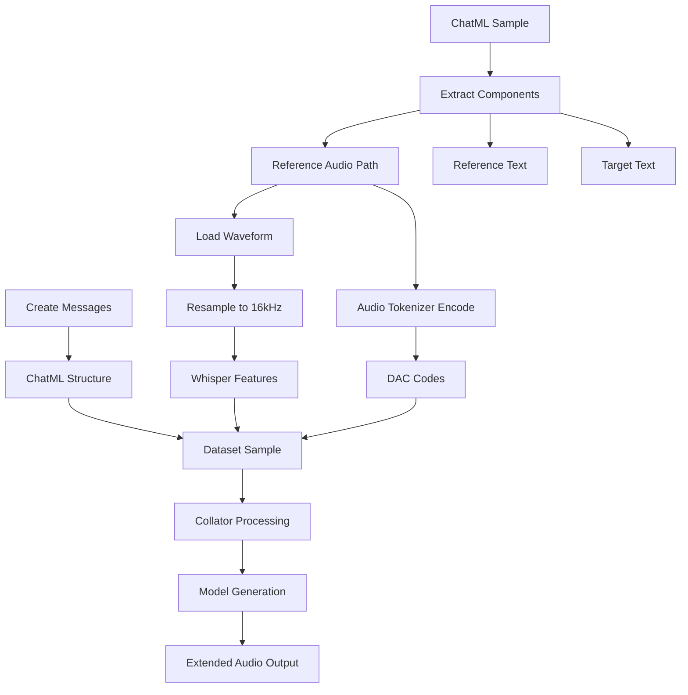
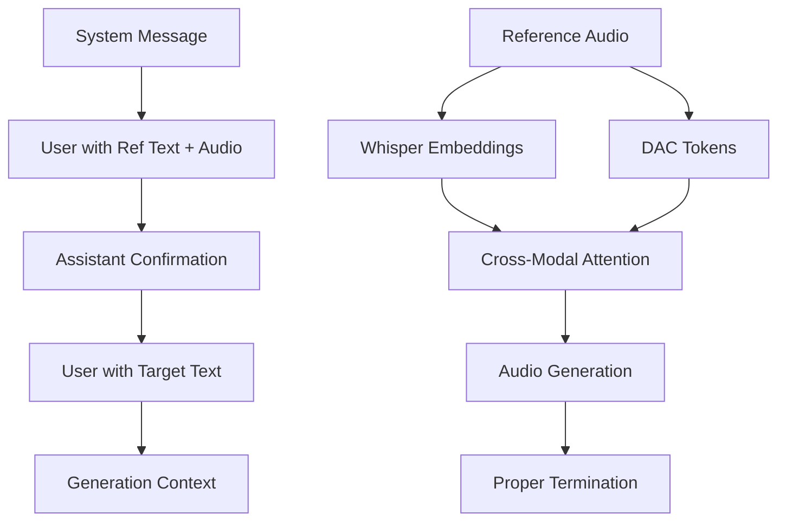
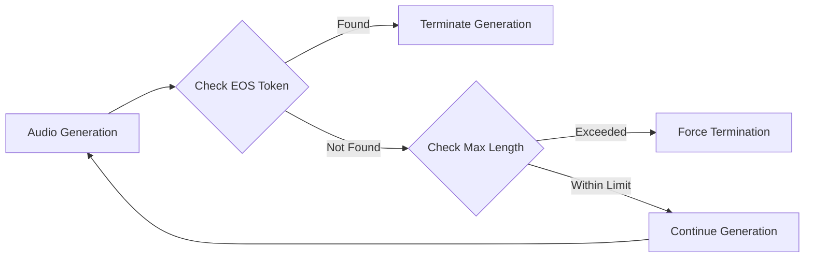
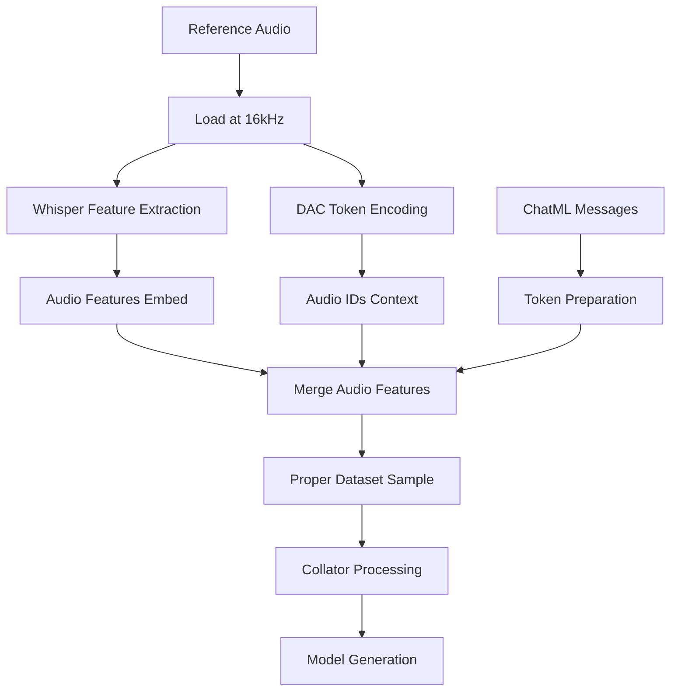
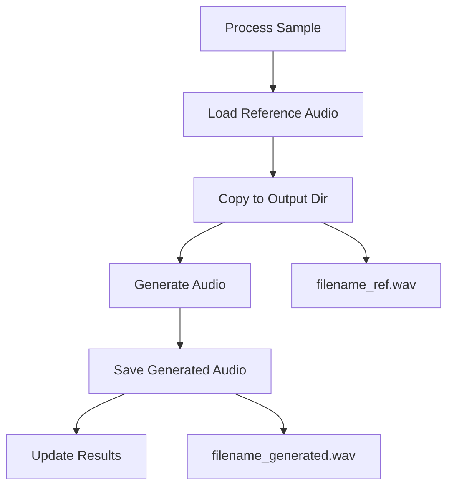
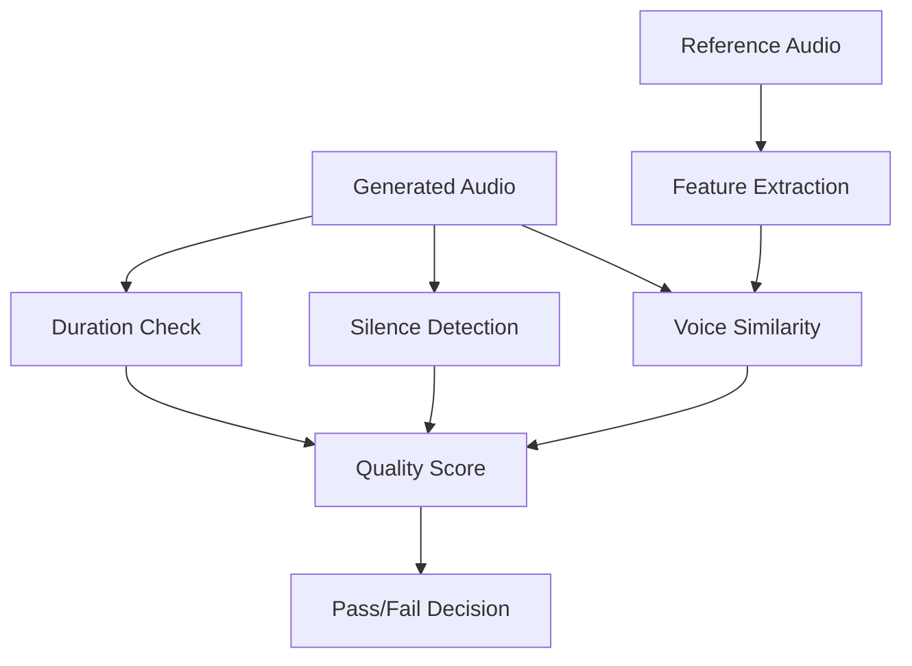

# Voice Cloning Optimization Design

## Overview

This design document addresses critical issues in the Arabic voice cloning inference pipeline, specifically targeting extended audio generation, proper reference audio conditioning alignment with Higgs Audio v2, and improved ChatML structure for zero-shot voice cloning.

## Current Issues Analysis

### Issue 1: Extended Audio Generation
- **Problem**: Generated audio exceeds 1 minute with extended silence after initial Arabic speech
- **Root Cause**: Improper audio termination conditions and generation length control
- **Impact**: Unusable audio output with excessive silence

### Issue 2: Reference Audio Conditioning Misalignment
- **Problem**: ChatML structure may not align with Higgs Audio v2's expected input format
- **Root Cause**: Incorrect message structure for voice cloning paradigm
- **Impact**: Suboptimal voice similarity and quality

### Issue 3: Missing Reference Audio Storage
- **Problem**: Reference audio files not saved alongside generated outputs
- **Root Cause**: No mechanism to copy reference audio to output directory
- **Impact**: Difficult to evaluate and compare voice cloning results

## Architecture Analysis

### Current Voice Cloning Pipeline



### Higgs Audio v2 Reference Pattern



## Optimization Strategy

### 1. Audio Generation Length Control

#### Problem Analysis
- Current `max_new_tokens=2048` allows excessive generation
- No proper audio-specific stopping criteria
- Missing audio EOS token handling

#### Solution Design


#### Implementation Components
- **Adaptive Max Tokens**: Calculate based on target text length
- **Audio EOS Detection**: Proper handling of `<|audio_eos|>` tokens
- **Length Estimation**: Use text length to estimate appropriate audio duration
- **Early Stopping**: Implement silence detection for auto-termination

### 2. Reference Audio Conditioning Alignment

#### Correct ChatML Structure
Based on Higgs Audio v2 patterns, the proper structure should be:

```python
# System Message - Brief and focused
system_message = Message(
    role="system",
    content="You are a helpful assistant capable of generating speech in the voice of the provided reference audio."
)

# User Message - Reference text with audio token
user_ref_message = Message(
    role="user", 
    content=f"{ref_text} <|audio_bos|><|AUDIO|><|audio_eos|>"
)

# Assistant Message - Reference audio 
assistant_ref_message = Message(
    role="assistant",
    content=AudioContent(audio_url=ref_audio_path)
)

# User Message - Target text for generation
user_target_message = Message(
    role="user",
    content=target_text
)
```

#### Dual Audio Processing Pipeline


### 3. Reference Audio Management

#### Storage Strategy


## Implementation Details

### 1. Enhanced Audio Length Control

#### Adaptive Max Tokens Calculation
```python
def calculate_max_audio_tokens(target_text: str, base_tokens_per_second: int = 25) -> int:
    """Calculate appropriate max tokens based on text length."""
    # Estimate speaking rate: ~150 words per minute
    word_count = len(target_text.split())
    estimated_duration_seconds = (word_count / 150) * 60
    
    # Add buffer for natural speech variations
    buffer_factor = 1.5
    max_duration = estimated_duration_seconds * buffer_factor
    
    # Convert to tokens (25 Hz rate)
    max_tokens = int(max_duration * base_tokens_per_second)
    
    # Reasonable bounds
    return max(min(max_tokens, 512), 64)
```

#### Audio Generation Termination
```python
class AudioGenerationController:
    def __init__(self, audio_eos_token_id: int, max_silence_tokens: int = 50):
        self.audio_eos_token_id = audio_eos_token_id
        self.max_silence_tokens = max_silence_tokens
        self.silence_counter = 0
    
    def should_terminate(self, generated_tokens: torch.Tensor) -> bool:
        """Check if generation should terminate."""
        # Check for explicit EOS token
        if self.audio_eos_token_id in generated_tokens[-5:]:
            return True
            
        # Check for extended silence patterns
        if self._is_silence_pattern(generated_tokens[-10:]):
            self.silence_counter += 1
            if self.silence_counter >= self.max_silence_tokens:
                return True
        else:
            self.silence_counter = 0
            
        return False
```

### 2. Proper Reference Audio Processing

#### Enhanced Message Creation
```python
def create_higgs_audio_v2_messages(
    ref_text: str, 
    ref_audio_path: str, 
    target_text: str
) -> tuple[List[Message], List[torch.Tensor], torch.Tensor, int]:
    """Create messages following Higgs Audio v2 patterns."""
    
    # System message - concise and task-focused
    system_message = Message(
        role="system",
        content="Generate speech in the provided voice."
    )
    
    # User with reference - proper audio token placement
    user_ref_message = Message(
        role="user",
        content=f"{ref_text} <|audio_bos|><|AUDIO|><|audio_eos|>"
    )
    
    # Assistant with reference audio
    assistant_ref_message = Message(
        role="assistant", 
        content=AudioContent(audio_url=ref_audio_path)
    )
    
    # User with target text
    user_target_message = Message(
        role="user",
        content=target_text
    )
    
    messages = [system_message, user_ref_message, assistant_ref_message, user_target_message]
    
    # Process reference audio for dual pathway
    ref_waveform, sr = load_and_process_reference_audio(ref_audio_path)
    audio_tokens = encode_reference_audio_tokens(ref_audio_path)
    
    return messages, [audio_tokens], ref_waveform, sr
```

#### Reference Audio Dual Processing
```python
def process_reference_audio_dual_pathway(
    ref_audio_path: str,
    whisper_processor,
    audio_tokenizer
) -> tuple[torch.Tensor, torch.Tensor, int]:
    """Process reference audio through both Whisper and DAC encoders."""
    
    # Load and normalize audio
    waveform, sr = torchaudio.load(ref_audio_path)
    if waveform.shape[0] > 1:
        waveform = waveform.mean(dim=0, keepdim=True)
    
    # Resample for Whisper (16kHz)
    if sr != 16000:
        resampler = T.Resample(sr, 16000)
        whisper_waveform = resampler(waveform)
    else:
        whisper_waveform = waveform
    
    # Process through Whisper for semantic features
    whisper_features = whisper_processor.feature_extractor(
        whisper_waveform.squeeze().numpy(),
        sampling_rate=16000,
        return_tensors="pt"
    )
    
    # Process through DAC for acoustic tokens
    audio_tokens = audio_tokenizer.encode(ref_audio_path)
    
    return whisper_features["input_features"], audio_tokens, 16000
```

### 3. Dataset Sample Construction

#### Correct Sample Structure
```python
def create_optimized_dataset_sample(
    input_tokens: List[int],
    audio_ids: List[torch.Tensor],
    ref_waveform: torch.Tensor,
    ref_sample_rate: int,
    encode_whisper_embed: bool = True
) -> ChatMLDatasetSample:
    """Create properly structured dataset sample for voice cloning."""
    
    if encode_whisper_embed and ref_waveform is not None:
        # Include reference waveform for Whisper processing
        sample = ChatMLDatasetSample(
            input_ids=torch.LongTensor(input_tokens),
            label_ids=None,
            audio_ids_concat=torch.concat([ele.cpu() for ele in audio_ids], dim=1) if audio_ids else torch.empty(0, 0, dtype=torch.long),
            audio_ids_start=torch.cumsum(
                torch.tensor([0] + [ele.shape[1] for ele in audio_ids], dtype=torch.long), 
                dim=0
            ) if audio_ids else torch.empty(0, dtype=torch.long),
            audio_waveforms_concat=ref_waveform,
            audio_waveforms_start=torch.tensor([0, len(ref_waveform)], dtype=torch.long),
            audio_sample_rate=torch.tensor([ref_sample_rate], dtype=torch.float32),
            audio_speaker_indices=torch.empty(0, dtype=torch.long),
        )
    else:
        # Fallback without Whisper features
        sample = ChatMLDatasetSample(
            input_ids=torch.LongTensor(input_tokens),
            label_ids=None,
            audio_ids_concat=torch.concat([ele.cpu() for ele in audio_ids], dim=1) if audio_ids else torch.empty(0, 0, dtype=torch.long),
            audio_ids_start=torch.cumsum(
                torch.tensor([0] + [ele.shape[1] for ele in audio_ids], dtype=torch.long), 
                dim=0
            ) if audio_ids else torch.empty(0, dtype=torch.long),
            audio_waveforms_concat=torch.empty(0, dtype=torch.float32),
            audio_waveforms_start=torch.empty(0, dtype=torch.long),
            audio_sample_rate=torch.empty(0, dtype=torch.float32),
            audio_speaker_indices=torch.empty(0, dtype=torch.long),
        )
    
    return sample
```

### 4. Reference Audio File Management

#### Enhanced Output Management
```python
def save_reference_and_generated_audio(
    ref_audio_path: str,
    generated_waveform: np.ndarray,
    sample_rate: int,
    output_dir: str,
    sample_id: int,
    speaker_id: str
) -> dict:
    """Save both reference and generated audio with consistent naming."""
    
    # Create filenames
    base_filename = f"arabic_generated_{sample_id:03d}_{speaker_id}"
    generated_file = os.path.join(output_dir, f"{base_filename}.wav")
    reference_file = os.path.join(output_dir, f"{base_filename}_ref.wav")
    
    # Save generated audio
    sf.write(generated_file, generated_waveform, sample_rate)
    
    # Copy reference audio
    if os.path.exists(ref_audio_path):
        import shutil
        shutil.copy2(ref_audio_path, reference_file)
    
    return {
        "generated_audio": generated_file,
        "reference_audio": reference_file,
        "sample_rate": sample_rate
    }
```

## Testing Framework

### Audio Quality Metrics



### Validation Criteria
1. **Duration Appropriateness**: Generated audio duration should be 1.2-2.0x text reading time
2. **Silence Ratio**: Silence should not exceed 30% of total audio
3. **Voice Similarity**: Perceptual similarity metrics above threshold
4. **Audio Quality**: No artifacts, proper sample rate, clear speech

### Test Cases
- **Short Text** (1-2 sentences): Verify proper termination
- **Medium Text** (1-2 paragraphs): Check natural pacing
- **Arabic Diacritics**: Test proper pronunciation
- **Cross-lingual**: Reference in one language, target in Arabic

## Performance Optimization

### Memory Management
- Stream audio processing for long references
- Efficient tensor operations with proper device placement
- Garbage collection after each sample

### GPU Utilization
- Batch processing where possible
- Static KV cache optimization
- Mixed precision inference

### Error Handling
- Graceful fallback for corrupted reference audio
- Timeout mechanisms for stuck generation
- Proper cleanup on interruption

## Configuration Parameters

### Audio Generation Control
```python
AUDIO_GENERATION_CONFIG = {
    "adaptive_max_tokens": True,
    "base_tokens_per_second": 25,
    "max_silence_tokens": 50,
    "duration_buffer_factor": 1.5,
    "min_tokens": 64,
    "max_tokens": 512
}
```

### Quality Thresholds
```python
QUALITY_THRESHOLDS = {
    "max_duration_ratio": 3.0,
    "max_silence_ratio": 0.3,
    "min_audio_length": 1.0,  # seconds
    "max_audio_length": 30.0  # seconds
}
```

### Model Parameters
```python
GENERATION_PARAMS = {
    "temperature": 0.3,
    "top_k": 50,
    "top_p": 0.95,
    "do_sample": True,
    "use_cache": True
}
```
## Current Issues Analysis

### Issue 1: Extended Audio Generation
- **Problem**: Generated audio exceeds 1 minute with extended silence after initial Arabic speech
- **Root Cause**: Improper audio termination conditions and generation length control
- **Impact**: Unusable audio output with excessive silence

### Issue 2: Reference Audio Conditioning Misalignment
- **Problem**: ChatML structure may not align with Higgs Audio v2's expected input format
- **Root Cause**: Incorrect message structure for voice cloning paradigm
- **Impact**: Suboptimal voice similarity and quality

### Issue 3: Missing Reference Audio Storage
- **Problem**: Reference audio files not saved alongside generated outputs
- **Root Cause**: No mechanism to copy reference audio to output directory
- **Impact**: Difficult to evaluate and compare voice cloning results

## Architecture Analysis

### Current Voice Cloning Pipeline


### Higgs Audio v2 Reference Pattern


## Optimization Strategy

### 1. Audio Generation Length Control

#### Problem Analysis
- Current `max_new_tokens=2048` allows excessive generation
- No proper audio-specific stopping criteria
- Missing audio EOS token handling

#### Solution Design


#### Implementation Components
- **Adaptive Max Tokens**: Calculate based on target text length
- **Audio EOS Detection**: Proper handling of `<|audio_eos|>` tokens
- **Length Estimation**: Use text length to estimate appropriate audio duration
- **Early Stopping**: Implement silence detection for auto-termination

### 2. Reference Audio Conditioning Alignment

#### Correct ChatML Structure
Based on Higgs Audio v2 patterns, the proper structure should be:

```python
# System Message - Brief and focused
system_message = Message(
    role="system",
    content="You are a helpful assistant capable of generating speech in the voice of the provided reference audio."
)

# User Message - Reference text with audio token
user_ref_message = Message(
    role="user", 
    content=f"{ref_text} <|audio_bos|><|AUDIO|><|audio_eos|>"
)

# Assistant Message - Reference audio 
assistant_ref_message = Message(
    role="assistant",
    content=AudioContent(audio_url=ref_audio_path)
)

# User Message - Target text for generation
user_target_message = Message(
    role="user",
    content=target_text
)
```

#### Dual Audio Processing Pipeline


### 3. Reference Audio Management

#### Storage Strategy


## Implementation Details

### 1. Enhanced Audio Length Control

#### Adaptive Max Tokens Calculation
```python
def calculate_max_audio_tokens(target_text: str, base_tokens_per_second: int = 25) -> int:
    """Calculate appropriate max tokens based on text length."""
    # Estimate speaking rate: ~150 words per minute
    word_count = len(target_text.split())
    estimated_duration_seconds = (word_count / 150) * 60
    
    # Add buffer for natural speech variations
    buffer_factor = 1.5
    max_duration = estimated_duration_seconds * buffer_factor
    
    # Convert to tokens (25 Hz rate)
    max_tokens = int(max_duration * base_tokens_per_second)
    
    # Reasonable bounds
    return max(min(max_tokens, 512), 64)
```

#### Audio Generation Termination
```python
class AudioGenerationController:
    def __init__(self, audio_eos_token_id: int, max_silence_tokens: int = 50):
        self.audio_eos_token_id = audio_eos_token_id
        self.max_silence_tokens = max_silence_tokens
        self.silence_counter = 0
    
    def should_terminate(self, generated_tokens: torch.Tensor) -> bool:
        """Check if generation should terminate."""
        # Check for explicit EOS token
        if self.audio_eos_token_id in generated_tokens[-5:]:
            return True
            
        # Check for extended silence patterns
        if self._is_silence_pattern(generated_tokens[-10:]):
            self.silence_counter += 1
            if self.silence_counter >= self.max_silence_tokens:
                return True
        else:
            self.silence_counter = 0
            
        return False
```

### 2. Proper Reference Audio Processing

#### Enhanced Message Creation
```python
def create_higgs_audio_v2_messages(
    ref_text: str, 
    ref_audio_path: str, 
    target_text: str
) -> tuple[List[Message], List[torch.Tensor], torch.Tensor, int]:
    """Create messages following Higgs Audio v2 patterns."""
    
    # System message - concise and task-focused
    system_message = Message(
        role="system",
        content="Generate speech in the provided voice."
    )
    
    # User with reference - proper audio token placement
    user_ref_message = Message(
        role="user",
        content=f"{ref_text} <|audio_bos|><|AUDIO|><|audio_eos|>"
    )
    
    # Assistant with reference audio
    assistant_ref_message = Message(
        role="assistant", 
        content=AudioContent(audio_url=ref_audio_path)
    )
    
    # User with target text
    user_target_message = Message(
        role="user",
        content=target_text
    )
    
    messages = [system_message, user_ref_message, assistant_ref_message, user_target_message]
    
    # Process reference audio for dual pathway
    ref_waveform, sr = load_and_process_reference_audio(ref_audio_path)
    audio_tokens = encode_reference_audio_tokens(ref_audio_path)
    
    return messages, [audio_tokens], ref_waveform, sr
```

#### Reference Audio Dual Processing
```python
def process_reference_audio_dual_pathway(
    ref_audio_path: str,
    whisper_processor,
    audio_tokenizer
) -> tuple[torch.Tensor, torch.Tensor, int]:
    """Process reference audio through both Whisper and DAC encoders."""
    
    # Load and normalize audio
    waveform, sr = torchaudio.load(ref_audio_path)
    if waveform.shape[0] > 1:
        waveform = waveform.mean(dim=0, keepdim=True)
    
    # Resample for Whisper (16kHz)
    if sr != 16000:
        resampler = T.Resample(sr, 16000)
        whisper_waveform = resampler(waveform)
    else:
        whisper_waveform = waveform
    
    # Process through Whisper for semantic features
    whisper_features = whisper_processor.feature_extractor(
        whisper_waveform.squeeze().numpy(),
        sampling_rate=16000,
        return_tensors="pt"
    )
    
    # Process through DAC for acoustic tokens
    audio_tokens = audio_tokenizer.encode(ref_audio_path)
    
    return whisper_features["input_features"], audio_tokens, 16000
```

### 3. Dataset Sample Construction

#### Correct Sample Structure
```python
def create_optimized_dataset_sample(
    input_tokens: List[int],
    audio_ids: List[torch.Tensor],
    ref_waveform: torch.Tensor,
    ref_sample_rate: int,
    encode_whisper_embed: bool = True
) -> ChatMLDatasetSample:
    """Create properly structured dataset sample for voice cloning."""
    
    if encode_whisper_embed and ref_waveform is not None:
        # Include reference waveform for Whisper processing
        sample = ChatMLDatasetSample(
            input_ids=torch.LongTensor(input_tokens),
            label_ids=None,
            audio_ids_concat=torch.concat([ele.cpu() for ele in audio_ids], dim=1) if audio_ids else torch.empty(0, 0, dtype=torch.long),
            audio_ids_start=torch.cumsum(
                torch.tensor([0] + [ele.shape[1] for ele in audio_ids], dtype=torch.long), 
                dim=0
            ) if audio_ids else torch.empty(0, dtype=torch.long),
            audio_waveforms_concat=ref_waveform,
            audio_waveforms_start=torch.tensor([0, len(ref_waveform)], dtype=torch.long),
            audio_sample_rate=torch.tensor([ref_sample_rate], dtype=torch.float32),
            audio_speaker_indices=torch.empty(0, dtype=torch.long),
        )
    else:
        # Fallback without Whisper features
        sample = ChatMLDatasetSample(
            input_ids=torch.LongTensor(input_tokens),
            label_ids=None,
            audio_ids_concat=torch.concat([ele.cpu() for ele in audio_ids], dim=1) if audio_ids else torch.empty(0, 0, dtype=torch.long),
            audio_ids_start=torch.cumsum(
                torch.tensor([0] + [ele.shape[1] for ele in audio_ids], dtype=torch.long), 
                dim=0
            ) if audio_ids else torch.empty(0, dtype=torch.long),
            audio_waveforms_concat=torch.empty(0, dtype=torch.float32),
            audio_waveforms_start=torch.empty(0, dtype=torch.long),
            audio_sample_rate=torch.empty(0, dtype=torch.float32),
            audio_speaker_indices=torch.empty(0, dtype=torch.long),
        )
    
    return sample
```

### 4. Reference Audio File Management

#### Enhanced Output Management
```python
def save_reference_and_generated_audio(
    ref_audio_path: str,
    generated_waveform: np.ndarray,
    sample_rate: int,
    output_dir: str,
    sample_id: int,
    speaker_id: str
) -> dict:
    """Save both reference and generated audio with consistent naming."""
    
    # Create filenames
    base_filename = f"arabic_generated_{sample_id:03d}_{speaker_id}"
    generated_file = os.path.join(output_dir, f"{base_filename}.wav")
    reference_file = os.path.join(output_dir, f"{base_filename}_ref.wav")
    
    # Save generated audio
    sf.write(generated_file, generated_waveform, sample_rate)
    
    # Copy reference audio
    if os.path.exists(ref_audio_path):
        import shutil
        shutil.copy2(ref_audio_path, reference_file)
    
    return {
        "generated_audio": generated_file,
        "reference_audio": reference_file,
        "sample_rate": sample_rate
    }
```

## Testing Framework

### Audio Quality Metrics


### Validation Criteria
1. **Duration Appropriateness**: Generated audio duration should be 1.2-2.0x text reading time
2. **Silence Ratio**: Silence should not exceed 30% of total audio
3. **Voice Similarity**: Perceptual similarity metrics above threshold
4. **Audio Quality**: No artifacts, proper sample rate, clear speech

### Test Cases
- **Short Text** (1-2 sentences): Verify proper termination
- **Medium Text** (1-2 paragraphs): Check natural pacing
- **Arabic Diacritics**: Test proper pronunciation
- **Cross-lingual**: Reference in one language, target in Arabic

## Performance Optimization

### Memory Management
- Stream audio processing for long references
- Efficient tensor operations with proper device placement
- Garbage collection after each sample

### GPU Utilization
- Batch processing where possible
- Static KV cache optimization
- Mixed precision inference

### Error Handling
- Graceful fallback for corrupted reference audio
- Timeout mechanisms for stuck generation
- Proper cleanup on interruption

## Configuration Parameters

### Audio Generation Control
```python
AUDIO_GENERATION_CONFIG = {
    "adaptive_max_tokens": True,
    "base_tokens_per_second": 25,
    "max_silence_tokens": 50,
    "duration_buffer_factor": 1.5,
    "min_tokens": 64,
    "max_tokens": 512
}
```

### Quality Thresholds
```python
QUALITY_THRESHOLDS = {
    "max_duration_ratio": 3.0,
    "max_silence_ratio": 0.3,
    "min_audio_length": 1.0,  # seconds
    "max_audio_length": 30.0  # seconds
}
```

### Model Parameters
```python
GENERATION_PARAMS = {
    "temperature": 0.3,
    "top_k": 50,
    "top_p": 0.95,
    "do_sample": True,
    "use_cache": True
}
```


